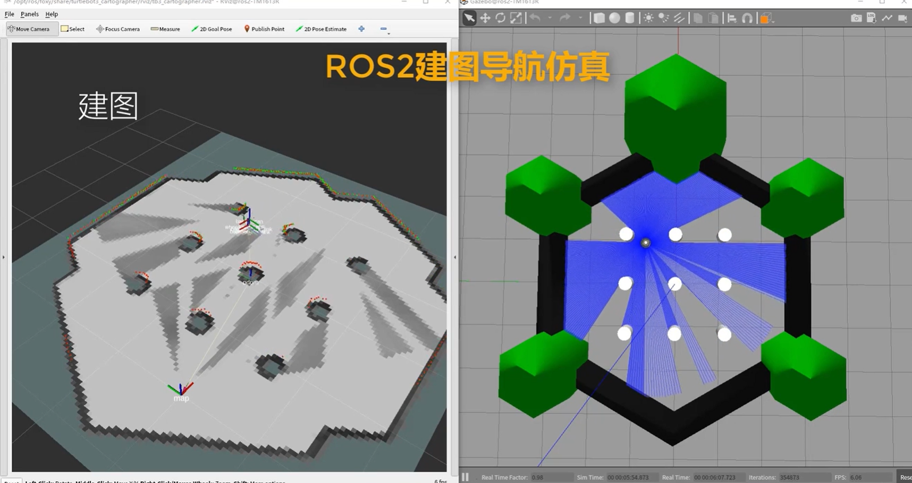
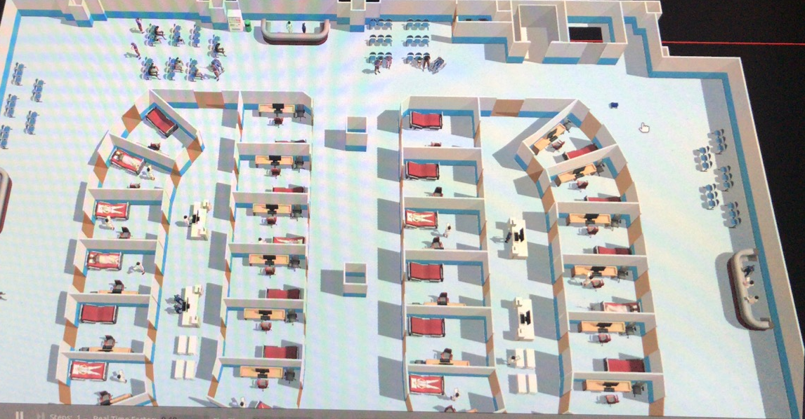
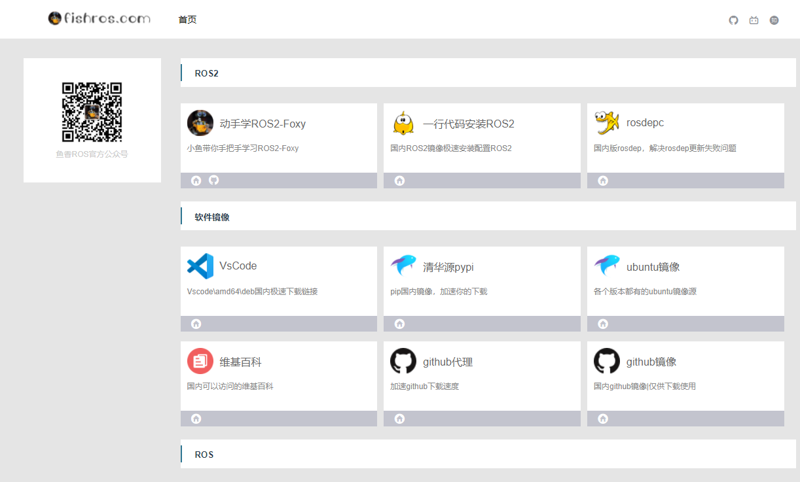

# 动手学ROS2

亲爱的鱼粉（请允许小鱼这么称呼），你好！我是《鱼香ROS》作者小鱼，很高兴你能看到这本在线教程，那么从现在开始希望你可以和小鱼一起动手学习ROS2、学习机器人。

小鱼很荣幸的告诉你，现在你所看到的教程已经是《动手学ROS2》的第二版了，第二版相较于第一版主要有以下改进：

- 采用ROS2五年长期支持版Humble版本进行讲解（第一版为Foxy版本，2023年停止维护）
- 增加Moveit2机械臂运动规划内容
- 增加Nav2进阶内容内容
- 增加DDS和ROS2通信机制进阶内容
- 优化文章结构和知识体系
- 增加ROS2-Control部分内容
- 增加MicroROS嵌入式内容
- 增加ROS2开源小车制作内容
- 完善机器人运动学相关内容
<!-- - 增加图像（标定，识别）相关内容 -->

## 1.为什么要学习ROS2？

后疫情时代，国内机器人行业也随之兴起，ROS机器人操作系统（Robot Operating System）作为快速搭建机器人的一大利器，在机器人行业的开发中被广泛使用。

ROS2作为第二代机器人操作系统，继承了ROS强大的生态，采用了全新的架构设计，使得ROS2满足现代机器人系统的实时性、安全性、标准性、可靠性等要求。

在未来，机器人将走进我们的生活之中，掌握机器人技术将成为每一个技术人员的必修课，而本教程旨在以ROS2为工具，从基础开始讲起，带你入门机器人，玩转机器人。

> 本教程采用在线教程文档形式，随着ROS2的更新而不断更新，大家可以关注小鱼个人公众号《鱼香ROS》，加入技术交流群第一时间获取更新通知

## 2.学了本课程能够做什么？

ROS2强大之处在于其生态系统，基于ROS2的软件库和工具集，针对不同种类的机器人和应用场景，衍生出了一系列机器人框架，比如：

- Nav2移动机器人导航 https://www.bilibili.com/video/BV1Ef4y1P7wt/

  

- Moveit2的机械臂运动规划 https://mp.weixin.qq.com/s/Lx-xLO_C9NKxCcRBHj2gUw

  

- ROS2的多机器人协同研究 https://osrf.github.io/ros2multirobotbook/intro.html

  

## 3.本教程适合学习对象有哪些？

为了让不同阶段的读者从本教程受益，小鱼会从基础、入门、进阶三部分进行讲解，本教程主要适合人群有：

- 机器人相关的大学生和的研究生等
- 有一定编程基础想要转行从事机器人的小伙伴
- 已有ROS基础想要学习ROS2的在职工程师
- 机器人爱好者或其他想学习了解机器人的小伙伴

### 3.1 没有机器人基础可以学习吗？

没有任何问题，即使你不是机器人相关专业也没事，小鱼会在教程中给大家讲解。

### 3.2 没有编程基础可以学习吗？

本教程使用Python和C++编程语言实现，大家只需要掌握其中之一即可。

所以对于没有任何编程基础的小伙伴，可以简单的学习一下Python语言，两三天就可以无证上岗了。

## 4.课程规划

教程分为基础篇、机器人学篇、建模仿真篇、Nav2导航篇、ROS2控制篇、实体机器人篇、Moveit2机械臂篇。

### 4.1 ROS2入门篇

基础篇主要对ROS2的软件库和工具集进行介绍，通过基础篇的学习，你可以掌握ROS2常用工具使用，并可以通过C++或Python调用ROS2的API进行通信。

- 第 1 章 ROS2介绍与安装
- 第 2 章 ROS2概念通识
- 第 3 章 ROS2通信机制入门(话题与服务)
- 第 4 章 ROS2通信机制进阶(参数与Action)
- 第 5 章 ROS2常用工具

### 4.2 机器人学篇

通过对基础的机器人学进行学习，丰富你的机器人理论知识，使得接下来的学习畅通无阻。

- 第 6 章 运动学基础
- 第 7 章 ROS2运动学

### 4.3 建模仿真篇

通过对机器人的结构进行建模，实现在ROS2的GUI工具中展示机器人模型，并进行仿真，让你的机器人动起来。

- 第 8 章 机器人建模
- 第 9 章 机器人仿真

### 4.4 Nav2导航篇

通过对Nav2框架结合仿真机器人进行实战，带你了解机器人建图导航技术，同时增加了进阶篇内容，小鱼带你一起将自己的算法在Nav2上进行实现。

- 第 10 章 SLAM建图
- 第 11 章 Nav2导航仿真实战
- 第 12 章 Nav2进阶实践

### 4.5 ROS2控制硬件篇

从点亮一颗小灯开始,带你掌握ROS2系统中接入电机（直流、步进、舵机）和传感器原理与方法。

- 第 13 章 嵌入式开发之从点灯开始
- 第 14 章 接入ROS2-MicroROS
- 第 15 章 ROS2控制硬件实战

### 4.6 实体移动机器人

手把手小鱼带你做一个可以建图导航到处跑的真的机器人出来。

- 第 16 章 实体机器人硬件搭建
- 第 17 章 嵌入式控制及通信开发
- 第 18 章 上位机建图及导航

### 4.7 Moveit2机械臂篇

手把手小鱼带你做一个可以建图导航到处跑的机器人出来。

- 第 19 章 ROS2-Control
- 第 20 章 Moveit2仿真
- 第 21 章 Moveit2进阶
- 第 23 章 Moveit2真机控制

## 5.学习资源

### 5.1 公众号:鱼香ROS

几乎每日更新的学习教程和资源，后台回复`学习资料`可获得大礼包

### 5.2 技术交流群

- 微信交流群：鱼香ROS公众号下方
- QQ交流群：139707339，进群指令(d2lros2+fishros)

### 5.3 鱼香ROS官网

记住网址：fish(鱼)+ros+.com=fishros.com

网罗各种机器人工具和资源

## 6.关于小鱼

小鱼目前主要在做移动机器人导航相关的工作，坐标深圳，有时间的小伙伴周末一起来喝个茶。

因为小鱼个人能力有限，教程之中难免有错误之处，如果你有发现请联系小鱼或直接提出PR，小鱼将第一时间修正。

最后欢迎关注小鱼的微信公众号《鱼香ROS》，和小鱼一起学习ROS2。公众号下方有小鱼的个人微信和机器人技术交流群，有问题可以联系。

#### 参考资料

- ROS2官方文档：http://docs.ros.org/en/humble/index.html
- ROS2教学视频：https://www.bilibili.com/video/BV19U4y1n7CQ
- 项目源码地址：https://github.com/fishros/ros2_town

------

技术交流&&问题求助：

- **微信公众号及交流群：鱼香ROS**
- **小鱼微信：AiIotRobot**
- **QQ交流群：139707339**

- 版权保护：已加入“维权骑士”（rightknights.com）的版权保护计划
