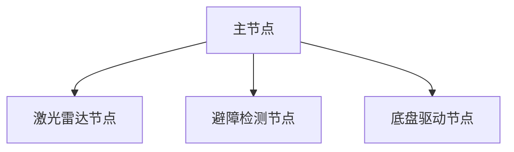

# 1.2 ROS与ROS2对比

经过上一节的学习，相信你已经对ROS和ROS2的发展有了一定的了解，本节小鱼将给大家从多个角度讲解ROS和ROS2的区别之处。

## 1.ROS问题举例

上节课说到ROS的设计目标是简化机器人的开发，如何简化呢？ROS为此设计了一整套通信机制（话题、服务、参数、动作）。

通过这些通信机制，ROS实现了将机器人的各个组件给的连接起来，在设计这套通信机制的时候就设计了一个叫做`Ros Master`的东西，所有节点（可以理解为某一个组件，比如：激光雷达）的通信建立必须经过这个主节点。

这种组合结构图如下：

一旦`Ros Master`主节点挂掉后，就会**造成整个系统通信的异常**,此时避障策略将会失效，如果机器人正在运行，碰到障碍物会径直装上去，机毁人亡！

> ROS的不稳定这个问题在虽然对大家做机器人研究问题不大，但如果是想基于ROS做商业化机器人（比如无人驾驶汽车），就会造成非常严重的后果，小鱼在工作中可没为这个问题发愁

除了不稳定这个问题，ROS还有很多其他地方存在着问题：

- 通信基于TCP实现，实时性差、系统开销大
- 对Python3支持不友好，需要重新编译
- 消息机制不兼容
- 没有加密机制、安全性不高

## 2.ROS与ROS2架构对比？

所以在ROS2中，首当其冲的将ROS的主节点干掉了，这里放一张网上流传最广的ROS/ROS2架构图，接下来就会按照这篇架构图给大家讲解。

> 该图出自论文：`Exploring the Performance of ROS2`，已放入小鱼的公众号中，后台回复`ROS2论文`可获取

小鱼来给大家讲解下这张图，我们从下往上看。

#### 2.1 OS层

从原来的只支持linux平台变成了支持windows、mac甚至是嵌入式RTOS平台，这一点要点个赞。

>  之前认识公众号一老哥，做扫地机器人，为了降低成本，不能用ROS，重新造轮子

#### 2.2 MiddleWare中间件层

> 如果大家觉得中间件太玄乎可以点击小鱼的文章链接：[ROS2和ROS最大的区别中间件到底有什么不一样？](https://zhuanlan.zhihu.com/p/390607053)
>
> 下一节的扩展阅读讲了ROS的中心化特性： [1.3课外阅读_ROS镇长与艳娘传奇](1.3课外阅读_ROS镇长与艳娘传奇.md) 

那么中间层ROS2到底相对于ROS做了哪些优化呢？

1. **去中心化master**，ROS和ROS2中间件不同之处在于，ROS2取消了master节点。

   去中心化后，各个节点之间可以通过DDS的节点相互发现，各个节点都是平等的，且可以1对1、1对n、n对n进行互相通信。

   

2. **不造通信的轮子**，通信直接更换为DDS进行实现（这个小鱼也要点赞，让专业的人做专业的事情）

   采用DDS通信，使得ROS2的实时性、可靠性和连续性上都有了增强。
   
   

#### 2.3 应用层

对于应用层来说ROS2也做了很大的改进，上面那张图没有体现出来。

ROS2进行改进有：

1. python2到pyhton3的支持
2. 编译系统的改进（catkin到ament）
3. 软件包更新到c++11
4. 可以使用相同 API 的进程间和进程内通信
5. 持续更新........

## 3.ROS2新概念例举
- 可用Python编写的Launch文件
- 多机器人协同通信支持
- 支持安全加密通信
- 同一个进程支持多个节点
- 使用ament进行包管理
- 支持Qos服务质量
- 支持节点生命周期管理
- 高效的进程间通信
- ......

## 4.更详细的对比

请看扩展阅读3章节：[扩展阅读3-ROS2VSROS详细对比](chapt1/扩展阅读3-ROS2VSROS详细对比.md) 

------

技术交流&&问题求助：

- 课程合作：[睿慕课](https://www.aiimooc.com/mall/preshow-htm-itemid-705.html)

- 微信公众号：鱼香ROS

- 小鱼微信：AiIotRobot

