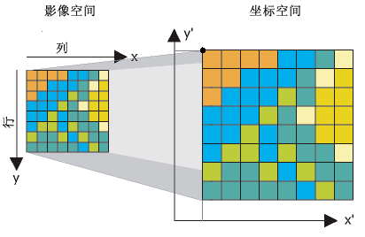

# 10.6导航地图概述

地图是对环境建模的结果，拥有地图，我们就可以在不进行任何测量的情况下来了解环境，从而完成一些比如路径规划的操作。

本节小鱼带你一起了解ROS2中地图的原理、常见格式及转换，加载方式、修改方式等基本操作。

1.地图与占据栅格地图

在日常生活中，我们会用到各种各样的地图，比如交通轨道图、城市地图、世界地图。

1.1 地图分类

我们根据地图所表达信息的不同可以将地图分为三类：

1. 尺度地图（Metric Map）

尺度地图用于表示尺寸距离，可以理解为把真实世界按比例缩小，尺度地图中每个点都可以使用一个经纬值进行表示。

> 因为尺度地图是按照真实世界按比例缩小，所以要有比例尺来表示缩小比例。

2. 拓扑地图（Topological Map）
拓扑地图用于表示点与点之间的连接信息，比如地铁轨道交通图。

3. 语义地图（Semantic Map）
语义地图可以理解为在上面两个地图上增加了语义，比如尺度地图中某处是红绿灯、斑马线。拓扑地图中某个点是深圳北站。

在机器人领域，尺度地图常用于定位于地图构建（Mapping）、定位（Localization）和同时定位与地图构建（Simultaneous Localization And Mapping，SLAM），拓扑地图常用于路径规划（Path Planning），而语义地图常用于人机交互（Human Robot Interaction）。

1.2 占据栅格地图

我们先了解下什么是栅格地图（Grid Map）。

如上图将地图数据分割为一块块的栅格来表达地图信息，就是栅格地图。

那什么是占据（Occupancy）呢？

机器人通过激光雷达等传感器来感知深度信息，但我们知道，传感器都是有噪声的（在前面的机器人仿真建模过程中，我们为了更加真实给激光雷达还添加了高斯噪声），所以机器人前方的某个位置到底有没有物体（障碍物）是不确定的。

我们可以采用概率来解决这一问题，认为确实有物体的栅格的占据率为100%，确定没有物体的栅格占据率为0%，不确定的栅格就用（确认占据概率/确认非占据概率）值表示占据率。

由此我们知道占据栅格地图就是一张写满占据率的格子组成的地图。

2.地图加载

OccupancyGrid由一个.yaml格式的元数据文件，和图片格式的地图数据文件组成。

3.地图编辑

参考文章：

- https://zhuanlan.zhihu.com/p/21738718

--------------

技术交流&&问题求助：

- **微信公众号及交流群：鱼香ROS**
- **小鱼微信：AiIotRobot**
- **QQ交流群：139707339**

- 版权保护：已加入“维权骑士”（rightknights.com）的版权保护计划
