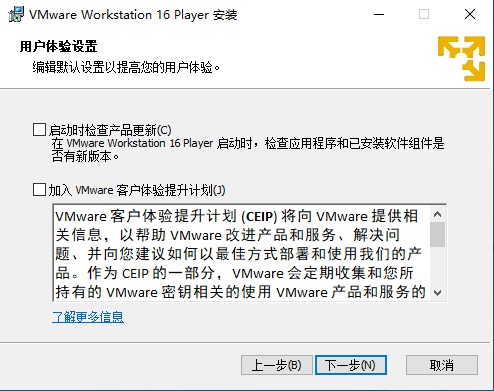
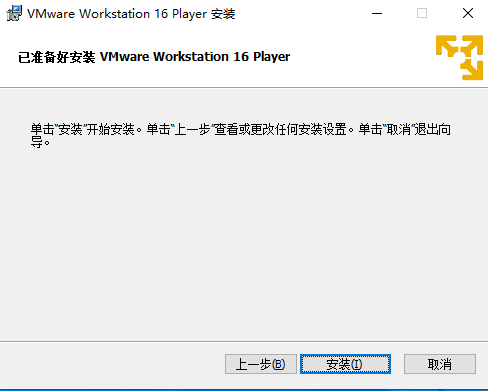
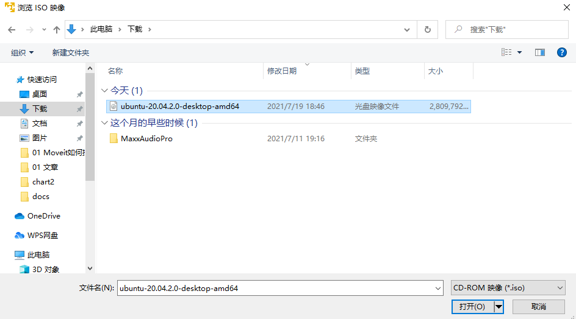
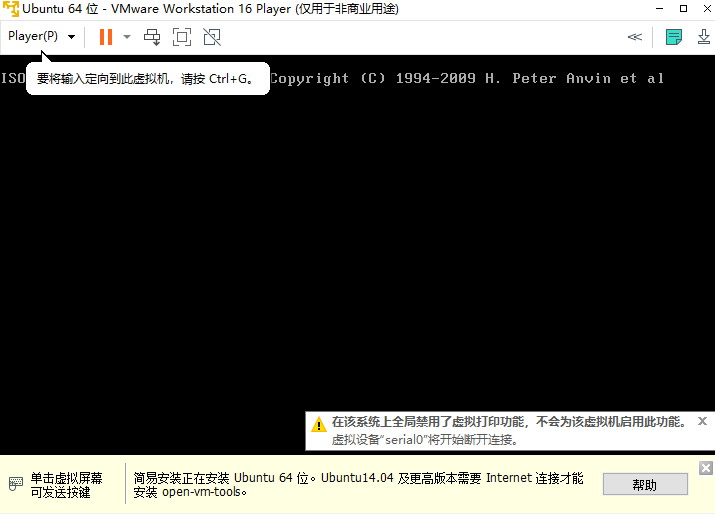

# 2.1 虚拟机安装Ubuntu

本节小鱼将带大家一起使用Vmware来安装一个ubuntu20.04的虚拟机。让我们开始吧！

> 所谓虚拟机，就是在你的电脑已有的系统上再使用软件模拟出另外一个系统。比较著名的软件就是Vmware了，因为Vmware是收费的，我们使用他们的非商业版本Vmware-Player。

本节资源列表：

- VMware-player虚拟机安装包：[地址](https://my.vmware.com/en/web/vmware/downloads/details?downloadGroup=WKST-PLAYER-1612&productId=1039&rPId=66621)
- Ubuntu20.04镜像一个：[地址](http://mirrors.ustc.edu.cn/ubuntu-releases/20.04/)

## 1.下载虚拟机和Ubuntu镜像

Vmvare官方下载链接：[VMware Workstation Player - My VMware](https://my.vmware.com/en/web/vmware/downloads/details?downloadGroup=WKST-PLAYER-1612&productId=1039&rPId=66621)

大家在浏览器里打开网页，然后点击下图中的DownLoad Now即可，注意上面一个是windows版本，下面一个是linux版本的。

下载好后虚拟机安装包后，接下来下载ubuntu镜像文件。

下载地址：[Index of /ubuntu-releases/20.04/ (ustc.edu.cn)](http://mirrors.ustc.edu.cn/ubuntu-releases/20.04/)，点开上面的网址，你会看到下面的页面：

话不多说选这个：`ubuntu-20.04.2.0-desktop-amd64.iso`  很多人有疑问，为啥是amd64，因为64位的架构是amd公司制定的，小鱼当初差点就去amd搞芯片了。

速度还可以：

下载好后，你应该得到这两个文件：

## 2.安装Vmware

双击执行VmWarePlayer，等待一下，然后跟着小鱼一路next。

点击安装，等待一下下

点完成

此时桌面上应该看到对应的图标了。

双击打开：

肯定免费白嫖啦，点继续

点完成，此时主界面就出来了

## 3.安装虚拟机

点开文件新建虚拟机

点开后选第二个选项

然后点浏览，找到我们下载的ubuntu镜像，**点击打开**

**点击下一步**

输入一下信息，名称小鱼用了ROS2，密码用的是123

**点下一步，点浏览，更改一下位置**

点下一步，然后改一下磁盘大小，小鱼改成80G。

然后点下一步

这里大家可以根据自己电脑自定义一下，小鱼有16G的内存，8核CPU，这里分给虚拟机4核8G。

然后点击完成

看到类似这个界面，不要着急，保持耐心，等待即可。

最终装好了之后，你就可以看到登录界面，输入密码即可进入系统。

