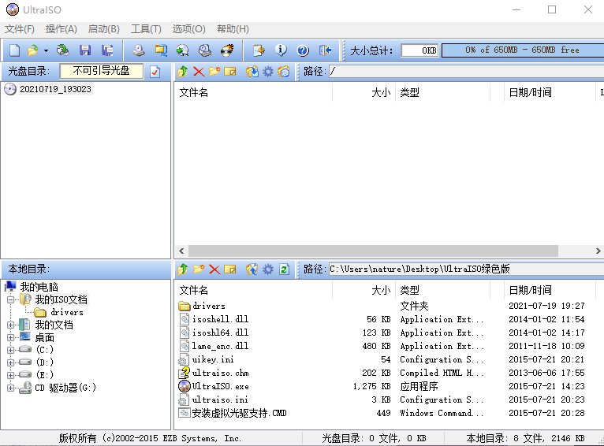
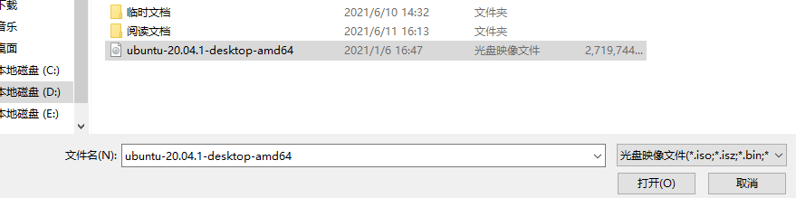
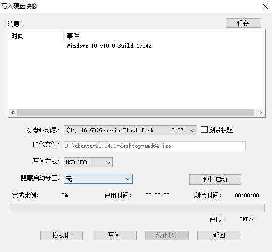
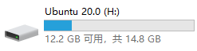
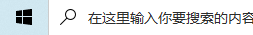
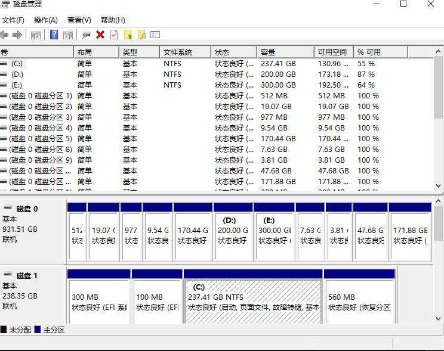
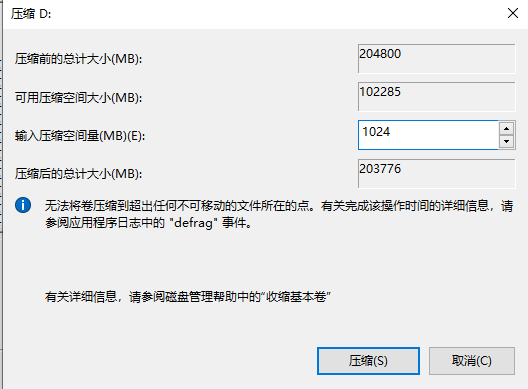
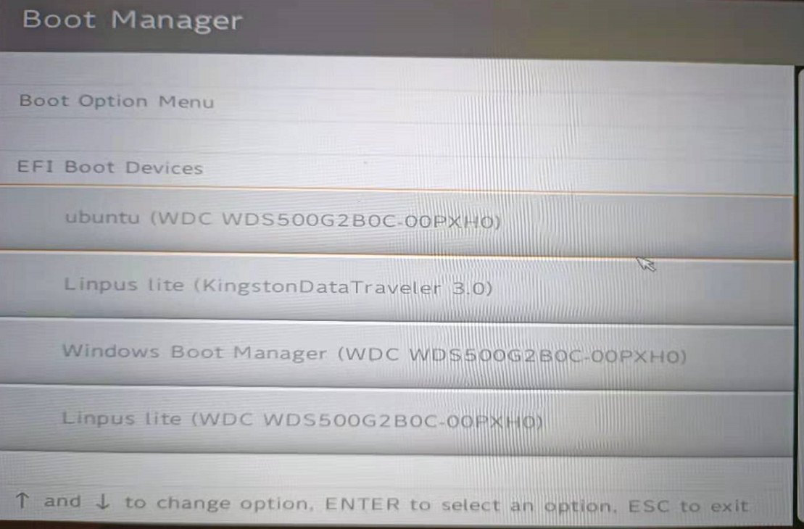
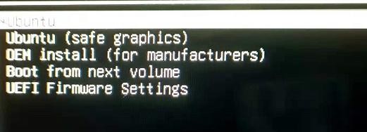

# 扩展阅读1：使用双系统安装Ubuntu

在群里看到群友分享的其他详细安装教程，这里小鱼也分享一下：

- [UBUNTU双系统安装教程](https://mp.weixin.qq.com/s?__biz=MzI4OTg4OTA0NA==&mid=2247485962&idx=1&sn=db5d858d8cee0463d33c46af7297a650&chksm=ec290471db5e8d6764baa3bb32a626a05c101c5292f09e690587808ee6389f6d3605937d32b1&mpshare=1&scene=23&srcid=0808lbEv8bK6J8l3zqWVumqI&sharer_sharetime=1631118708526&sharer_shareid=349e36b4db668527affa7ccd00962cf9#rd)
- [WIN10安装ubuntu双系统教程（超详细）](https://mp.weixin.qq.com/s?__biz=MzIzODQzMjI4NA==&mid=2247483965&idx=1&sn=2abf6756611c9c7b7b542e6202d33f76&chksm=e9383b4ede4fb2585d1fc85ae734ccef1ff5c2d86f271d62ce5cfd5f0da0f01c22b43e3b14e5&mpshare=1&scene=23&srcid=0808GdmWmqzt5JjBjlDXjRXn&sharer_sharetime=1631118732579&sharer_shareid=349e36b4db668527affa7ccd00962cf9#rd)

接着是小鱼的不完全教程

这节给大家讲一讲如何使用双系统的方式安装ubuntu，毕竟虚拟机还是虚拟的，是两个系统在分硬件资源，有时候会卡到怀疑人生，所以本节小鱼就给大家讲一讲如何安装双系统。

安装双系统需要准备哪些材料呢？
- U盘一个（大于4G）
- ubuntu镜像一个（下载可以点链接：[链接](http://mirrors.ustc.edu.cn/ubuntu-releases/20.04/ubuntu-20.04.2.0-desktop-amd64.iso)）
- U盘烧写工具**UltralSO**这个可以加入课程交流群下载**139707339**

准备好三个工具后，咱们就开干了

## 1 制作启动盘—烧录镜像

打开UltralSO

左上角文件，打开选择我们的镜像。

点击打开，确保电脑上插上了U盘。

点启动，写入硬盘映像

会跳出烧录界面

点击**写入**操作飞一会，Ubuntu20.04的启动盘就制作完成了。

这个时候看看电脑就会出现一个叫做ubuntu20.0的磁盘。

## 2 整理磁盘给出空间

如果你的电脑里连50个G的空闲空间都没有了，最好还是别装了。装双系统费钱吗？不费，但费磁盘容量。

小鱼这里留出了80G的空间用来安装ubuntu。具体怎么操作呢？

在窗口上右击，选择磁盘管理器。

你就能看到这样一个窗口。

这个窗口显示着你电脑上所有的磁盘和分区状态。

你可以找一块你没用的分区，右击压缩卷（一定要谨慎操作哦，不然这个磁盘都没了，心中默念数据无价，阿弥陀佛）

压缩卷的意思其实是把某个分区在分出来一部分。

比如小鱼在D盘上压缩，D盘剩余的空间都可以被压榨出来。

这里小鱼只压榨出来1024M=1G的空间来。

点击压缩后D盘就变成了199G，而且后面多出来了1G的未分配空间，这个未分配空间就可以用来安装linux的，大家至少压缩出来50G左右最好，小鱼一般给80G。

## 3 修改开机选项进入启动盘

先将电脑关机，保证刚刚制作启动盘的U盘在要装双系统的电脑上插好。

点击开机键，然后立刻马上点击F12（大多电脑是F12选择启动项，不是的可以根据自己电脑型号百度或者尝试一下F2,F4,F8,Enter等）。

操作正确，电脑就会跳出来，下面的界面。

这些对应的都是你的电脑从磁盘上搜索到的启动项，这里需要自己辨识一下，小鱼的是第二个Kinston的。按上下键选中它，点回车即可。

接下来会加载一会，然后进入选择界面。

这里我们选择第一个即可。然后会进入一个让你选安装还是试用的界面，这里可以修改一下语言然后选试用。

接下来的步骤可以参考视频啦

已经录制好的视频找不到了，小鱼会尽快补上，遇到问题可直接联系小鱼~

