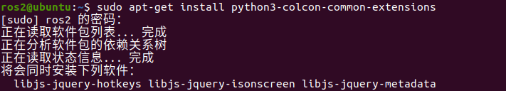
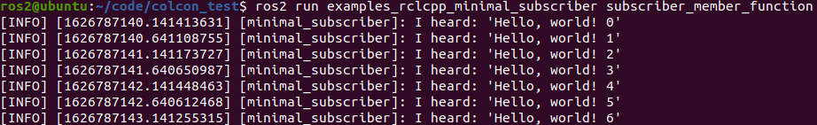

# 3.2 ROS2编工具—Colcon

## 1.Colcon是个啥

colcon其实是一个包构建工具，这个工具用来做什么的呢？

简单点说就是用来编译代码的，上几节跟大家讲了如何进行ROS2工作空间的创建，但没有说如何进行编译，其实就是用colcon。

ROS2默认是没有安装colcon的，所以小鱼就从如何安装colcon开始跟大家讲解colcon的使用方法。


> colcon想当于ros1中的catkin工具，学过ros1的同学可以辅助理解。没学过也没关系，用多了自然也就懂了。


## 2.安装colcon

因为安装ros2时候是不会自动安装这个工具的，所以需要我们手动安装，不过安装就一句话，非常简单，快打开终端复制粘贴进去吧

```
sudo apt-get install python3-colcon-common-extensions
```




## 3. 编个东西测试一下

1. 创建一个工作区文件夹`colcon_test`

   ```
   mkdir colcon_test && cd colcon_test
   ```

   

2. 下载个ROS2示例源码测试一下

   ```
   git clone https://github.com/ros2/examples src/examples -b foxy
   ```

   

3. 编译工程

   ```
   colcon build
   ```

   

4. 编完之后的目录结构

   从一个src变成了四个，进来一个送你仨

   


## 4.运行一个自己编的节点

1. 打开一个终端使用 cd colcon_test 进入我们刚刚创建的工作空间，先source 一下资源

   ```
   source install/setup.bash
   ```

2. 运行一个订杂志节点

    ```
    ros2 run examples_rclcpp_minimal_subscriber subscriber_member_function
    ```
    
3. 打开一个新的终端，先source，再运行一个发行杂志节点

    ```
    source install/setup.bash
    ros2 run examples_rclcpp_minimal_publisher publisher_member_function
    ```

    


## 5.本节学习指令

### 只编译一个包

```
colcon test --packages-select YOUR_PKG_NAME 
```

### 不编译测试单元

```
colcon test --packages-select YOUR_PKG_NAME  --cmake-args -DBUILD_TESTING=0
```

### 运行编译的包的测试

```
colcon test
```

### 允许通过更改src下的部分文件来改变install（重要）

每次调整 python 脚本时都不必重新build了

```
colcon build --symlink-install
```


> 这个小鱼要特别说一下，因为ros2的build没有ros中的devel概念了，如果想达到devel目录那样的效果，就需要加这个参数。没有学过ros的请主动忽略这句话。


参考资料:

- colcon官方文档 [https://colcon.readthedocs.io/en/released/user/installation.html](https://colcon.readthedocs.io/en/released/user/installation.html)
- ROS2官网文档 [https://docs.ros.org/en/foxy/Tutorials/Colcon-Tutorial.html](https://docs.ros.org/en/foxy/Tutorials/Colcon-Tutorial.html)

