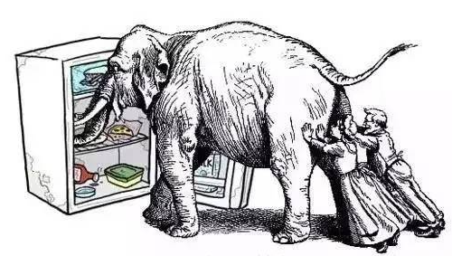

3.5.2 OOP介绍

除了使用上节中的方法编写一个Python节点外，还有另外两种方式。

本节小鱼就来讲一讲出现么多种编写节点的原因，并对其中较为重要的OOP方法进行介绍。

要做机器人离不开计算机编程，而计算机编程经过多年的发展，演变出了三种不同且常用的编程思想，分别是：

1. 面向过程编程思想。缩写：POP
2. 面向对象编程思想。缩写：OOP
3. 函数式思想。缩写：FP

1.Why

为什么了解这些编程思想呢？尤其是OOP.

小鱼遇到过很多同学，在阅读机器人相关开源程序代码时，比如导航框架Nav2、机械臂运动控制框架Moveit时发现，别人的代码，每一行好像都看得懂，但放一起就看不懂了，看别人函数调来调去，很快人就给整蒙了。不知道如何下手。

这其实就是对别人的编程思想不了解造成的，所以本节课小鱼就给提一提常见的三种编程思想，让大家脑子里有个概念，以后遇到了看不明白的程序，知道该往哪个方向去学习。

本节编程思想博大精深，小鱼这里三种概念的基本介绍。

2.思想辨析

首先明确一件事情，编程是为了什么？

是为了赚钱吗？

不，我们写程序肯定是为了解决实际的问题的，那编程思想编程思想就是解决问题的思路（赚钱工具）

那这三种思想有什么区别呢？

比如我们想把一只大象装进冰箱，分别用三种思想，我们看看有什么不一样。

如果我们采用面向过程的思想，可以分为三步：

1. 打开冰箱门
2. 把大象塞进去
3. 关上冰箱门

面向过程编程就是分析出解决问题所需要步骤，然后分别实现每一步，再一步步执行即可。

面向对象编程思想（OOP）怎么做呢？

那就要先知道面向对象是什么？搞清楚啥是对象？

对象是女朋友吗？答案肯定不是。

任何我们想要探究的事物都可以当作一个对象，比如我们可以把你家的冰箱理解为一个对象，我们就可以研究你家冰箱由哪些部分（指令装置等）组成，你家冰箱能干什么（制冷、调温等）？

接着我们开始下定义，就是取个高大上的名字

| 冰箱           | 定义       | 举例                     |
| -------------- | ---------- | ------------------------ |
| 冰箱的组成部分 | 冰箱的属性 | 制冷器，调温旋钮、灯带等 |
| 冰箱能干什么   | 冰箱的行为 | 制冷，调温、照明等       |

行为其实是对对象的操作，比如对制冷器操作就可以制冷，给灯带通电就可以照明。

**对象 = 属性+行为**

接着我们开始采用OOP的方法把大象装进冰箱

1. 调用：冰箱->打开门(行为)
2. 调用：冰箱->装东西(行为)
3. 调用：冰箱->关闭门(行为)

看起来和面向过程没啥区别，但我们的思想发生了重大的转变，我们把冰箱当作了一个独立的对象，我们是通过和冰箱这个对象交互完成了整个过程。

接着来看函数式编程

1. 定义关进（冰箱，大象）函数
2. 实现函数：关门(放入(开门(冰箱)，大象))

可以看到多层的函数嵌套调用，这就是函数编程的魅力，因为FP不是我们的机器人学习中的重点，这里就不过多讲解啦！

参考链接：

-[浅谈面向对象的编程思想：如何优雅地把大象装进冰箱？_SYSU_101的博客-CSDN博客](https://blog.csdn.net/SYSU_101/article/details/78057008)