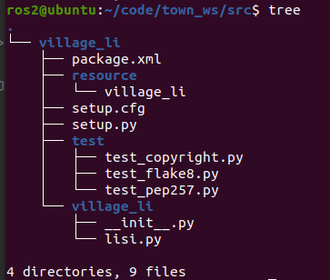

# 3.5 带你手撸一个Python节点

上一节的小游戏，相信你已经运行起来了。这一节小鱼就从上一节的小游戏说起，带你一起手撸一个python版本的节点。


在上一节小游戏中，小鱼一共启动了多少个节点呢？节点名字分别叫什么？

聪明的小伙伴，可能会想到一个命令，那就是

```
ros2 node list
```

这个命令是在3.1节中讲到的，用于获取ros2的在运行的节点列表。

我们启动上节课的小游戏，然后输入这个命令试一试。

```
$ ros2 node list
/teleop_turtle
/turtle_spawner
/turtlesim
```

这里出现了三个节点，这三个节点之间有什么关系？节点的名字又是在哪里定义的？

带着你的好奇心，小鱼带你一起手撸一个节点。


## 1.准备工作

节点需要存在于功能包当中、功能包需要存在于工作空间当中。所以我们要先创建一个工作空间，再创建功能包。

### 1.1 创建工作空间

工作空间就是文件夹，所以很简单

```
mkdir -p town_ws/src
cd town_ws/src
```

### 1.2 创建一个功能包

这个小鱼不打算单独讲，遇到一个命令说一个。

我们先讲一下如何创建一个名字叫做`village_li `(李家村)python版本的功能包。

```
ros2 pkg create village_li --build-type ament_python --dependencies rclpy
```

大家可以手写一下这个代码，感受一下。现在小鱼来讲一讲这条命令的含义和参数。

- pkg create 是创建包的意思
- --build-type 用来指定该包的编译类型，一共有三个可选项`ament_python`、`ament_cmake`、`cmake`
- --dependencies 指的是这个功能包的依赖，这里小鱼给了一个和通信相关的`rclpy`


> 如果build-type什么都不写，ros2会默认类型为ament_cmake.


最后你可以得到这样一个目录结构。


## 2.开始编写节点

接下来我们开始编写一个python节点，首先在`__init__.py`同级别目录下创建一个叫做`li4.py`的文件(在vscode中右击新建就行)。

创建完成后的目录结构长这样子



打开li4.py,接着我们开始编写代码。跟着小鱼一起边理解输入下面的代码，注释不用输。

```
#!/usr/bin/env python3
import rclpy
from rclpy.node import Node


class Li4Node(Node):
    """
    创建一个李四节点，并在初始化时输出一句话
    """
    def __init__(self):
        super().__init__("li4") #给节点一个名字 li4
        self.get_logger().info("大家好，我是艳娘传奇作者李四！") #来个自我介绍


def main(args=None):
    """
    ros2运行该节点的入口函数，可配置函数名称
    """
    rclpy.init(args=args) # 初始化rclpy
    node = Li4Node()  # 新建一个节点
    rclpy.spin(node) # 保持节点运行，检测是否收到退出指令（Ctrl+C）
    rclpy.shutdown() # rcl关闭
```


代码编写完成用Crtl+S进行保存。接着修改`setup.py`

增加一句话，告诉ros2村庄来了一位新村民李四，要找这位村民去`village_li.li4:main`路径下寻找。

```
    entry_points={
        'console_scripts': [
            "li4_node = village_li.li4:main"
        ],
    },
)
```


完成上面的工作后，就可以编译运行了。


## 3.编译运行节点

打开vscode终端，进入`town_ws`

### 编译节点

```
colcon build
```

### source环境

```
source install/setup.bash
```

### 运行节点

```
ros2 run village_li li4_node
```

### 运行结果


## 4.总结

当节点运行起来后，可以再尝试使用`ros2 node list `指令来查看现有的节点。这个时候你应该能看到：


这说明你的节点已经运行起来了，并且被其他节点感知到了。


这一节，小鱼带你一起使用Python完成了python节点的编写，成功创建出来一个li4的节点。下一节小鱼带你一起去王家村，来创建单身汉王二，让我们一起加油吧~
