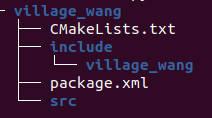

# 3.5.1创建一个C++功能包

## 1.创建王家村功能包

王二居住在王家村，王家村和李家村不一样，是使用ament-cmake作为编译类型的。

所以王家村建立指令像下面这样，只不过依赖变成了rclcpp

```
ros2 pkg create village_wang --build-type ament_cmake --dependencies rclcpp
```

打开终端，进入`town_ws/src`运行上面的指令，创建完成后的目录结构如下：




## 2.创建节点

接着我们在`village_wang/src`下创建一个`wang2.cpp`文件，创建完成后的目录结构如下：

