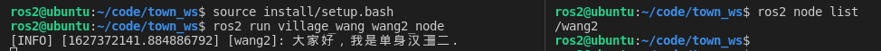

# 3.6小鱼带你手撸一个C++节点

李四来到了李家村后，到了第4章就要开始进行写小说了，所以本节我们要使用C++给李四创建一个读者节点王二。


## 1.创建王家村功能包

王二居住在王家村，王家村和李家村不一样，是使用ament-cmake作为编译类型的。

所以王家村建立指令像下面这样，只不过依赖变成了rclcpp

```
ros2 pkg create village_wang --build-type ament_cmake --dependencies rclcpp
```

打开终端，进入`town_ws/src`运行上面的指令，创建完成后的目录结构如下：


## 2.编写节点

接着我们在`village_wang/src`下创建一个`wang2.cpp`文件，创建完成后的目录结构如下：


### 编写代码

继续跟着小鱼一起输入代码，输入的时候可以边输边理解。

```cpp
#include "rclcpp/rclcpp.hpp"

/*
    创建一个类节点，名字叫做Wang2Node,继承自Node.
*/
class Wang2Node : public rclcpp::Node
{
public:
    Wang2Node() : Node("wang2")
    {
        // 打印一句自我介绍
        RCLCPP_INFO(this->get_logger(), "大家好，我是单身汉王二.");
    }
};

int main(int argc, char **argv)
{
	/*初始化rclcpp*/
    rclcpp::init(argc, argv);
    /*产生一个Wang2的节点*/
    auto node = std::make_shared<Wang2Node>();
    /* 运行节点，并检测退出信号*/
    rclcpp::spin(node);
    /*接收到退出信号，关闭rclcpp*/
    rclcpp::shutdown();
    return 0;
}
```

上面的代码声明了一个叫做Wang2Node的类，并在类的初始化函数中，输出了一句话。主函数中首先初始化rclcpp，然后新建了一个Wang2Node节点的对象，接着使用rclcpp让这个节点暴露在外面，并检测退出信号（Ctrl+C），检测到退出信号后，就会执行`rcl.shutdown()`关闭节点。

### 添加到CmakeLists

在wang2.cpp中输入上面的内容后，还需要修改一下CmakeLists.txt。

在CmakeLists.txt最后一行加入下面两行代码。

```
add_executable(wang2_node src/wang2.cpp)
ament_target_dependencies(wang2_node rclcpp)
```


添加这两行代码的目的是让编译器编译wang2.cpp这个文件，不然不会主动编译。接着在上面两行代码下面添加下面的代码。

```
install(TARGETS
  wang2_node
  DESTINATION lib/${PROJECT_NAME}
)
```

这个是C++比Python要麻烦的地方，需要手动将编译好的文件安装到`install/village_wang/lib/village_wang`下


## 3.编译运行节点

打开vscode终端，进入`town_ws`

### 编译节点

```
colcon build
```

### source环境

```
source install/setup.bash
```

### 运行节点

```
ros2 run village_wang wang2_node
```

不出意外，你可以看到王二的自我介绍。


## 4.总结

当节点运行起来后，可以再尝试使用`ros2 node list `指令来查看现有的节点。这个时候你应该能看到：




至此，相信你已经掌握了如何编写一个C++版本的ros2节点，下一章中，作家李四将会开始编写艳娘传奇，我们到时候可以帮单身狗王二编写代码，订阅艳娘传奇。


