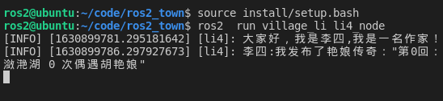
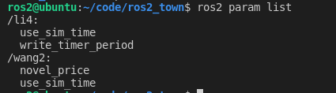
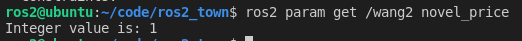
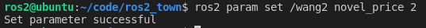

# 5.3使用C++玩转参数

大家好，我是小鱼，本节课带大家一起学习如何使用C++来对参数进行操作。

本节课的任务是通过参数实现动态调整王二卖二手书的价格。

## 1.编写代码

打开`village_wang`下的`wang2.cpp`，我们可以看到王二节点同样是继承于`rclcpp:Node`的，因此王二也具备了操作参数的能力。                                                                                                                                                                         

```
class SignalDogNode : public rclcpp::Node
```

| 函数名称               | 描述                                                         |
| ---------------------- | ------------------------------------------------------------ |
| **declare_parameter**  | 声明和初始化一个参数                                         |
| **declare_parameters** | 声明和初始化一堆参数                                         |
| **get_parameter**      | 通过参数名字获取一个参数                                     |
| **get_parameters**     | 获取具有给定前缀的所有参数的参数值                           |
| **set_parameters**     | 设置一组参数的值                                             |
| 更多函数               | [rclcpp： rclcpp：Node](https://docs.ros2.org/latest/api/rclpy/api/node.html) |

完成王二卖书章节价格的参数，我们只需要做两步即可，声明参数和获取参数

### 1.1 声明参数

首先在Wang2的private中声明一个章节单价，默认值是1，代表一元一章。

```
//声明一下书的单价
unsigned int novel_price = 1;
```

然后在构造函数中声明参数

```
//声明参数
this->declare_parameter<std::uint32_t>("novel_price", novel_price);
```

### 1.2 获取并设置参数

最后在收到买书请求回调函数中`sell_book_callback`调更新并使用该参数

```
//更新参数
this->get_parameter("novel_price",novel_price);
unsigned int novelsNum = int( request->money / novel_price ); //应给小说数量，一块钱一章
```

修改完成后的新增的SignalDogNode代码如下：

```
class SignalDogNode : public rclcpp::Node
{

public:
    // 构造函数
    SignalDogNode(std::string name) : Node(name)
    {
        //声明参数
        this->declare_parameter<std::int32_t>("novel_price", novel_price);
    }

private:
    //声明一下书的单价
    unsigned int novel_price = 1;
    
    // 声明一个回调函数，当收到买书请求时调用该函数，用于处理数据
    void sell_book_callback(const village_interfaces::srv::SellNovel::Request::SharedPtr request,
                            const village_interfaces::srv::SellNovel::Response::SharedPtr response)
    {
   
        //更新参数
        this->get_parameter("novel_price",novel_price);
        unsigned int novelsNum = int( request->money / novel_price ); //应给小说数量，钱/小说章节单价=章节数
};
```

## 2.测试

### 2.1编译程序

```
colcon build --packages-select village_wang
```

### 2.2 运行节点

#### 2.2.1 运行王二节点

```
source install/setup.bash
ros2 run village_wang wang2_node 
```


#### 2.2.2 运行李四写书

```
source install/setup.bash
ros2  run village_li li4_node 
```



### 2.2 运行李四节点

```
ros2 run village_li  li4_node
```


### 2.3 使用ros2 param命令行测试

#### 2.3.1 查看参数列表

```
ros2 param list
```



#### 2.3.2 查看描述

```
ros2 param describe /wang2 novel_price
```


#### 2.3.3 获取参数值

```
ros2 param get /wang2 novel_price
```



#### 2.3.4 设置参数值提高价钱

这里设置成2，将小说的价钱涨到2元一章，然后我们启动张三，看一下张三能够买到几本小说

```
ros2 param set /wang2 novel_price 2
```



运行张三节点，可以看到张三最终只收到了两章小说，

```
source install/setup.bash
ros2 run  village_zhang zhang3_node
```


可以看到，花了5块钱的张三只买到了两章小说，CPI又上涨了~

## 3.总结

通过本节的学习，我们已经完成了ROS2中参数的基本使用，更多的姿势还需你在实践中探索和发现，也可以通过官方文档进行学习。


- 参考文档：[rclcpp: rclcpp::Node Class Reference (ros2.org)](https://docs.ros2.org/foxy/api/rclcpp/classrclcpp_1_1Node.html)


