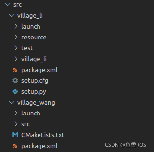
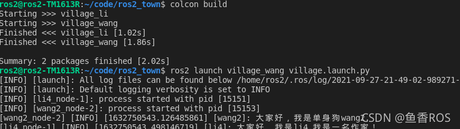

# 6.1 ROS2节点管理之launch文件

大家好，我是小鱼。今天我们来讲一讲launch文件。

## 1.为什么需要launch文件
### 1.1 需要启动的节点太多
看过小鱼[动手学ROS2](https://d2lros2.fishros.com/)教程的同学都知道，我们每启动一个节点的时候，都是先打开一个新的终端，然后使用下面这种方式来启动节点：
```shell
ros2 run package-name  execute-name
```
如果只启动一个节点的确没有问题，一行`ros2 run`指令就完成了，但是如果我们要启动三个甚至更多的节点，重复的动作做很多遍？是不是就很浪费生命。

### 1.2 节点之间有依赖关系管理
我们在前面的章节中学习客户端服务端通信时，客户端李三要找服务端李四借钱吃麻辣烫，假设李四节点没启动（这个人还不存在），我们先启动李三节点，李三节点直接不检查李四服务是否存在就发送了请求，这个时候肯定是会请求失败的。

再比如我们想在原有的导航地图上设置一个虚拟墙（原本不存在墙，人为加上，不让机器人过去），如果地图服务都没启动，在地图上设置虚拟墙肯定会失败。

从上面的例子我们可以得出，节点之间的启动有时会有依赖关系。


### 1.3 秘密武器-launch介绍
可不可以编写一个类似于脚本的文件来管理节点的启动呢？ROS2设计时就为我们想好了，为我们设计了一套完整的语法和规则的文件来帮助我们组织节点的启动，这个武器就叫launch文件。

**launch文件允许我们同时启动和配置多个包含 ROS 2 节点的可执行文件**

> 在ROS1中launch文件只有一种格式以.launch结尾的xml文档，不熟悉的同学写起来被xml语法折磨的死去活来。不过在ROS2中不要担心，因为在ROS2你可以使用Python代码来编写launch文件


## 2.编写第一个ROS2的launch文件
### 2.1 三种编写launch文件的方法
ROS2的launch文件有三种格式，python、xml、yaml。其中ROS2官方推荐的时python方式编写launch文件。
原因在于，相较于XML和YAML，**Python是一个编程语言，更加的灵活，我们可以利用Python的很多库来做一些其他工作**（比如创建一些初始化的目录等）。

> 除了灵活还有另外一个原因是ros2/launch（一般launch共功能）和ros2/launch_ros（ROS 2 launch的特性）是用 Python 编写的，我们使用python编写launch文件可以使用 XML 和 YAML 中不能用的launch功能。
> 要说使用python版本的launch有什么坏处，那就是写起来比yaml要冗余

### 2.2 使用Python同时启动李四和王二节点
这里举例的是小鱼动手学ROS2课程中的程序，相关源码获取
```
git clone https://github.com/fishros/ros2_town.git -b charpter3
```
我们的目标是编写一个launch文件，最后使用launch指令，同时启动李四和王二节点。

#### 2.2.1 创建文件
在功能包`village_li`和`village_wang`目录下创建`launch`文件夹。



#### 2.2.2 编写launch文件

接着我们开始编写`launch`文件，在`village_li`目录下创建`village.launch.py`文件。
我们需要导入两个库，一个叫做LaunchDescription，用于对launch文件内容进行描述，一个是Node，用于声明节点所在的位置。

接着我们就可以编写代码了，注意这里要定一个名字叫做`generate_launch_description`的函数，ROS2会对该函数名字做识别。

```python
# 导入库
from launch import LaunchDescription
from launch_ros.actions import Node

# 定义函数名称为：generate_launch_description
def generate_launch_description():
    # 创建Actions.Node对象li_node，标明李四所在位置
    li4_node = Node(
        package="village_li",
        executable="li4_node"
        )
    # 创建Actions.Node对象wang2_node，标明王二所在位置
    wang2_node = Node(
        package="village_wang",
        executable="wang2_node"
        )
    # 创建LaunchDescription对象launch_description,用于描述launch文件
    launch_description = LaunchDescription([li4_node,wang2_node])
    # 返回让ROS2根据launch描述执行节点
    return launch_description
```

#### 2.2.3 修改setup.py将launch文件拷贝到安装目录
如果你编写完成后直接编译你会发现install目录下根本没有你编写的launch文件，后续launch自然也找不到这个launch文件。

```python
from setuptools import setup
from glob import glob
import os

package_name = 'village_li'

setup(
    name=package_name,
    version='0.0.0',
    packages=[package_name],
    data_files=[
        ('share/ament_index/resource_index/packages',
            ['resource/' + package_name]),
        ('share/' + package_name, ['package.xml']),
        (os.path.join('share', package_name, 'launch'), glob('launch/*.launch.py')),
    ],
    install_requires=['setuptools'],
    zip_safe=True,
    maintainer='ros2',
    maintainer_email='sangxin2014@sina.com',
    description='TODO: Package description',
    license='TODO: License declaration',
    tests_require=['pytest'],
    entry_points={
        'console_scripts': [
            "li4_node = village_li.li4:main",
            "li3_node = village_li.li3:main"
        ],
    },
)

```

#### 2.2.4编译测试
使用colcon指令编译我们的程序

```python
colcon build
```
编译完成后，我们source以下工作空间，就可以运行我们的village.launch.py文件了

```sheel
source install/setup.bash
ros2 launch village_li village.launch.py
```
运行结果如下，可以看到李四和王二在统一终端和大家打了招呼，我们也可以使用，ros2 node list 看一看两个节点是否都存在。


### 2.3 cmake编译类型功能包的launch文件安装
如果是ament_cmake或者是cmake类型的功能包，我们需要在CmakeLists.txt中添加安装指令，将launch文件夹安装到install目录。

```cmake
install(DIRECTORY launch
  DESTINATION share/${PROJECT_NAME})
```
将village_li/launch目录下的village.launch.py复制到village_wang/launch下，接着我们编译运行试一试

```
colcon build
ros2 launch village_wang village.launch.py 
```



## 3.将参数加入launch文件

当我们启动节点时，可以对该节点的参数进行赋值，比如我们可以尝试在启动节点时修改李四写书的速度，改变王二卖书的价格。

在node中给param赋值即可。


```python
# 导入库
from launch import LaunchDescription
from launch_ros.actions import Node

# 定义函数名称为：generate_launch_description
def generate_launch_description():
    # 创建Actions.Node对象li_node，标明李四所在位置
    li4_node = Node(
        package="village_li",
        executable="li4_node",
        output='screen',  #四个可选项 
        parameters=[{'write_timer_period': 1}]
        )
    # 创建Actions.Node对象wang2_node，标明王二所在位置
    wang2_node = Node(
        package="village_wang",
        executable="wang2_node",
        output='screen',  #四个可选项 
        parameters=[{'novel_price': 2}]
        )
    # 创建LaunchDescription对象launch_description,用于描述launch文件
    launch_description = LaunchDescription([li4_node,wang2_node])
    # 返回让ROS2根据launch描述执行节点
    return launch_description
```

大家自行运行尝试。

## 4.命名空间修改

我们可以修改命名空间，这样就可以区分两个同名节点。

```python
# 导入库
from launch import LaunchDescription
from launch_ros.actions import Node

# 定义函数名称为：generate_launch_description
def generate_launch_description():


    # 创建Actions.Node对象li_node，标明李四所在位置
    li4_node = Node(
        package="village_li",
        executable="li4_node",
        output='screen',  #四个可选项 
        parameters=[{'write_timer_period': 1}]
        )
    # 创建Actions.Node对象wang2_node，标明王二所在位置
    wang2_node = Node(
        package="village_wang",
        executable="wang2_node",
        parameters=[{'novel_price': 2}]
        )

    # 创建另外一个命名空间下的，创建Actions.Node对象li_node，标明李四所在位置
    li4_node2 = Node(
        package="village_li",
        namespace="mirror_town",
        executable="li4_node",
        parameters=[{'write_timer_period': 2}]
    )
    # 创建另外一个命名空间下的，Actions.Node对象wang2_node，标明王二所在位置
    wang2_node2 = Node(
        package="village_wang",
        namespace="mirror_town",
        executable="wang2_node",
        parameters=[{'novel_price': 1}]
    )

    # 创建LaunchDescription对象launch_description,用于描述launch文件
    launch_description = LaunchDescription([li4_node,wang2_node,wang2_node2,li4_node2])
    # 返回让ROS2根据launch描述执行节点
    return launch_description
```

## 四、小总结
今天只是简单讲了下，使用launch文件来同时启动多个接待年，但对节点的一些参数也可以在launch中配置

最近在紧张的录制课程，比较忙，大家的一些问题回答没那么及时，今天就到这里，欢迎大家点赞分享～

