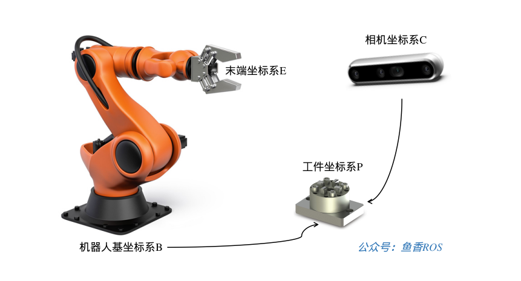
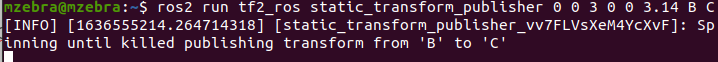
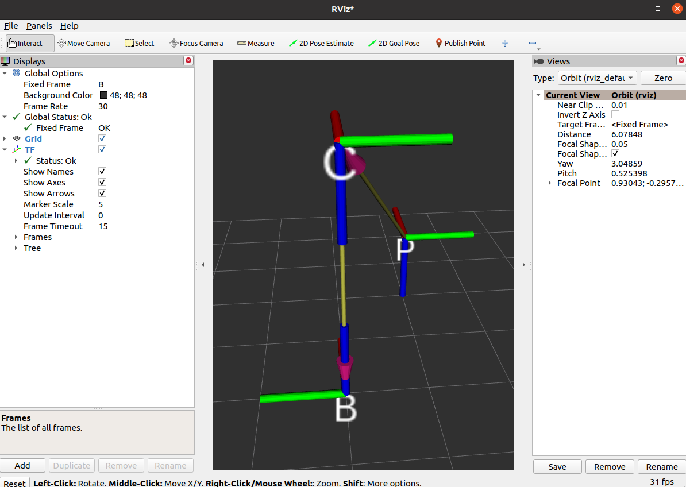
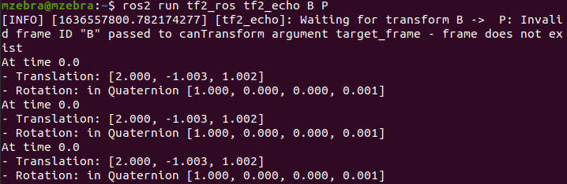

# 7.2.2动手学空间姿态描述与变换

大家好，我是小鱼，上一节我们学习了坐标的描述和坐标变换，本节课我们把重点放到动手实现上，通过numpy实现坐标的描述和变换，同时结合ROS2鱼RVIZ进行坐标关系可视化与求解。

通过本节你将掌握：
- 使用numpy表示位置矢量和旋转矩阵
- 使用numpy进行平移与旋转坐标变换
- 了解ROS2中TF2的概念
- 掌握tf2相关CLI工具进行坐标变换
- 掌握python操作TF进行坐标变换

## 1.numpy表示位姿

在前几节中，小鱼带你安装使用了ROS2和MiniConda，并学习使用Numpy进行矩阵相关运算的验证。

那我们如何使用numpy中的矩阵表示位置矢量和旋转矩阵呢？

### 1.1 位置表示

上一节中我们使用一个3行1列的矩阵表示了位置，那么我们在numpy中自然也可以使用这样一个矩阵表示。

打开终端，输入下面指令打开jupyter

```shell
jupyter-notebook
```

新建一个python3的代码并重命名，接着在单元格中导入numpy

```
import numpy as np
```


#### 1.1.1 位置矩阵

使用3*1的矩阵表示位置，我们新建一个沿着x、y、z各平移1个单位的位置矢量。

```
np.asarray([1.0,1.0,1.0]).reshape(3,1)
```


### 1.2 姿态表示

姿态可以使用`3*3`的旋转矩阵表示,`3*3`的单位矩阵代表没有姿态变换，注意没有姿态变换不是零矩阵，而是单位矩阵。

我们新建一个旋转矩阵，用该旋转矩阵表示绕着z轴旋转45度，可以这样写：

```
import math
import numpy as np
theta = math.radians(45)
R_AB = np.asarray([math.cos(theta),-math.sin(theta),0,
                   math.sin(theta),math.cos(theta),0,
                   0,0,1
                  ]).reshape(3,3)
print(R_AB)
```

运行后得到的旋转矩阵是不是和上节的一样


## 2.numpy坐标变换

掌握了使用numpy表示位置和姿态后，接着我们来使用numpy来完成上一节的小练习

### 2.1 题目

#### 如图🔓示，已知：



1.相机坐标系{C}为参考坐标系，工具坐标系{P}的位置矢量在相机坐标系{C}`x,y,z`各轴投影为$2,1,2$，并且工具坐标系和相机坐标系姿态相同。

2.机器人基坐标系{B}为参考坐标系，相机坐标系{C}在的位置矢量在{B}各轴的投影为$0,0,3$,坐标系{C}和绕着坐标系{B}的x轴转了180度

可以参考下图看题目


#### 求：

**{B}为参考坐标系，坐标系{P}的位置矢量和旋转矩阵**

### 2.2 使用numpy求解

#### 2.2.1 旋转矩阵求解

这里我们就需要使用复合坐标变换了，根据坐标变换规则有：
$$
^B_PR=^B_CR^C_PR
$$
{C}和{P}姿态相同，所以$^C_PR$是一个单位矩阵。又因为{C}绕着{B}的x旋转了180度，根据上节的重要公式2可知
$$
R(x,\theta)= \begin{bmatrix} 
1 & 0           &          0\\
0 & {cos\theta} & -sin\theta \\
0&{sin\theta} & cos\theta \\

\end{bmatrix} \tag{小鱼提示：重要方程2}
$$
所以$^B_CR$对应的程序可以这样写

```python
import math
import numpy as np
theta = math.radians(180)
R_BC = np.asarray([1,0,0,
                   0,math.cos(theta),-math.sin(theta),
                   0,math.sin(theta),math.cos(theta)]).reshape(3,3)
```

所以$^B_PR$可以用程序求得：

```
R_BP = R_BC*np.identity(3)
print("旋转矩阵R_BP：\n",R_BP)
```


#### 2.2.2 平移矩阵求解

根据复合变换规则可知：
$$
^B_PP=^B_CR^C_PP+^B_CP
$$
根据描述有：$^B_CP=[0,0,3]^T$、$^C_PP=[2,1,2]^T$

所以可以写这样写程序：

```python
P_BC = np.asarray([0,0,3]).reshape(3,1)
P_CP = np.asarray([2,1,2]).reshape(3,1)
P_BP = np.add(np.dot(R_BC,P_CP),P_BC)
print("位置矢量P_BP:\n",P_BP.T)
```

运行下，可以得到结果


### 2.3 结果对比

与上节课答案一致

位置矢量：$[2,-1,1]^T$

旋转矩阵：
$$\begin{bmatrix} 
1 & 0 & 0\\
0 & -1 & 0\\
0 &0 & -1\\
\end{bmatrix} \tag{小鱼提示：重要方程1}$$


大家好，我是小鱼，上一节我们学习了使用numpy表示位置和姿态，并使用了numpy来进行坐标变换，本节课我们直接使用ROS2中的TF工具不写一行代码进行坐标，同时我们还可以使用RVIZ2进行直观的查看坐标关系。

## 3.tf2介绍
TF即`变换`的英文单词`TransForm`的缩写，后面的2是版本编号。所以`ROS`和`ROS2`中的`TF`就是指和坐标变换相关的工具。

> 在搞机器人当中，坐标变换经常用到，所以`ROS2`帮我们做了一个强大易用的TF工具

### 3.1 发布坐标关系

我们先使用TF2的相关工具，解决上一节的手眼坐标转换问题，直观的感受一下TF2的强大。

要想让TF帮我们完成坐标变换，我们就需要告诉它坐标和坐标之间的关系。


拿上面的手眼系统来说，我们要想获取到相机的基坐标系{B}和工具{P}之间的关系，只需要将机械臂和相机、相机和工具之间的关系即可

#### 我们如何告诉TF？

可以使用tf的坐标广播工具进行广播坐标关系，广播时需要三个数据：
- 父坐标系名称（字符串）
- 子坐标系名称（字符串）
- 父子之间的变换关系（平移关系和旋转关系）

比如针对上面的手眼转换，广播机械臂坐标系{B}和相机坐标系{C}之间的关系。

父坐标系的名字就是B,子坐标系的名字是C，父子之间的平移关系是`0 0 3`,旋转关系是绕x轴旋转180度

在ROS2中可以使用下面的指令发布变换，打开终端，输入下面的指令：

```
ros2 run tf2_ros static_transform_publisher 0 0 3 0 0 3.14 B C
```
如果在终端中看到下面的提示则代表发布成功



使用TF发布位置和姿态时，位置的描述使用的是xyz三个参数，而姿态的描述则分两种，第一种是四元数形式，第二种是欧拉角形式，我们这里采用的是欧拉形式，绕x轴旋转采用欧拉角中的滚转角roll来描述(其余两个为：偏航角与俯仰角)，旋转180度则换算成弧度约为3.14，所以上述的姿态采用的描述为`0,0,3.14`


#### 发布C到P的位姿

接着我们发布坐标系{C}到坐标系{T}的位姿

再打开一个新的终端，输入下面的命令：

```
ros2 run tf2_ros static_transform_publisher 2 1 2 0 0 0 C P
```

### 3.2 可视化坐标变换
打开终端输入rviz2，打开rviz2，我们尝试在rviz2中直观的看到坐标之间的关系

#### 3.2.1 设置默认坐标系

刚打开RVIZ2，你看到的应该是这样一个界面

我们可以看到窗口左边的配置选项，全局选项默认选择的FixedFrame为map，这个map就是rviz2默认的坐标系的名字，动动脚趾头想一下我们并没有发布map这个坐标系，所以下面Global Status也是红色的错误。

此时我们可以手动的修改以下固定的Frame为B，让默认的坐标系设置成机械臂的基坐标系{B}


设置完成后，错误也没有了，因为此时的ROS2的TF中确确实实找到了一个叫做B的坐标系。

#### 3.2.2 添加TF插件
即使没有错误，现在我们还是看不到坐标系，这是为什么呢？在小鱼的动手学ROS2课程当中，小鱼讲过，RVIZ2是一个插件化的软件，所以我们要添加TF相关的插件才能看到TF数据。 

点击左下角的Add，在弹出的窗口中选择TF点击OK


之后你就在RVIZ2中可以看到下图的坐标关系


终于显示出来了，但是没有名字又太小了，修改下左边的选项，勾选Show Names，修改Marker Scale 为5



如果觉得视角不好，可以使用鼠标左键右键以及按下滚轮拖动修改。

### 3.3 监听/获取TF关系
发布也发布了，看也看了，接着我们就把坐标系之间的关系打印出来，只要坐标系之间是有连接的，我们就可以使用TF求出来，使用下面的指令就可以得到机械臂基坐标系{B}和工具坐标系{P}之间的关系。

打开终端,输入命令：

```bash
ros2 run tf2_ros tf2_echo B P
```


可以看到终端中不断输出B和C之间的平移和旋转，平移采用的是xyz，基本正确，y和z的微小变换是因为我们发布变换中时旋转输入的是3.14并不精确。

至于旋转部分采用的是四元数表示，关于这部分姿态的表示，小鱼在第六节会讲，大家不必纠结。

除了使用TF获取关系外，ros2还提供很多工具来查看坐标之间的关系，大家可以在终端中输入下面的命令自行尝试
#### tf2_monitor
查看所有的发布者和频率。
```
ros2 run tf2_ros tf2_monitor 
Gathering data on all frames for 10 seconds...

RESULTS: for all Frames

Frames:
Frame: C, published by <no authority available>, Average Delay: 3001.98, Max Delay: 3001.98
Frame: P, published by <no authority available>, Average Delay: 741.497, Max Delay: 741.497
All Broadcasters:
Node: <no authority available> 5029.14 Hz, Average Delay: 1871.74 Max Delay: 3001.98


RESULTS: for all Frames
Frames:
Frame: C, published by <no authority available>, Average Delay: 3001.98, Max Delay: 3001.98
Frame: P, published by <no authority available>, Average Delay: 741.497, Max Delay: 741.497
All Broadcasters:
Node: <no authority available> 5029.14 Hz, Average Delay: 1871.74 Max Delay: 3001.98


```

#### view_frames.py
可以生成TF的pdf，目前也有在线的实时查看工具。
```
ros2 run tf2_tools view_frames.py 
[INFO] [1636558316.667894410] [view_frames]: Listening to tf data during 5 seconds...
[INFO] [1636558321.702280144] [view_frames]: Generating graph in frames.pdf file...
[INFO] [1636558321.709904442] [view_frames]: Result:tf2_msgs.srv.FrameGraph_Response(frame_yaml="C: \n  parent: 'B'\n  broadcaster: 'default_authority'\n  rate: 10000.000\n  most_recent_transform: 0.000000\n  oldest_transform: 0.000000\n  buffer_length: 0.000\nP: \n  parent: 'C'\n  broadcaster: 'default_authority'\n  rate: 10000.000\n  most_recent_transform: 0.000000\n  oldest_transform: 0.000000\n  buffer_length: 0.000\n")
/opt/ros/foxy/lib/tf2_tools/view_frames.py:75: YAMLLoadWarning: calling yaml.load() without Loader=... is deprecated, as the default Loader is unsafe. Please read https://msg.pyyaml.org/load for full details.
  data = yaml.load(result.frame_yaml)

```


除了使用命令行进行坐标关系广播和监听，我们还可以使用代码来广播和监听，下一节小鱼就带你一起用程序来发布TF广播和获取坐标关系。


## 4.python操作tf2坐标变换
运行前面安装的jupyter，我们尝试使用代码来操作tf

在开始之前，我们总结下TF相关的操作有哪些？
- 广播（TransformBroadcaster）：将坐标系鱼坐标系之间的位姿态关系发布出去
- 监听（TransformListener）：获取坐标系和坐标之间的位姿关系
- TF(坐标变换TransformStamped)帧：广播出去的一组数据可以称作一个TF帧，包含父坐标系名称、子坐标系名称，父坐标系和子坐标系之间的关系

接着我们就可以编写代码来实现上面对TF帧的发布和监听。

### 4.1 坐标变换广播

在进行坐标变换广播前，我们根据两个坐标系之间的关系是否会随着时间变化分出以下两种情况：
1. 坐标系之间的关系不随时间推移而改变，称之为静态坐标变换，需要使用静态广播发布器（StaticTransformBroadcaster）发布。比如：机器人的两个轮子之间关系，可以认为随时间的变换其相对位置不变。
2. 坐标系之间的关系随时间的推移而改变，称之为（动态）坐标变换，使用广播发布器（TransformBroadcaster）发布坐标关系。比如机器人在世界坐标系中的位置，因为机器人会动。

我们依然使用手眼系统为例，尝试使用广播发布器来发布坐标系之间的关系。
在手眼系统中，机械臂基座和相机坐标系之间的位置是固定不变的，我们可以通过静态广播发布器来发布，而相机坐标系下工件的位置是实时识别得到的，其值会随时间变换，故我们用广播发布器来发布。

#### 4.1.1 静态广播发布器

在jupyter中输入并运行以下程序，使用方式就像ros2的话题发布，只不过不需要指名发布的话题（发布到系统的TF树上）。


> 原程序地址：[tf2_static_tf_publish.ipynb](https://fishros.com/d2lros2foxy/chapt7/7.2.2%E5%8A%A8%E6%89%8B%E5%AD%A6%E7%A9%BA%E9%97%B4%E5%A7%BF%E6%80%81%E6%8F%8F%E8%BF%B0/code/tf2_static_tf_publish.ipynb)

这里四元数的值需要通过在线的坐标转换获取，选择角度，绕x轴旋转`180`，上面就是对应的四元数，`x,y,z,w`为`1,0,0,0`


最后通过坐标监听工具可以查找出B和C之间的关系：


> 注意这里输出的At time 0.0 代表任意时刻

#### 4.1.2 广播发布器

接着我们来使用广播发布器发布C和工具P之间的关系平移：` x:2 y:1 z:2  ` 旋转:`qx:0 qy:0 qz:0 qw:1`

只需要将上面的静态广播发布器改为广播发布器，但需要注意的是,发布坐标变换时要以一定的频率实时发布，这样当我们获取坐标时才能获取到当前时刻的坐标（有点不好理解，就是坐标关系和时间有关系）。


> 原程序地址：[tf2_tf_publish.ipynb](https://fishros.com/d2lros2foxy/chapt7/7.2.2%E5%8A%A8%E6%89%8B%E5%AD%A6%E7%A9%BA%E9%97%B4%E5%A7%BF%E6%80%81%E6%8F%8F%E8%BF%B0/code/tf2_tf_publish.ipynb)


同样也可以使用命令行获取到C和P之间关系。


也可以通过命令行获取到B和P之间关系，完成手眼转换


> 注意这里的结果中的时间：At time 1637494822.281105208.代表具体的某一个时刻，不同时刻坐标之间的平移和旋转可以不同

### 4.2 坐标变换监听

所谓坐标变换监听就是通过监听整个系统的坐标变换关系.

通过`TransformListener`即可获取到整个`tf`系统中窗口大小为10s的坐标关系，并且我们创建了一个`buffer`，`TransformListener`会把收到的坐标关系放入`buffer`中，我们后面就可以通过`buffer`的`lookup_transform()`函数获取到坐标之间的关系。


> 原程序地址：[tf2_tf_listener.ipynb](https://fishros.com/d2lros2foxy/chapt7/7.2.2%E5%8A%A8%E6%89%8B%E5%AD%A6%E7%A9%BA%E9%97%B4%E5%A7%BF%E6%80%81%E6%8F%8F%E8%BF%B0/code/tf2_tf_listener.ipynb)


可以看到最终打印的结果和我们上面用命令行和numpy计算结果一致。

--------------

技术交流&&问题求助：

- **微信公众号及交流群：鱼香ROS**
- **小鱼微信：AiIotRobot**
- **QQ交流群：139707339**
- 版权保护：已加入“维权骑士”（rightknights.com）的版权保护计划
