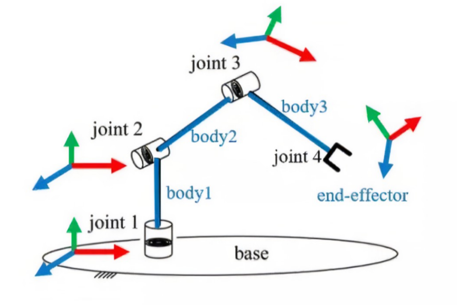
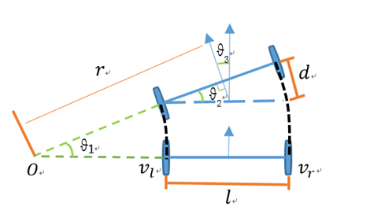

## 机器人运动学介绍

机器人学是一个非常庞大的学科，凡是和机器人设计应用相关的都可以划分到机器人学中，主要有运动学和动力学、系统结构、感知传感技术、运动规划技术、决策技术等。

为了方便后面的机器人建模和仿真，本节我们对机器人的运动学进行简单的介绍和学习。

## 1.机器人运动学

机器人运动学研究机器人的位姿关系，主要包含正向运动学和逆向运动学两类。

正向运动学即给定机器人各关节变量，计算机器人末端的位置姿态；比如上节课我们已知机器人关节和关节之间的关系，求关节1和关节3之间的关系

逆向运动学即已知机器人末端的位置姿态，反求机器人的关节变量；比如当我们已知机器人关节1和关节3之间的关系，求关节关节1和关节2，关节2和关节3之间关系。

## 2.机械臂运动学介绍

正运动学：已知每个关节的角度，求末端的位姿

逆运动学：已知末端姿态，求每一个关节的角度

## 3.两轮差速底盘运动学介绍

### 3.1 正逆解

正运动学：已知两个轮子的速度，求整车的角速度和线速度

逆运动学：已知目标角速度和线速度，求两个轮子的速度

### 3.2里程计

里程计计算：

里程计可以通过对机器人的角速度进行积分得到角度，对线速度积分得到距离，之后对距离分解的出x和y上的分量。

--------------

技术交流&&问题求助：

- **微信公众号及交流群：鱼香ROS**
- **小鱼微信：AiIotRobot**
- **QQ交流群：139707339**

- 版权保护：已加入“维权骑士”（rightknights.com）的版权保护计划
