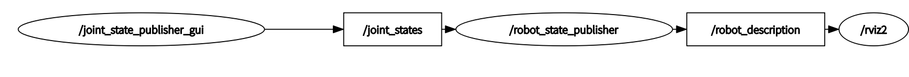

# 8.4 控制移动机器人轮子运动

我是小鱼,本节我们来看看如何手动的发送`joint_states`来控制机器人轮子连续转动


要实现上图效果，我们需要自己编写节点,取代`joint_state_publisher`发送关节位姿给`robot_state_pubsher`，robot_state_publisher发送tf控制机器人的关节转动。



1.新建节点

2.创建发布者

3.编写发布逻辑

4.编译测试

## 1.新建节点

方便起见，我们就在`fishbot_describle`包中新建节点（参考李四节点代码）

```

```

配置以下setup.py

```

```


## 2.创建发布者

创建发布者之前，要知道`robot_state_pubsher`所订阅的话题类型是什么？

回忆前面章节中学习的内容，我们可以采用如下指令查看

```
ros2 topic info /joint_states
```

接着

```
ros2 interfaces show 
```

知道了话题类型，我们就可以来创建发布者了

```

```


## 3.编写发布逻辑

创建好发布者，我们想让话题按照某个固定的速度进行发布，可以采用ROS2中的定时神器Rate,不清楚Rate的小伙伴可以看看小鱼的这篇文章：

接着我们来构造发布的数据：

joint_states有

```

```

对应的含义为：

```

```

>  单个轮子的转速 = (当前的位置-上一时刻位置）/ 两个时间之间的间隔

所以最终有如下代码：

```

```


## 4.编译测试


编译程序

```
colcon build
```
此时运行关节数据发布节点

```
ros2 run 
```

测试之前还需要修改下`display_rviz2.launch.py`文件，注释其`joint_state_publisher`节点

```

```

先运行rviz和robot_state_publisher

```
source install/setup.bash
ros2 launch fishbot_description display_rviz2.launch.py
```

观察此时rviz界面


--------------

技术交流&&问题求助：

- **微信公众号及交流群：鱼香ROS**
- **小鱼微信：AiIotRobot**
- **QQ交流群：139707339**

- 版权保护：已加入“维权骑士”（rightknights.com）的版权保护计划
