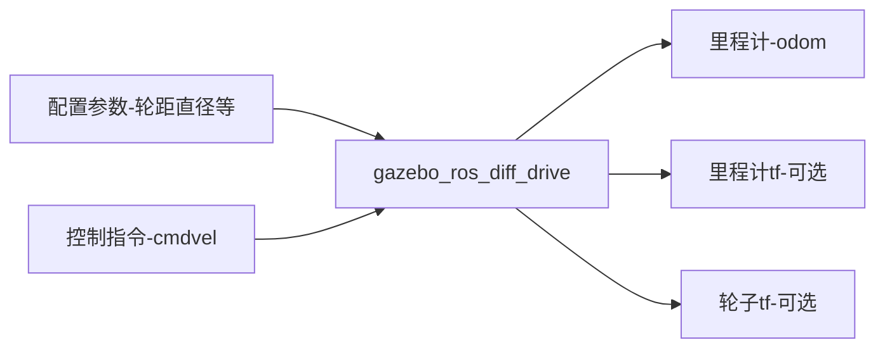
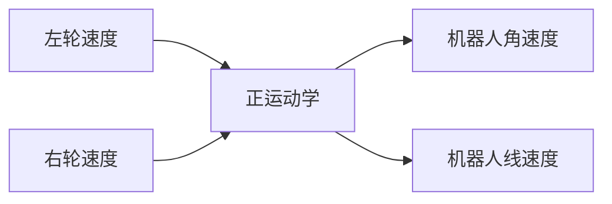
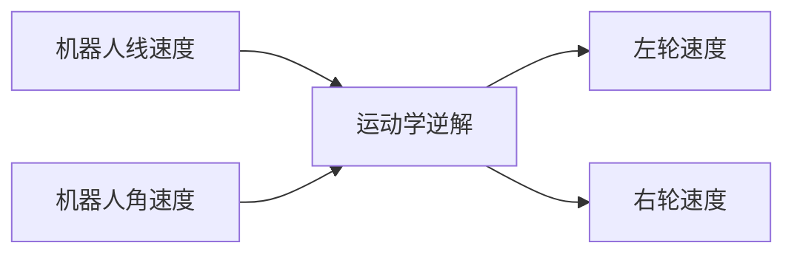

# 9.3为FishBot配置两轮差速控制插件

小鱼又来了，完成了上节课的Gazebo加载FishBot，但是机器人还是不会动，你一定很不开心吧，本节课小鱼就带你一起通过配置两轮差速控制插件，让我们的机器人动起来~

最终效果：

此处缺少一个动图，哪位鱼粉可以贡献一个

## 1. Gazebo插件介绍

之前小鱼说过Gazebo是一个独立于ROS的软件，对外提供了丰富的API可以使用，gazebo的插件按照用途大致可以分为两种：

1. **用于控制的插件**，通过插件可以控制机器人关节运动，可以进行位置、速度、力的控制，比如我们这节课的两轮差速控制器。
2. **用于数据采集的插件**，比如IMU传感器用于采集机器人的惯性，激光雷达用于采集机器人周围的点云信息。

当然上面两类插件功能也可以写到一个插件里，两轮差速插件就是一个二合一加强版。

## 2.两轮差速插件介绍

两轮差速插件用于控制机器人轮子关节的位置变化，同时该插件还会获取轮子的位置以及速度的信息的反馈，根据反馈的位置信息结合运动学模型即可计算出当前机器人的位姿（里程计）。

> 该插件的名称为：gazebo_ros_diff_drive
>
> 源码地址：https://github.com/ros-simulation/gazebo_ros_pkgs/blob/foxy/gazebo_plugins/src/gazebo_ros_diff_drive.cpp

要想快速了解一个系统的功能，最直接的就是看系统的对外的输入和输出是什么？什么都不要说，看下图：

上图就是对gazebo_ros_diff_drive的输入和输出信息的总结，可以很直观的看到该插件主要**输入控制指令**，主要**输出里程计信息**。接着小鱼带你分别认识一下输入和输出两个部分。

### 2.2 输入参数

#### 2.2.1 配置参数

不知道你是否还记得在第七章中，小鱼对两轮差速底盘的运动学正的介绍，小鱼再带你一起回顾一下：

两轮差速运动学一共分为三个部分：

1. 运动学正解

2. 运动学逆解

3. 里程计推算
   

#### 2.2.2 控制指令

### 2.3 输出参数

#### 2.3.1 里程计

#### 2.3.2 TF变换信息

#### 2.3.3 joint-states

--------------

技术交流&&问题求助：

- **微信公众号及交流群：鱼香ROS**
- **小鱼微信：AiIotRobot**
- **QQ交流群：139707339**

- 版权保护：已加入“维权骑士”（rightknights.com）的版权保护计划
