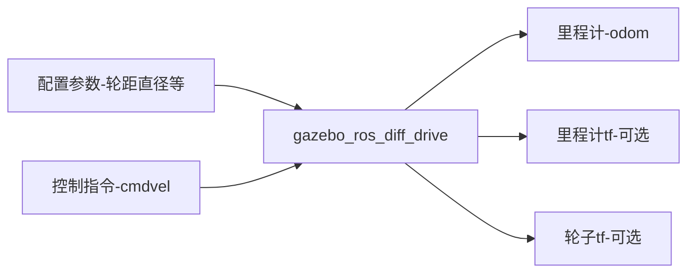

# 9.3为FishBot配置两轮差速控制插件

小鱼又来了，完成了上节课的Gazebo加载FishBot，但是机器人还是不会动，你一定很不开心吧，本节课小鱼就带你一起通过配置两轮差速控制插件，让我们的机器人动起来~

最终效果：

此处缺少一个动图，哪位鱼粉可以贡献一个


## 1. Gazebo插件介绍

之前小鱼说过Gazebo是一个独立于ROS的软件，对外提供了丰富的API可以使用，gazebo的插件按照用途大致可以分为两种：

1. **用于控制的插件**，通过插件可以控制机器人关节运动，可以进行位置、速度、力的控制，比如我们这节课的两轮差速控制器。
2. **用于数据采集的插件**，比如IMU传感器用于采集机器人的惯性，激光雷达用于采集机器人周围的点云信息。

当然上面两类插件功能也可以写到一个插件里，两轮差速插件就是一个二合一加强版。

## 2.两轮差速插件介绍

两轮差速插件用于控制机器人轮子关节的位置变化，同时该插件还会获取轮子的位置以及速度的信息的反馈，根据反馈的位置信息结合运动学模型即可计算出当前机器人的位姿（里程计）。

> 该插件的名称为：gazebo_ros_diff_drive
>
> 源码地址：https://github.com/ros-simulation/gazebo_ros_pkgs/blob/foxy/gazebo_plugins/src/gazebo_ros_diff_drive.cpp

**两轮差速控制器和Gazebo的关系**

两轮差速控制器可以将轮子的目标转速发送给Gazebo，并从Gazebo获取到实际的速度和位置。

> 注意：发送给Gazebo是目标速度，反馈回来的是实际速度。目标!=实际，比如轮子卡住了，无论你发什么目标速度，实际速度都是0。

要想快速了解一个系统的功能，最直接的就是看系统的对外的输入和输出是什么？什么都不要说，看下图：



上图就是对gazebo_ros_diff_drive的输入和输出信息的总结，可以很直观的看到该插件主要**输入控制指令**，主要**输出里程计信息**。接着小鱼带你分别认识一下输入和输出两个部分。

### 2.2 输入参数

#### 2.2.1 配置参数

不知道你是否还记得在第七章中，小鱼对两轮差速底盘的运动学正的介绍。如果要完成底盘的正逆解和里程计的推算就必须要知道轮子的直径和间距。

同时该插件还提供了一些可以控制输出的选项，因为是仿真，所以还要告诉插件轮子对应的joint名称等信息，这样就有了下面这个参数表格：

| 配置项                 | 含义                                    |
| ---------------------- | --------------------------------------- |
| ros                    | ros相关配置，包含命名空间和话题重映射等 |
| update_rate            | 数据更新速率                            |
| left_joint             | 左轮关节名称                            |
| right_joint            | 右轮关节名称                            |
| wheel_separation       | 左右轮子的间距                          |
| wheel_diameter         | 轮子的直径                              |
| max_wheel_torque       | 轮子最大的力矩                          |
| max_wheel_acceleration | 轮子最大的加速度                        |
| publish_odom           | 是否发布里程计                          |
| publish_odom_tf        | 是否发布里程计的tf开关                  |
| publish_wheel_tf       | 是否发布轮子的tf数据开关                |
| odometry_frame         | 里程计的framed ID，最终体现在话题和TF上 |
| robot_base_frame       | 机器人的基础frame的ID                   |

#### 2.2.2 控制指令

两轮差速控制器默认通过订阅话题`cmd_vel`来获取目标线速度和角速度。该话题的类型为：`geometry_msgs/msg/Twist`

我们通过ros2的CLI来看一下这个消息包含的内容有哪些？

```
ros2 interface show geometry_msgs/msg/Twist
```

```
# This expresses velocity in free space broken into its linear and angular parts.

Vector3  linear
Vector3  angular
```

可以看到包含线速度和角速度，我们用proto在看一下包含的基本数据类型有哪些？

```
ros2 interface proto geometry_msgs/msg/Twist
```

```
"linear:
  x: 0.0
  y: 0.0
  z: 0.0
angular:
  x: 0.0
  y: 0.0
  z: 0.0
"
```

线速度和角速度都包含在x、y、z，代表坐标系的三个方向上的对应速度。

两轮差速控制器收到这个话题数据后将其中的角速度和线速度转换上两个轮子的转动速度发送给Gazebo。

### 2.3 输出参数

#### 2.3.1 里程计

里程计信息默认的输出话题为`odom`，其消息类型为：`nav_msgs/msg/Odometry`

同样的使用CLI看一下其消息的组成结构：

```
ros2 interface show nav_msgs/msg/Odometry
```

```
# This represents an estimate of a position and velocity in free space.
# The pose in this message should be specified in the coordinate frame given by header.frame_id
# The twist in this message should be specified in the coordinate frame given by the child_frame_id

# Includes the frame id of the pose parent.
std_msgs/Header header

# Frame id the pose points to. The twist is in this coordinate frame.
string child_frame_id

# Estimated pose that is typically relative to a fixed world frame.
geometry_msgs/PoseWithCovariance pose

# Estimated linear and angular velocity relative to child_frame_id.
geometry_msgs/TwistWithCovariance twist

```

```
ros2 interface proto nav_msgs/msg/Odometry
```

```
"header:
  stamp:
    sec: 0
    nanosec: 0
  frame_id: ''
child_frame_id: ''
pose:
  pose:
    position:
      x: 0.0
      y: 0.0
      z: 0.0
    orientation:
      x: 0.0
      y: 0.0
      z: 0.0
      w: 1.0
  covariance:
  - 0.0
  - 0.0
    ...
twist:
  twist:
    linear:
      x: 0.0
      y: 0.0
      z: 0.0
    angular:
      x: 0.0
      y: 0.0
      z: 0.0
  covariance:
  - 0.0
  - 0.0
	...
"
```

可以看到其数据主要包含三个部分：

- header，表示该消息发布的时间
- pose，表示当前机器人位置和朝向
- twist，表示当前机器人的线速度和角速度

> 数据中还包含一个covariance，其代表协方差矩阵，后面小鱼写篇文章来介绍下，这里只需了解其含义即可。

#### 2.3.2 里程计TF信息

设为true，订阅tf话题里你就可以看到像下面的msg，建议后面配置好后，手动修改下，对比区别

```
- header:
    stamp:
      sec: 6157
      nanosec: 907000000
    frame_id: odom
  child_frame_id: base_footprint
  transform:
    translation:
      x: 0.0005557960241049835
      y: -0.0007350446303238693
      z: 0.01599968753145574
    rotation:
      x: 4.691143395208505e-07
      y: 7.115496626557812e-06
      z: -0.018531475772549166
      w: 0.9998282774331005
```


#### 2.3.3 左右轮子TF信息

设为true，订阅tf话题里你就可以看到像下面的msg，建议后面配置好后，手动修改下，对比区别

```
- header:
    stamp:
      sec: 6157
      nanosec: 941000000
    frame_id: base_link
  child_frame_id: left_wheel_link
  transform:
    translation:
      x: -0.02
      y: 0.1
      z: -0.06
    rotation:
      x: 0.0
      y: 0.049519025127821005
      z: 0.0
      w: 0.9987731805321918
- header:
    stamp:
      sec: 6157
      nanosec: 941000000
    frame_id: base_link
  child_frame_id: right_wheel_link
  transform:
    translation:
      x: -0.02
      y: -0.1
      z: -0.06
    rotation:
      x: 0.0
      y: -0.0663387077034509
      z: 0.0
      w: 0.9977971616817898
```

## 3.在URDF中配置两轮差速模型

上面该介绍的我们都给介绍了，接着我们直接来配置。

因为是给Gazebo的插件，所以在`URDF`中，我们需要使用`<gazebo>`进行配置，因为是要给`gazebo`配置插件，所有要在`gazebo`标签下添加`plugin`子插件。

话不多说，上代码

```
  <gazebo>
    <plugin name='diff_drive' filename='libgazebo_ros_diff_drive.so'>
          <ros>
            <namespace>/</namespace>
            <remapping>cmd_vel:=cmd_vel</remapping>
            <remapping>odom:=odom</remapping>
          </ros>
          <update_rate>30</update_rate>
          <!-- wheels -->
          <left_joint>left_wheel_joint</left_joint>
          <right_joint>right_wheel_joint</right_joint>
          <!-- kinematics -->
          <wheel_separation>0.2</wheel_separation>
          <wheel_diameter>0.065</wheel_diameter>
          <!-- limits -->
          <max_wheel_torque>20</max_wheel_torque>
          <max_wheel_acceleration>1.0</max_wheel_acceleration>
          <!-- output -->
          <publish_odom>true</publish_odom>
          <publish_odom_tf>true</publish_odom_tf>
          <publish_wheel_tf>false</publish_wheel_tf>
          <odometry_frame>odom</odometry_frame>
          <robot_base_frame>base_footprint</robot_base_frame>
      </plugin>
```

将这段代码加到我们的URDF中，然后对着上面小鱼介绍的配置项，一一看下，接着我们就可以来测试运行了。


--------------

技术交流&&问题求助：

- **微信公众号及交流群：鱼香ROS**
- **小鱼微信：AiIotRobot**
- **QQ交流群：139707339**

- 版权保护：已加入“维权骑士”（rightknights.com）的版权保护计划
