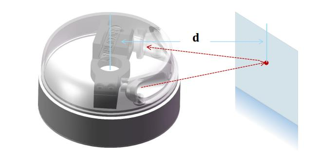
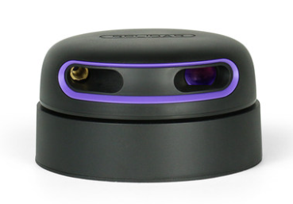
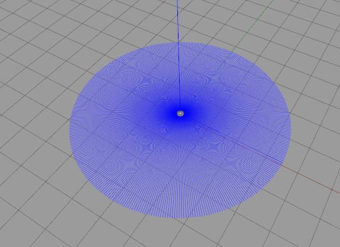

# 9.5为FishBot添加添加激光雷达传感器

本节我们来认识一个新的传感器，该传感器在自动驾驶、室内导航等应用非常多，比如扫地机器人上就是用的它作为感知环境的重要工具，该传感器是激光雷达。

## 1.激光雷达介绍

激光雷达（Light Detection And Ranging）,缩写`LiDAR`，翻译一下叫——激光探测与测距。

### 1.1 激光雷达原理介绍

激光雷达的原理也很简单，就像蝙蝠的定位方法一样，蝙蝠定位大家都知道吧，像下面这样子的回声定位。


普通的单线激光雷达一般有一个发射器，一个接收器，发射器发出激光射线到前方的目标上，物品会将激光反射回来，然后激光雷达的接受器可以检测到反射的激光。



通过计算发送和反馈之间的时间间隔，乘上激光的速度，就可以计算出激光飞行的距离，该计算方法成为TOF（飞行时间法Time of flight，也称时差法）。

除了TOF之外还有其他方法进行测距，比如三角法，这里就不拓展了放一篇文章，大家自行阅读。

- [激光三角测距原理详述](https://www.slamtec.com/cn/News/Detail/190)

目前市面上的激光雷达，几乎都是采用三角测距，比如思岚的：


**需要注意的是虽然只有一个发射器和一个接受器，激光雷达通过电机可以进行旋转，这样就可以达到对周围环境360度测距的目的。**

### 1.2 激光雷达大赏

五位数的长这样


四位数的长这样



三位数的长这样


两位数的长这样


不要钱的长这样

仿真的，不要钱


## 2.Gazebo激光雷达插件

因为激光雷达是属于射线类传感器，该类传感在在Gazebo插件中都被封装成了一个动态库`libgazebo_ros_ray_sensor.so`。

接着我们来看看LiDAR的话题消息接口`sensor_msgs/msg/LaserScan`。

```
ros2 interface show  sensor_msgs/msg/LaserScan
```

```
# Single scan from a planar laser range-finder
#
# If you have another ranging device with different behavior (e.g. a sonar
# array), please find or create a different message, since applications
# will make fairly laser-specific assumptions about this data

std_msgs/Header header # timestamp in the header is the acquisition time of
                             # the first ray in the scan.
                             #
                             # in frame frame_id, angles are measured around
                             # the positive Z axis (counterclockwise, if Z is up)
                             # with zero angle being forward along the x axis

float32 angle_min            # start angle of the scan [rad]
float32 angle_max            # end angle of the scan [rad]
float32 angle_increment      # angular distance between measurements [rad]

float32 time_increment       # time between measurements [seconds] - if your scanner
                             # is moving, this will be used in interpolating position
                             # of 3d points
float32 scan_time            # time between scans [seconds]

float32 range_min            # minimum range value [m]
float32 range_max            # maximum range value [m]

float32[] ranges             # range data [m]
                             # (Note: values < range_min or > range_max should be discarded)
float32[] intensities        # intensity data [device-specific units].  If your
                             # device does not provide intensities, please leave
                             # the array empty.
```

雷达的数据结构有些复杂，但通过注释和名字相信你可以看的七七八八，看不懂也没关系，一般情况下我们不会直接的对雷达的数据做操作。小鱼这里也就先skip。

## 3.为FishBot添加雷达插件

有了前面的经验，我们需要在URDF添加以下内容即可

```xml
  <gazebo reference="laser_link">
      <sensor name="laser_sensor" type="ray">
      <always_on>true</always_on>
      <visualize>true</visualize>
      <update_rate>5</update_rate>
      <pose>0 0 0.075 0 0 0</pose>
      <ray>
          <scan>
            <horizontal>
              <samples>360</samples>
              <resolution>1.000000</resolution>
              <min_angle>0.000000</min_angle>
              <max_angle>6.280000</max_angle>
            </horizontal>
          </scan>
          <range>
            <min>0.120000</min>
            <max>3.5</max>
            <resolution>0.015000</resolution>
          </range>
          <noise>
            <type>gaussian</type>
            <mean>0.0</mean>
            <stddev>0.01</stddev>
          </noise>
      </ray>

      <plugin name="laserscan" filename="libgazebo_ros_ray_sensor.so">
        <ros>
          <remapping>~/out:=scan</remapping>
        </ros>
        <output_type>sensor_msgs/LaserScan</output_type>
        <frame_name>laser_link</frame_name>
      </plugin>
      </sensor>
    </gazebo>
```

可以看到:

1. 雷达也可以设置更新频率`update_rate`，这里设置为5
2. 雷达可以设置分辨率，设置为1，采样数量360个，最终生成的点云数量就是360
3. 雷达也有噪声，模型为`gaussian`
4. 雷达有扫描范围`range`，这里配置成0.12-3.5，0.015分辨率
5. 雷达的`pose`就是雷达的joint中位置的设置值

## 4.编译测试


编译

```shell
colcon build
```

运行

```
ros2 launch fishbot_description gazebo.launch.py
```



CLI看话题

```
ros2 topic list
ros2 topic info /scan
```

```
ros2 topic echo /scan
```

接着我们尝试使用rviz2进行可视化激光雷达数据

添加和修改RVIZ2的如下：（通过LaserScan插件可以看到激光数据）


相信你改完之后依然是看不到任何激光雷达的数据的，反看topic的echo出来的数据，不是0就是inf(无限大)，再看看gazebo你会发现，激光雷达并没有达到任何一个物体上。


所以我们可以手动的给激光雷达周围添加一下东西，点击Gazebo工具栏的正方体，圆球或者圆柱，随意放置几个到我们激光雷达的最大扫描半径内。


接着我们再看一下RVIZ2，这里小鱼把size改大了10倍0.01->0.1。


## 5.总结

到这里我们就把fishbot的各个传感器都仿真出来了，第九章的内容也暂且告一段落，迎接我们的是第十章，也就是fishbot的导航仿真，nav2了。

如果你想先本教程一步学习Nav2，可以到[nav2中文网](http://dev.nav2.fishros.com/)哦～

--------------

技术交流&&问题求助：

- **微信公众号及交流群：鱼香ROS**
- **小鱼微信：AiIotRobot**
- **QQ交流群：139707339**

- 版权保护：已加入“维权骑士”（rightknights.com）的版权保护计划
