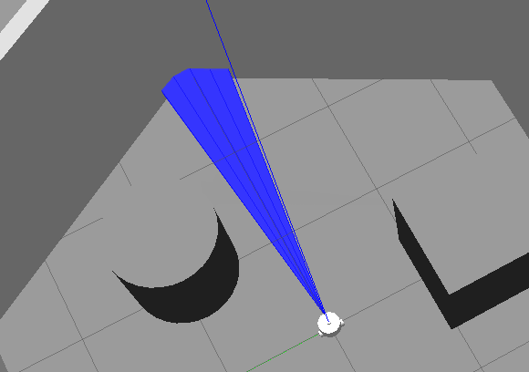

# 9.6拓展:为Fishbot添加超声波传感器

本节是拓展章节，主要讲解一下如何给FishBot添加一个超声波传感器。

在实际的机器人开发过程中，我们可能会利用超声波传感器实现实时避障的功能，毕竟超声波的价格相较于激光雷达要便宜很多（便宜的几块钱）。

所以本节我们来说一下如何使用ROS2+Gazebo来仿真超声波传感器。


## 1.超声波传感器介绍

百科来一段：

超声波传感器是将超声波信号转换成其它能量信号（通常是电信号）的传感器。超声波是[振动频率](https://baike.baidu.com/item/振动频率/8068137)高于20kHz的机械波。它具有频率高、波长短、绕射现象小，特别是方向性好、能够成为[射线](https://baike.baidu.com/item/射线/327964)而定向传播等特点。超声波对液体、固体的穿透本领很大，尤其是在阳光不透明的固体中。超声波碰到杂质或分界面会产生显著反射形成反射回波，碰到活动物体能产生[多普勒效应](https://baike.baidu.com/item/多普勒效应/115710)。超声波传感器广泛应用在工业、国防、生物医学等方面。

接着看看长什么样子：


便宜的就长这样子，一共两个头，一个头用于发送波，一个头接收波。这个还稍微高级一点，带一个光敏电阻，可以为超声波数据做一些补偿。

超声波传感器原理是什么呢？

```
距离=(发送时间-接收时间)*速度/2
```

看了超声波的原理，你有没有发现和前面的激光雷达传感器是一样的，是的，所以超声波传感器插件和激光雷达传感器插件在Gazebo插件中是同一个：

```
libgazebo_ros_ray_sensor.so
```

## 2.超声波插件配置

直接上配置，接着再解释

### 2.1 添加超声波关节

超声波总要装在机器人身上某个位置，所以我们先添加一个关节和Joint，为了省事，link我们就只写个名字，你如果有需要可以按照前面的章节那样添加一下。

```xml
<link name="ultrasonic_sensor_link" />

  <joint name="ultrasonic_sensor_joint" type="fixed">
    <parent link="base_link"/>
    <child link="ultrasonic_sensor_link"/>
    <origin xyz="0.07 0.0 0.076" rpy="0 0 0"/>
  </joint>
```

### 2.2 添加Gazebo插件

添加完了关节，我们就可以配置gazebo的插件了，gazebo插件配置如下

```xml
  <gazebo reference="ultrasonic_sensor_link">
    <sensor type="ray" name="ultrasonic_sensor">
      <pose>0 0 0 0 0 0</pose>
      <!-- 是否可视化，gazebo里能不能看到 -->
      <visualize>true</visualize>
      <!-- 扫描速率，也就是数据更新速率 -->
      <update_rate>5</update_rate>
      <ray>
        <scan>
          <!-- 水平扫描的点数 -->
          <horizontal>
            <samples>5</samples>
            <resolution>1</resolution>
            <min_angle>-0.12</min_angle>
            <max_angle>0.12</max_angle>
          </horizontal>
          <!-- 垂直方向扫描的点数 -->
          <vertical>
            <samples>5</samples>
            <resolution>1</resolution>
            <min_angle>-0.01</min_angle>
            <max_angle>0.01</max_angle>
          </vertical>
        </scan>
        <!-- 超声波检测的范围和数据分辨率单位m -->
        <range>
          <min>0.02</min>
          <max>4</max>
          <resolution>0.01</resolution>
        </range>
        <!-- 数据噪声采用高斯噪声 -->
        <noise>
          <type>gaussian</type>
          <mean>0.0</mean>
          <stddev>0.01</stddev>
        </noise>
      </ray>
      <plugin name="ultrasonic_sensor_controller" filename="libgazebo_ros_ray_sensor.so">
        <ros>
          <!-- 重映射输出的话题名称 -->
          <remapping>~/out:=ultrasonic_sensor_1</remapping>
        </ros>
        <!-- 输出消息的类型，注意与雷达区分，这里是sensor_msgs/Range -->
        <output_type>sensor_msgs/Range</output_type>
        <!-- 射线类型，这里要写ultrasound，注意和雷达区分 -->
        <radiation_type>ultrasound</radiation_type>
        <!-- frame名称，填写link名称即可 -->
        <frame_name>ultrasonic_sensor_link</frame_name>
      </plugin>
    </sensor>
  </gazebo>
```

## 3.编译运行测试

### 3.1Gazebo可视化

添加完成后就可以编译测试下代码

```shell
colcon build --packages-select fishbot_description
source install/setup.bash
```

```shell
ros2 launch fishbot_description gazebo.launch.py
```

没有物体的前面可以放个东西，因为本节是后面补充的，所有小鱼这里有个墙。



### 3.2话题数据

打开终端，输入下面指令

```
ros2 topic list 
ros2 topic info /ultrasonic_sensor_1
ros2 topic echo /ultrasonic_sensor_1
```

不出意外可以看到下面的数据

```
header:
  stamp:
    sec: 4458
    nanosec: 1000000
  frame_id: ultrasonic_sensor_link
radiation_type: 0
field_of_view: 0.23999999463558197
min_range: 0.019999999552965164
max_range: 4.0
range: 2.6798219680786133
```

这里的range就是fishbot到墙之间的距离：2.67982

我们来讲一讲超声波传感器的数据类型`sensor_msgs/msg/Range`

```
# ros2 topic info /ultrasonic_sensor_1
Type: sensor_msgs/msg/Range
Publisher count: 1
Subscription count: 0
```

你可以使用`ros2 interface show  sensor_msgs/msg/Range`看到详细的解释，我们翻译一下

```

# Single range reading from an active ranger that emits energy and reports
# one range reading that is valid along an arc at the distance measured.
# This message is  not appropriate for laser scanners. See the LaserScan
# message if you are working with a laser scanner.
#
# This message also can represent a fixed-distance (binary) ranger.  This
# sensor will have min_range===max_range===distance of detection.
# These sensors follow REP 117 and will output -Inf if the object is detected
# and +Inf if the object is outside of the detection range.

std_msgs/Header header # timestamp in the header is the time the ranger
                             # returned the distance reading

# Radiation type enums
# If you want a value added to this list, send an email to the ros-users list
uint8 ULTRASOUND=0
uint8 INFRARED=1

uint8 radiation_type    # 传感器射线类型
                        # (sound, IR, etc) [enum]

float32 field_of_view   # 距离数据对应的弧[rad]的大小，测量物体的范围介于		 
    					# -field_of_view/2 到 field_of_view/2 之间。
                        # 0 角度对应于传感器的 x 轴。

float32 min_range       # 最小范围值 [m]
float32 max_range       # 最大范围值 [m]
                        #  固定距离需要 min_range==max_range

float32 range           # 范围数据 [m]
                        # (Note: values < range_min or > range_max should be discarded)
                        # Fixed distance rangers only output -Inf or +Inf.
                        # -Inf represents a detection within fixed distance.
                        # (Detection too close to the sensor to quantify)
                        # +Inf represents no detection within the fixed distance.
                        # (Object out of range)
```

结论，主要关注range就可以了。

### 3.3 在RVIZ2中可视化超声波数据

Add ->By topic->Range


## 4.总结

本节主要介绍了如何对超声波传感器进行仿真，在导航的过程中我们通常把超声波放到一个代价地图中进行停障等行为。所以学习其仿真还是很有用的。

--------------

技术交流&&问题求助：

- **微信公众号及交流群：鱼香ROS**
- **小鱼微信：AiIotRobot**
- **QQ交流群：139707339**

- 版权保护：已加入“维权骑士”（rightknights.com）的版权保护计划