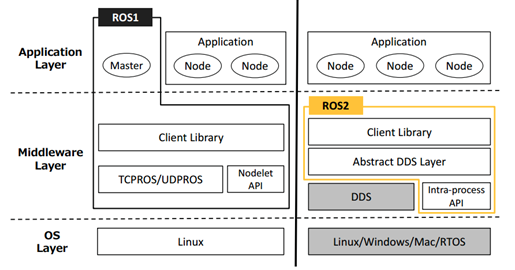

# 扩展阅读1：中间件

你好，我是小鱼，欢迎关注，本片文章属于动手学ROS2系列文章中扩展阅读的一篇，主要为大家讲解一下什么是中间件。

中间件的确听起来比较高达上，其实也挺高大上的。

## 1 What is 中间件？

**顾名思义**

中间件就是介于某两个或者多个节点中间的组件。

干嘛用的呢？

**就是提供多个节点中间通信用的。**

**官方解释就比较玄乎了：**

> 中间件是一种独立的系统软件或服务程序，分布式应用软件借助这种软件在不同的技术之间共享资源。中间件位于客户机/ 服务器的操作系统之上，管理计算机资源和网络通讯。是连接两个独立应用程序或独立系统的软件。相连接的系统，即使它们具有不同的接口，但通过中间件相互之间仍能交换信息。执行中间件的一个关键途径是信息传递。通过中间件，应用程序可以工作于多平台或OS环境。

小鱼看完表示

## 2 ROS中的中间件和ROS2中的中间件有和不同？

答：长的不同

ROS/ROS2中间件对比

> 此图来自论文Exploring the Performance of ROS2，小鱼已经收录到了公众号

ROS1的中间件是ROS组织自己基于TCP机制建立的，刚开始用起来还可以，但随着现在传感器的升级，数据量越来越大，原先的数据拷贝机制就不再适了，主要是使系统的开销大大增大。

这也是ROS2要解决的问题之一。

ROS2除了将进程间通信**intra-process**自己来做之外,其他部分的通信就使用DDS来实现（截止到foxy版本，fastdds已支持进程间通信），ROS2将DDS服务接口进行了一层抽象，保证了上层应用层调用接口的统一性。

同时ROS2终于干掉了Master节点。

去掉了master节点后，节点之间通信就非常的自由了，通过P2P节点发现协议，很方便的完成了连接和通信。

## 3 将ROS替换ROS2有什么好处？

系统稳定性提高了，在也不怕master删库跑路了

效率提高了，不用再因为降低性能被迫去ROS了

终于可以光明正大使用Python3了

好处太多太多....

......

