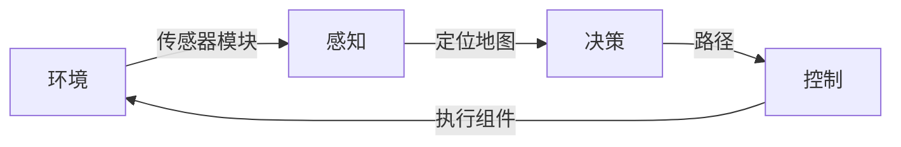

# 10.1 机器人自主导航技术概述

## 1.自主导航的目的

打开[Nav2中文网](https://nav2.fishros.com/),映入眼帘的第一句话是：

这个就是自主导航的目的，让我们的机器人自主的安全的从A点移动到B点。

那么对于机器人来说，就会遇到三个经典的问题：

1. 我在哪里？（A点的位置如何得到——定位）
2. 我到哪里去？（B点的位置如何表示——环境建模|地图）
3. 我该怎么去？（A到B点的安全路径如何获取，如何走——路径规划&控制）

## 2.如何实现自主导航

### 2.1 导航的三大组件

还记得在1.1章节中的机器人三大组件吗？感知决策和控制。

那对于移动机器人来说，这三大组件分别对应着：

| 名称 | 对应关系                               |
| ---- | -------------------------------------- |
| 感知 | 建图和定位                             |
| 决策 | 路径规划（全局路径规划、局部路径规划） |
| 规划 | 运动控制                               |

所以对于移动机器人来说，一个完整的导航系统就是由建图和定位、路径规划、运动控制这三部分组成。

### 2.2 三大组件之间的关系

三大组件之间有何关系？如何互相配合完成自主导航的呢？

小鱼再对上图做一个更详细的介绍，每组件分别对应的任务如下：

- 感知系统，通过机器人上或机器人外的传感器数据，完成对环境的感知，获取到机器人当前的位置（A）和完成对环境的建模（地图）。
- 决策系统，根据机器人当前的位置和地图中目标点的位置，结合地图中的障碍物信息，规划出一条无障碍的路径。
- 控制系统，根据决策系统给出的路径，控制电机（执行组件）完成路径的追踪，并在跟随时结合传感器信息完成障碍物的躲避。

## 3.自主导航案例

小鱼分享几个建图定位和决策控制的案例，帮助大家理解上述过程。

<iframe height="400" width="600" src="//player.bilibili.com/player.html?aid=377949564&bvid=BV1Ef4y1P7wt&cid=405507889&page=1" scrolling="no" border="0" frameborder="no" framespacing="0" allowfullscreen="false"> </iframe>

看完视频，一键三连后，我们再继续

视频中，小鱼先是用键盘控制机器人完成了建图，这一步其实就是感知中的建图环节（使用Cartographer实现），在建图的过程中其实也包含了机器人的定位。

建好地图将地图保存，接着启动Nav2,我们使用RVIZ2的工具给机器人一个目标点（B点），机器人自己规划出了一条路径，从A点移动到B点。这个过程就包含了决策和控制（使用Navigation2实现）。

## 4.总结

了解完了自主导航技术，接下来我们就一步步的在Fishbot上实现自主导航。

是不是很激动呀~

别着急，课后作业来了：

- 根据小鱼的这篇文章[TurtleBot3导航测试](https://blog.csdn.net/qq_27865227/article/details/120200888)体验建图导航（完不成也没关系，可以继续往下学习）

--------------

技术交流&&问题求助：

- **微信公众号及交流群：鱼香ROS**
- **小鱼微信：AiIotRobot**
- **QQ交流群：139707339**

- 版权保护：已加入“维权骑士”（rightknights.com）的版权保护计划
