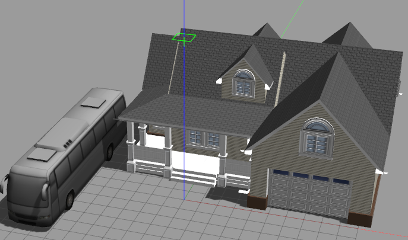
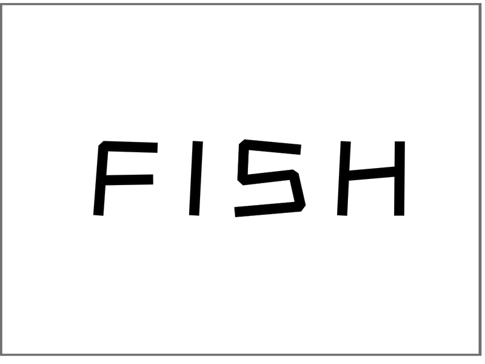
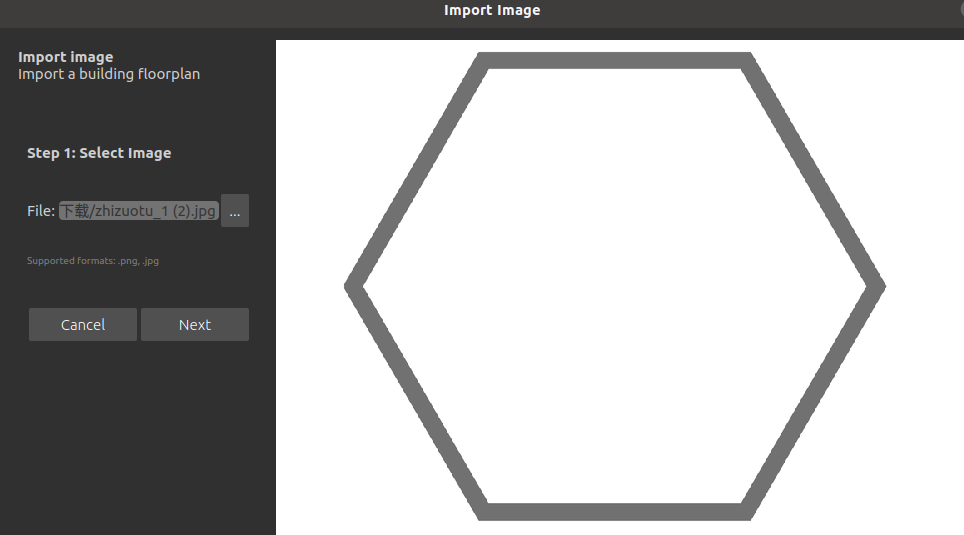
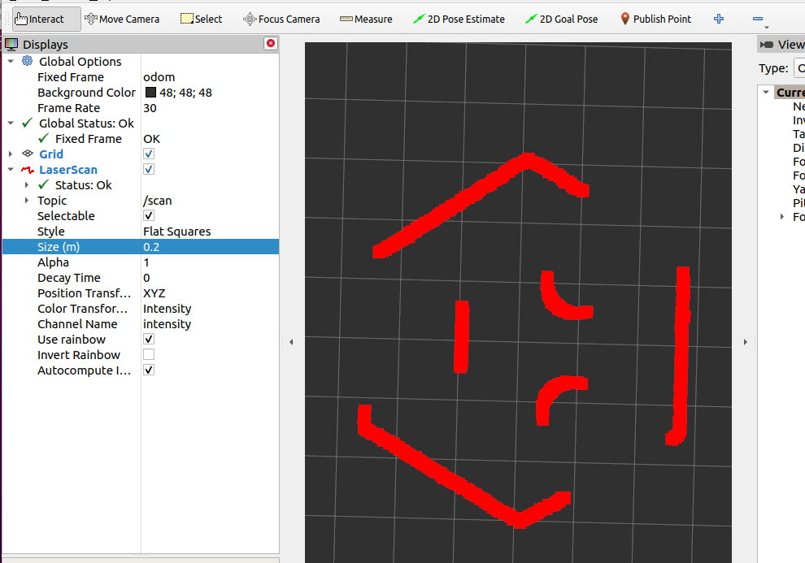
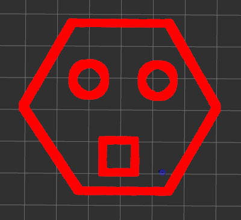

# 10.2 Gazebo仿真环境准备

上节，小鱼介绍了机器人的导航，其中我们知道导航三大组件通过传感器从环境中获取数据，接着又通过执行器作用于机器人以改变环境数据。

所以在开始进行SLAM导航进行导航之前，我们要在Gazebo中建立一个测试的环境，其实也很简单，利用Gazebo的画墙工具即可完成。


## 1. Gazebo的world介绍

world即世界，gazebo的world文件就是用于描述世界模型的，也就是环境模型。

Gazebo已经为我们准备了很多常用的物体模型，除了基础的圆球，圆柱，立方体外的，其实还有飞机、汽车、房子等你现实中无法拥有的。

但是一开始安装Gazebo的时候并不会帮你下载好这些模型，需要我们手动下载，万幸的是小鱼已经帮你封装成了一行代码下载指令，打开终端，复制粘贴下面这句

```shell
cd ~/.gazebo && wget https://gitee.com/ohhuo/scripts/raw/master/gazebo_model.py && python3 gazebo_model.py
```

然后等待脚本运行完成，当然也不用等它完成，因为一共有281个模型，是逐一下载并解压到`~/.gazebo/models/`目录的。

此时再次打开终端，输入`gazebo`，把选项卡切换到Insert


在Insert选项卡下可以看到一个目录，以及目录下的模型名称，随着下载脚本的不断下载，这里的模型会越来越多。

随手拖几个，搭建一个漂亮的环境出来~

每个成功的男人都有一辆车，小鱼也不例外



上面是Gazebo为我们准备好的开源模型，我们也可以通过Gazebo的工具来自己画一个环境。

## 2. 通过建墙工具建立world

Gazebo左上角->Edit->Building Editor

接着可以看到这样一个编辑界面


### 2.1 随手画墙

点击左边的Wall,你就可以在上方的白色区域进行建墙了。


建完后还可以用选Add Color或者Add Texture，然后点击下方墙，给墙添加颜色或者纹理。

### 2.2 从已有地图画墙

首先你要有一个地图，小鱼为你准备了两个，两个图片都是800*600像素的。




打开Gazebo->Gazebo左上角->Edit->Building Editor->左下方选Import


将上面两个图片存到本地，在这个界面选图片，记着选Next



左边选尺寸对应关系


我们选择默认的，100像素/米。点击OK（需要手动将100改变一下才能点击OK哦），之后就可以用图片画墙了。

**注意：导入完图片不会直接出来墙，图片只是提供了墙的大概位置，需要你手动用墙再将边描一遍。**


建完后点击File->Exit,在退出的弹框中选Exit。

接着在Gazebo界面中就可以看到墙了，我们再手动添加几个物体，就可以用于下面的导航使用了。


添加完，接着点击File->SaveWorld，将文件保存到我们的fishbot_descrption的world下。

> 没有world目录的小伙伴可以先手动创建下


点击右上角Sace，在文件夹就可以看到这个world文件


## 3.启动时加载world

### 3.1 命令行加载World

加载world其实也很简单，可以先启动Gazebo，再手动的加载文件，也可以在Gazebo启动时加载：

比如在前面加载ROS2插件基础上再加载fishbot.world。

```
gazebo --verbose  -s libgazebo_ros_init.so -s  libgazebo_ros_factory.so 你的world文件目录/fishbot.world
```

### 3.2 在launch中加载World

修改launch文件，将上面的命令行写到`gazebo.launch.py`中即可。

```python
    gazebo_world_path = os.path.join(pkg_share, 'world/fishbot.world')

    # Start Gazebo server
    start_gazebo_cmd = ExecuteProcess(
        cmd=['gazebo', '--verbose','-s', 'libgazebo_ros_init.so', '-s', 'libgazebo_ros_factory.so', gazebo_world_path],
        output='screen')
```

最后记得修改setup.py文件，让编译后将world文件拷贝到install目录下

添加一行

```
        (os.path.join('share', package_name, 'world'), glob('world/**')),
```

添加完后

```
    data_files=[
        ('share/ament_index/resource_index/packages',
            ['resource/' + package_name]),
        ('share/' + package_name, ['package.xml']),
        (os.path.join('share', package_name, 'launch'), glob('launch/*.launch.py')),
        (os.path.join('share', package_name, 'urdf'), glob('urdf/**')),
        (os.path.join('share', package_name, 'world'), glob('world/**')),
    ],
```

### 3.3 编译测试

```
colcon build
source install/setup.bash
ros2 launch fishbot_description gazebo.launch.py 
```


打开RVIZ2看看雷达



## 4.总结

本节我们实现了在Gazebo中简单的搭建了一个环境，下节我们就开始对SLAM建图进行介绍。

课后作业：

- 将雷达的Decay Time修改成1000,然后遥控Fishbot在环境中走一圈，然后观察雷达留下的点云形状。

正确答案如下（小鱼的环境）：



--------------

技术交流&&问题求助：

- **微信公众号及交流群：鱼香ROS**
- **小鱼微信：AiIotRobot**
- **QQ交流群：139707339**

- 版权保护：已加入“维权骑士”（rightknights.com）的版权保护计划
