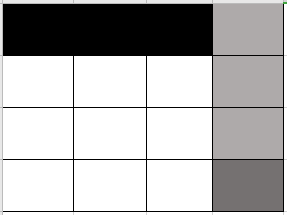

# 10.6导航地图概述

地图是对环境建模的结果，拥有地图，我们就可以在不进行任何测量的情况下来了解环境，从而完成一些比如路径规划的操作。

本节小鱼带你一起了解ROS2中地图的原理、常见格式及转换，加载方式、修改方式等基本操作。同时需要重点了解占据栅格地图（OccupancyGridMap）的概念。

## 1.地图与占据栅格地图

在日常生活中，我们会用到各种各样的地图，比如交通轨道图、城市地图、世界地图。

### 1.1 地图分类

我们根据地图所表达信息的不同可以将地图分为三类：

1. #### 尺度地图（Metric Map）

尺度地图用于表示尺寸距离，可以理解为把真实世界按比例缩小，尺度地图中每个点都可以使用一个经纬值进行表示。

> 因为尺度地图是按照真实世界按比例缩小，所以要有比例尺来表示缩小比例。

2. #### 拓扑地图（Topological Map）

  拓扑地图用于表示点与点之间的连接信息，比如地铁轨道交通图。

3. #### 语义地图（Semantic Map）

  语义地图可以理解为在上面两个地图上增加了语义，比如尺度地图中某处是红绿灯、斑马线。拓扑地图中某个点是深圳北站。


在机器人领域，尺度地图常用于定位于地图构建（Mapping）、定位（Localization）和同时定位与地图构建（Simultaneous Localization And Mapping，SLAM），拓扑地图常用于路径规划（Path Planning），而语义地图常用于人机交互（Human Robot Interaction）。

### 1.2 占据栅格地图

我们先了解下什么是栅格地图（Grid Map）。


如上图将地图数据分割为一块块的栅格来表达地图信息，就是栅格地图。

那什么是占据（Occupancy）呢？

机器人通过激光雷达等传感器来感知深度信息，但我们知道，传感器都是有噪声的（在前面的机器人仿真建模过程中，我们为了更加真实给激光雷达还添加了高斯噪声），所以机器人前方的某个位置到底有没有物体（障碍物）是不确定的。

我们可以采用概率来解决这一问题，认为确实有物体的栅格的占据率为100%，确定没有物体的栅格占据率为0%，不确定的栅格就用（确认占据概率/确认非占据概率）值表示占据率。


由此我们知道占据栅格地图就是一张写满占据率的格子组成的地图。


> 我们在做机器人的路径规划的时候，需要确定一个格子是有障碍物？没障碍物？还是未知呢？所以我们一般会设定两个阈值：
>
> - 占据阈值（occupied_thresh），比如0.65，则表示栅格占据率大于0.65的认为是有障碍物。
> - 空闲阈值（free_thresh），比如0.25，则表示栅格占据率小于0.25的认为没有障碍物。
>
> 那在free_thresh和occupied_thresh之间的则认为是未知区域（未探索）。

## 2.地图文件介绍

### 2.1 地图数据文件.pgm介绍

OccupancyGrid由一个`.yaml格式`的元数据文件，和.pgm图片格式的地图数据文件组成。从上节课建图后保存的文件也可以看出。

```
.
├── fishbot_map.pgm
└── fishbot_map.yaml

0 directories, 2 files
```


打开上节课建好的地图，观察下，你应该会有几点疑问：

1. 不是说占据栅格地图每个栅格都有一个概率吗？为什么看不出来？
2. 立方体内和圆柱体内和墙之外的区域为什么是灰色的？

原因如下：

1. 一个栅格对应到图片上其实是一个像素，每一个像素的值在0-255之间，所以将像素值和占据率之间的映射即可，而像素值反应到图像上就是颜色的深浅，1.2图对应的像素颜色如下：



2. 建图的时候物体内和墙之外的区域机器人并没有探索到，没有数据参考就认为其值是未知的。

### 2.2 地图描述文件.yaml介绍

除了`fishbot_map.pgm`文件外，还有另外一个`fishbot_map.yaml`的文件，`fishbot_map.yaml`文件是地图的配置文件，该文件内容如下：

```yaml
image: fishbot_map.pgm
mode: trinary
resolution: 0.05
origin: [-3.37, -2.88, 0]
negate: 0
occupied_thresh: 0.65
free_thresh: 0.25
```

- image：图像名称

- mode：图像模式，默认为trinary(三进制)，还有另外两个可选项scale(缩放的)和raw(原本的值)。

- resolution：分辨率，一个栅格对应的物理尺寸，单位为m。0.05则表示一个栅格为0.05m

- origin：地图原点位置，单位是m。


- negate：是否反转图像

- cooupied_thresh：占据阈值

- free_thresh：空闲阈值

#### 如何在地图上找出机器人原点的像素位置？

  1. 图像的像素原点在左下角

  3. 借张图左边的0,0是地图原点，右边的图是图像的像素原点

     

3. 假如机器人地图原点是[-3.37m, -2.88m]，除上分辨率则可得到像素原点[-67.4px,-57.6px]。`地图原点`在x和y轴分别偏移[-67.4px,-57.6px]就到了像素原点，反过来说，地图原点就在像素原点的[67.4px,57.6px]处。

## 3.地图加载

### 3.1 启动地图

了解完地图的格式和描述文件，接着我们看看如何将地图加载到rviz2中进行显示。我们使用nav2_map_server进行地图的保存，也可以使用它来加载地图。

打开终端，进入`src/map/`运行下面指令：

```shell
ros2 run nav2_map_server map_server --ros-args --param yaml_filename:=map/fishbot_map.yaml
```

其中`--ros-args --param yaml_filename:=map/fishbot_map.yaml`指定地图描述文件名称`.fishbot_map.yaml`。

### 3.2 打开rviz2

打开终端

```
rviz2
```

通过add->bytopic->选择map组件。此时你应该什么都看不到，没关系，这是正常的。

### 3.3 配置并激活map_server

`map_server`节点采用的是ROS2的生命周期进行编写的，除了启动节点，我们还需要手动的配置和激活节点才能使用。

打开新的终端，使用下面指令进行配置：

```
ros2 lifecycle set /map_server configure
```

使用下面的指令进行激活：

```
ros2 lifecycle set /map_server activate
```

完成这一步，你应该就可以在`rviz2`中看到地图了。


将栅格数量改大，然后将Grid的cellsize改成0.05,你就可以看到我们之间建立的地图每一个栅格的占据情况了。


> 生命周期节点转换图如下：
>
> 


## 4.地图编辑

最后我们来说一下如何对地图进行编辑，地图编辑的方法有很多，你可以手动改图片，也可以通过opencv等图像处理库进行图像的去除噪点等操作。

这里小鱼介绍的是手动添加一个地图用PS进行编辑 。

打开网址：https://www.gaituya.com/ps/

接着点击文件打开选择我们的.pgm文件，即可看到下图。


接着小鱼将下面的正方形给补上。


保存后在文件选择导出为`png`格式即可，因为PS并不支持`pgm`格式的导出，所以我们选择`png`格式，幸运的是`png`格式的地图也是被map_server所支持的。

把导出的图片放到map文件夹下，接着我们需要修改下yaml配置文件中图片的后缀。

```
image: fishbot_map.png
mode: trinary
resolution: 0.05
origin: [-3.37, -2.88, 0]
negate: 0
occupied_thresh: 0.65
free_thresh: 0.25
```

接着你可以重新运行下map_server（记得先关闭rviz2），然后看一下map是否发生了改变。

## 5. 总结

本节我们主要学习了地图的相关概念以及加载和编辑的方式，下一节我们就开始正式学习Nav2导航框架。


参考文章：

- https://zhuanlan.zhihu.com/p/21738718

--------------

技术交流&&问题求助：

- **微信公众号及交流群：鱼香ROS**
- **小鱼微信：AiIotRobot**
- **QQ交流群：139707339**

- 版权保护：已加入“维权骑士”（rightknights.com）的版权保护计划
