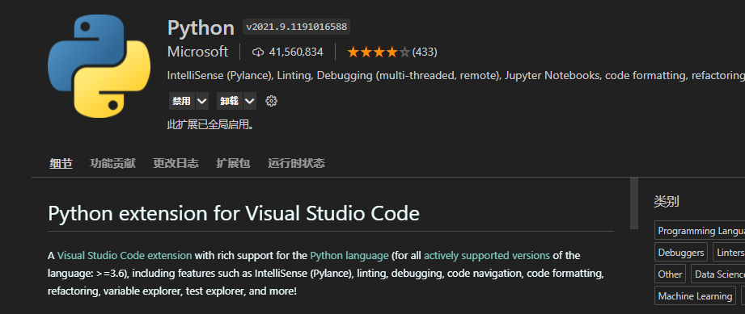
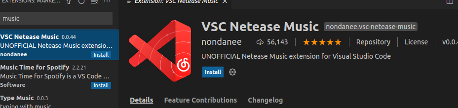
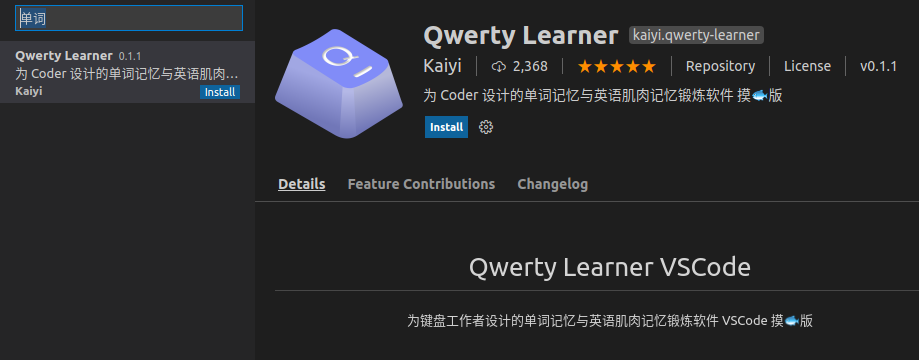
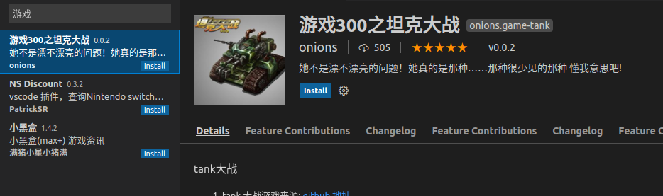
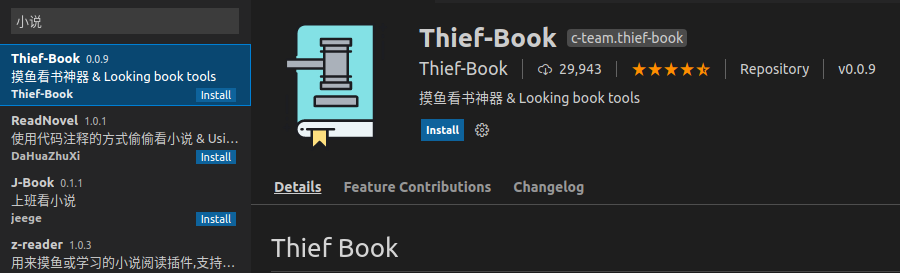

# 2.4VsCode编辑器安装与配置

> 工欲善其事必先利其器

这节小鱼是想给大家安利非常好用的一款编辑器——vscode。

> 小鱼刚到公司时做机器人的小伙伴大多大多分成两个流派，一个是QT Design流，一个是Vscode流。不过随着Vscode做的越来越好，用的人也变得越来越多了。


## 1 为什么叫vscode编辑器？

小鱼需要给大家区分一下的哈，编辑器和编译器是有很大区别的，别看只有一个字。


- **编辑器**，就像记事本一样，是用来编写代码的

- **编译器，**是一个翻译机，用来翻译代码的

> 所以vscode不负责编译代码，只负责编辑代码。


## 2.Vscode下载

linux版本的安装包，最终是deb格式的。

下载地址小鱼已经放到了[鱼香ROS (fishros.com)](https://fishros.com/#/fish_home)网站

> 该网站主要分享一些机器人学习过程中的常用工具和教程书籍工具等等，内容正在不断更新中，大家有想分享的资源也可以分享给小鱼


点击即可极速下载Vscode，再也不担心下载不下来了


## 3.Vscode安装

### 方式1

双击打开，会有图形化的界面，点击安装即可

### 方式2：

装逼命令行

```
sudo dpkg -i code_1.58.0-1625728071_amd64.deb
# -i 是 install的意思
```


随便在某一个终端输入，就可以以当前目录打开vscode

```
code ./
```


## 4.本课程中常用插件

**Python**



**C++**


## 5.Vscode插件大观

vscode最牛的地方就是各种插件都有。

不要问小鱼怎么知道的哈~

##### 汉化插件


##### Python插件


**听歌网易抑云**



**背单词**



##### 玩坦克大战



##### 看小说



##### 彩虹屁

在你写代码时候疯狂夸你写的好的插件


##### 股票


大家也有好玩的插件也可以分享一下哈，不过目前针对ROS2就四个插件按，看起来不太好用的样子，还是先用命令行好了，省的增加学习成本。


## 5 结束语

本节到此结束，告诉大家那么多有意思的插件，其实就是希望大家可以开开心心的学ROS2，敲代码也可以很快乐的哦~


