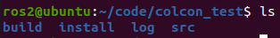
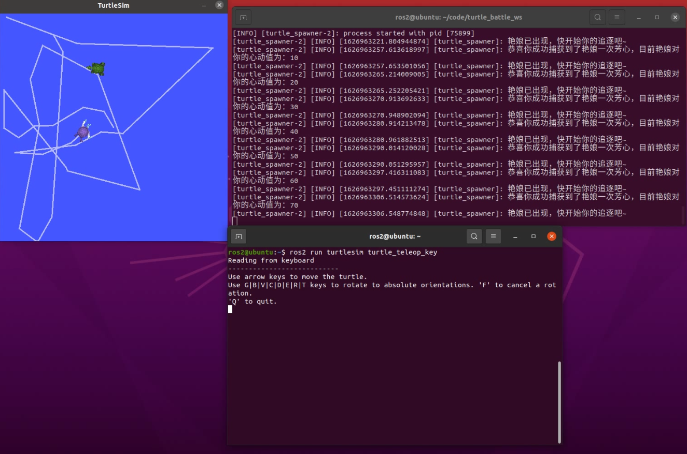

# 3.4 小游戏：小乌龟求偶大作战

呱呱呱~恭喜你进入了本章节的实战环节，小乌龟求偶大作战。你将要使用命令行来完成新建工作空间以及编译、运行节点这三项任务。

- 项目开源地址：[fishros/turtle_battle: 追逐你喜欢的那个小乌龟，满100分奖励教学视频哦 (github.com)](https://github.com/fishros/turtle_battle)

## 1.游戏介绍

游戏内容很简单，画面中会出现两只小乌龟，一个乌龟是可以被控制的，玩家控制这只小乌龟去找自己的配偶乌龟，找到后配偶乌龟会随机出现在其他位置。每找到一次，好感度加10分，如果满100分就会跳出一个神秘网页，至于网页的内容嘛~`嘿嘿嘿`

## 2.创建工作空间编译功能包

### 2.1创建工作空间

打开终端

```
mkdir -p turtle_ws/src
cd turtle_ws/src
```

#### 2.2下载源码功能包到工作空间的src文件夹下

```
git clone https://github.com/fishros/turtle_battle.git
```

#### 2.3 进入工作空间上一级编译

```
cd ..
colcon build
```


## 3.运行游戏

完成了上一步的编译之后，你会看到工作空间里的文件夹从一个src变成了四个。




### 3.1 source空间

```
source install/setup.bash
```

### 3.2启动游戏节点

打开一个新终端，进入turtle_ws工作空间，启动以下节点：

```
ros2 run turtle_battle turtle_spawner
```

### 3.3 启动乌龟模拟器

打开一个新终端，进入turtle_ws工作空间，启动以下节点：

```
ros2 run turtlesim turtlesim_node
```

### 3.4 打开遥控器节点

打开一个新终端，进入turtle_ws工作空间，启动以下节点：

```
ros2 run turtlesim turtle_teleop_key
```





**成功捕获10次小乌龟，有神秘奖励哦~**


## 4.查看节点数量

完成这个小游戏一共有多少个节点参与呢？节点名字分别叫什么？

聪明的小伙伴，可能会想到一个命令，那就是

```
ros2 node list
```

这个命令是在3.1节中讲到的，用于获取ros2的在运行的节点列表。

我们启动上节课的小游戏，然后输入这个命令试一试。

```
$ ros2 node list
/teleop_turtle
/turtle_spawner
/turtlesim
```

这里出现了三个节点，这三个节点之间有什么关系？节点的名字又是在哪里定义的？

带着好奇心，一起来看下一节，自定义节点吧~
