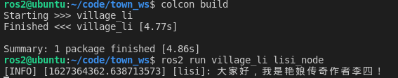

## 3.4.4 使用OOP方法编实现作家李四

打开li4.py,接着我们开始修改代码。跟着小鱼一起边理解输入下面的代码，注释不用输。

```
#!/usr/bin/env python3
import rclpy
from rclpy.node import Node


class WriterNode(Node):
    """
    创建一个作家节点，并在初始化时输出一个话
    """
    def __init__(self,name):
        super().__init__(name)
        self.get_logger().info("大家好，我是%s,我是一名作家！" % name)


def main(args=None):
    """
    ros2运行该节点的入口函数
    1. 导入库文件
    2. 初始化客户端库
    3. 新建节点
    4. spin循环节点
    5. 关闭客户端库
    """
    rclpy.init(args=args) # 初始化rclpy
    node = WriterNode("li4")  # 新建一个节点
    rclpy.spin(node) # 保持节点运行，检测是否收到退出指令（Ctrl+C）
    rclpy.shutdown() # 关闭rclpy

```


代码编写完成用Crtl+S进行保存。接着修改`setup.py`

增加一句话，告诉ros2村庄来了一位新村民李四，要找这位村民去`village_li.li4:main`路径下寻找。

```
    entry_points={
        'console_scripts': [
            "li4_node = village_li.li4:main"
        ],
    },
)
```


完成上面的工作后，就可以编译运行了。


## 3.编译运行节点

打开vscode终端，进入`town_ws`

### 编译节点

```
colcon build
```

### source环境

```
source install/setup.bash
```

### 运行节点

```
ros2 run village_li li4_node
```

### 运行结果



## 4.总结

当节点运行起来后，可以再尝试使用`ros2 node list `指令来查看现有的节点。这个时候你应该能看到：


这说明你的节点已经运行起来了，并且被其他节点感知到了。


这一节，小鱼带你一起使用Python完成了python节点的编写，成功创建出来一个li4的节点。下一节小鱼带你一起去王家村，来创建单身汉王二，让我们一起加油吧~