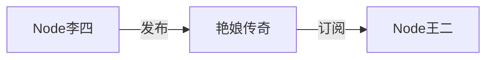
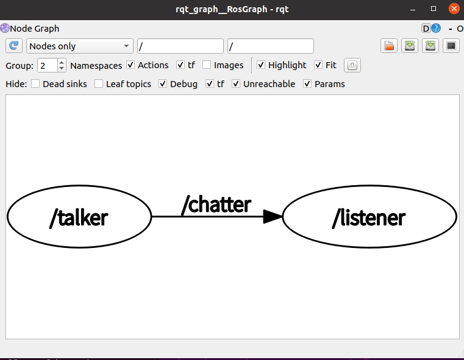
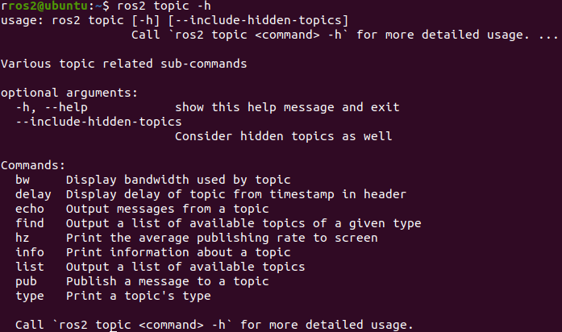
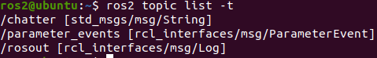
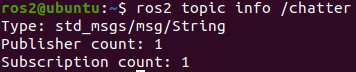
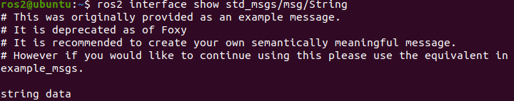
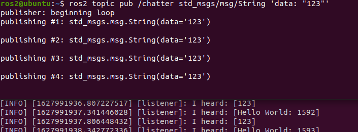

# 4.1 ROS2话题介绍

大家好，我是小鱼。上一章节中，我们采用了面向对象的方法创建了作家李四和单身狗王二，本节课我们就通过ROS2的话题机制，让作家李四发布小说，让单身狗王二订阅小说并付费。

## 1.背景故事

李四是一名擅长写小说的作家，既然是作家，肯定要写文章才行，所以李四就写了一本带颜色的小说《艳娘传奇》。

王二是一名单身多年的单身狗,单身狗没啥爱好，但是《艳娘传奇》肯定是必看的（单身多年的你肯定懂）。

所以我们就要想办法让王二可以看到李四写的小说，有什么好的办法吗？

办法就是ROS2的话题机制。

我们让王二（Node）通过订阅（Subscribe）李四（Node）发布（Publish）的《艳娘传奇》（Topic）来欣赏小说的。


## 2.话题介绍

故事其实就是讲了一下ROS2中Topic通信方式，Topic通信模型是一种发布订阅模型。

### 2.1 话题的发布订阅模型

这里的王二和李四两个节点，通过话题来互相通信（传递数据）。

李四节点会创建一个发布者（Publisher）来发布一个话题（艳娘传奇,小鱼取个英文名叫sexy_girl）。单身汉王二节点，他创建了一个订阅者（Subscriber）来订阅李四发布的话题sexy_girl。

那艳娘传奇的内容是什么呢？我们暂且规定为由文字组成的字符串（连插图都没的那种）。




`李四王二通信模型`是一个一对一（一个发布者，一个订阅者）的模型，除此之外ROS2中话题通信其实还可以是`1对n`,`n对1`,`n对n`的。


### 2.2 话题通信有哪些需要注意的规则呢？

需要满足以下规则：

- 话题名字是关键,发布订阅接口类型要相同，发布的是字符串，接受也要用字符串来接收;
- 同一个人(节点)可以订阅多个话题，同时也可以发布多个话题，就像一本书的作者也可以是另外一本书的读者;
- 同一个小说不能有多个作者（版权问题），但跟小说不一样，同一个话题可以有多个发布者。


## 3.相关的工具

### 3.1  RQT工具之rqt_graph


ROS2作为一个强大的工具，在运行过程中，我们是可以通过命令来看到节点和节点之间的数据关系的。

运行我们第二章中的你说我听小demo。依次打开三个终端，分别输入下面三个命令。

```
ros2 run demo_nodes_py listener
ros2 run demo_nodes_cpp talker
rqt_graph
```

你将看到下面这张图




> 你可以尝试改变菜单栏的选项，看一看下面图的变化，感受一下rqt_graph工具的强大。

这是一个很重要的工具，小鱼在学习和使用ROS2的过程中经常会用到它，来看一看数据到底是怎么走的，它可以帮我们搞清楚一个节点的输入和输出是什么。

### 3.2 ROS2话题相关命令行界面（CLI）工具

还记得上一节的ros2 node指令吗？ros2也支持很多强大的topic指令。可以使用下面的指令查看。

```
ros2 topic -h
```




本着学以致用的目的，小鱼先对比较常用的几个命令进行介绍，其他的我们用到的时候小鱼再介绍（现在介绍反而不好理解）。


#### 3.2.1 ros2 topic list 返回系统中当前活动的所有主题的列表

命令

```
ros2 topic list
```

结果


####  3.2.2 ros2 topic list -t 增加消息类型

命令

```
ros2 topic list -t
```

结果




#### 3.2.3 ros2 topic echo <topic_name> 打印实时话题内容

命令

```
ros2 topic echo /chatter
```

结果


#### 3.2,4 ros2 topic info <topic_name> 查看主题信息

命令

```
ros2 topic info  /chatter
```

结果



#### 3.2.5 ros2 interface show 查看消息类型

上面一个指令告诉大家这个消息是std_msgs/msg/String，那String里面有什么呢？不妨来试一试。

命令

```
ros2 interface show std_msgs/msg/String
```

结果




#### 3.2.6 ros2 topic pub <topic_name> <msg_type>  arg 手动发布命令

关闭发布者，我们受到来发布

命令

```
ros2 topic pub /chatter std_msgs/msg/String 'data: "123"'
```


结果




## 4.最后

了解完话题，下一节小鱼就会带大家来手动写Python版本的话题通信。


------

参考链接：[Understanding ROS 2 topics — ROS 2 Documentation: Foxy documentation](http://docs.ros.org/en/foxy/Tutorials/Topics/Understanding-ROS2-Topics.html)

