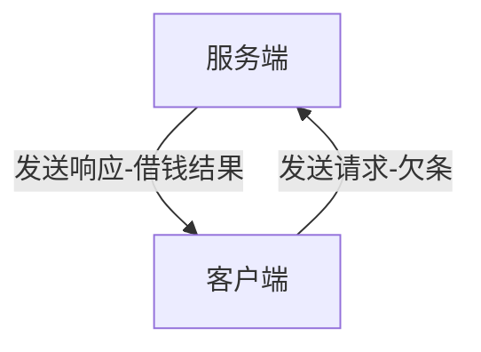
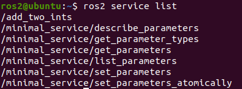
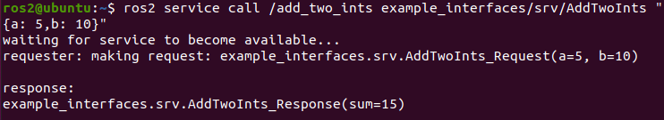
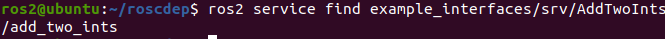

# 4.4 ROS2服务介绍

大家好，帅鱼又蹬蹬蹬的游回来了。本节小鱼将要带大家一起了解一下什么是服务。

还记的ROS镇的外卖服务吗？ROS2镇长上任之后，为了鼓励大家多多运动，就把外卖给取消了。后来镇里又发生了一些有意思的事情。

## 1.讲个故事

### 1.1 李三借钱

话说乡村作家李四通过写小说赚了不少钱，李四又是一个心地善良的人，于是他决定无利息借钱给村里的人，帮助大家。

李四三哥李三，比起李四就差太多了，整天游手好闲，除了白嫖李四小说外，听说李四无息对外借钱，就立马想过去捞一笔。但李四对外借钱是有规矩的,规矩如下：

1. 借钱一定要打欠条，收到欠条才能给钱
2. 每次借钱不能超过自己全部资金的10%且一定是整数，也就是说假如李四现在有100块钱，那么最多借出去`100x10%=10`块钱

李三看到之后心想，还要写欠条，那不能借太多，不然以后`亲兄弟，明算账`起来，自己还不起也不行，于是打算先借10块钱搓一碗麻辣烫去。

### 1.2 王二与二手书

在李三算计着借钱吃麻辣烫的时候，隔壁王家村王二也在和张家村张三讨价还价着。

原来隔壁张家村穷光蛋张三，想看艳娘传奇，但是买不起正版的，想从王二这边买王二看过的二手书。王二思虑一番后，答应了张三，但他有下面的两点要求：

1. 必须一手交钱，一手交货，爱买不买
2. 每次给多少钱卖多少章，每章一块钱，如果手里的存货不足，就继续等待

张三一看，虽然一块钱对我来说还是很贵，但想想`美腻的艳娘`，必须买。


## 2.服务介绍

看完上面的小故事，我们开始正式介绍一下服务。上面所说的李四对外借钱其实就可以理解为对外提供服务，我们将李四称为服务端，而李三要借李四的钱，李三就称之为客户端。

客户端发送请求给服务端，服务端可以根据客户端的请求做一些处理，然后返回结果给客户端。



而王二向张三卖二手的《艳娘传奇》也是服务-客户端模型，王二是提供二手书的服务端，张三是购买二手书的客户端。

> 不知道你有没有感觉到服务和话题的不同之处，话题是没有返回的，适用于单向或大量的数据传递。而服务是双向的，客户端发送请求，服务端响应请求。

同时服务还是有一些注意事项：

- 同一个服务（名称相同）有且只能有一个节点来提供
- 同一个服务可以被多个客户端调用

放两张官方形象的动图：


## 3.体验服务

在我们安装ROS2的时候其实系统为我们安装了一些样例程序，其中就有服务使用样例，我们可以先来体验一下。

### 3.1 启动服务端

打开终端，运行下面的命令，这个命令用于运行一个服务节点，这个服务的功能是将两个数字相加，给定a，b两个数，返回sum也就是ab之和。

```
ros2 run examples_rclpy_minimal_service service
```

### 3.2 使用命令查看服务列表

```
ros2 service list
```



### 3.3手动调用服务

再启动一个终端，输入下面的命令（注意a：、b：后的空格）。

```
ros2 service call /add_two_ints example_interfaces/srv/AddTwoInts "{a: 5,b: 10}"
```


我们可以看到客户端请求两个数字5+10，服务端返回15。

## 4.ROS2服务常用命令

ROS2的命令行工具，小鱼觉得还是非常值得一学的，毕竟确实很实用（装X），之前已经给大家讲过了关于节点、话题、接口相关的命令了，现在小鱼说一下关于服务的那些命令行。

### 4.1查看服务列表

```
ros2 service list
```


### 4.2手动调用服务

```
ros2 service call /add_two_ints example_interfaces/srv/AddTwoInts "{a: 5,b: 10}"
```



如果不写参数值调用会怎么样？比如下面这种，大家可以尝试下。

```
ros2 service call /add_two_ints example_interfaces/srv/AddTwoInts
```

### 4.3 查看服务接口类型

```
ros2 service type /add_two_ints
```


### 4.4查找使用某一接口的服务

这个命令看起来和3.3刚好相反。

```
ros2 service find example_interfaces/srv/AddTwoInts
```




## 5.总结

本节大家和小鱼一起又多认识了一个小伙伴，ROS2的服务。

下一节，我们将从自定义服务接口开始，帮助李三借钱吃麻辣烫，帮助张三看上二手书。

