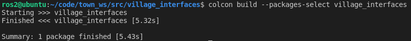
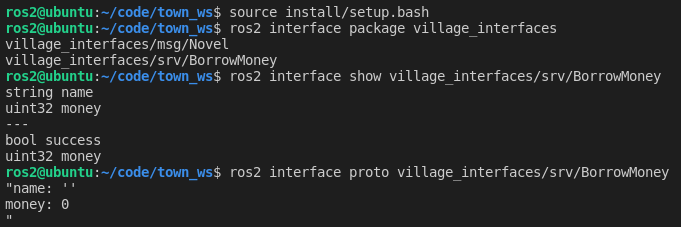

# 4.5.1 自定义服务接口

帅鱼又来了，上一节小鱼给大家介绍了什么是服务，并且给大家举了李三向李四借钱吃麻辣烫，张三向王二买二手书的例子。作为ROS镇的创造者的我们，肯定要满足村民们的需求。

所以本节小鱼将带你一起，创造一个借钱服务接口和一个买书服务接口。

## 1.服务接口介绍

在4.5到4.6章节中，小鱼介绍了接口和话题接口的概念。那服务接口和话题接口有什么不同呢？

那就要看，话题和服务有什么不同之处了。之前小鱼曾提起过：

- 话题是**发布订阅模型**。主要是单向传输数据，只能由发布者发布，接收者接收（同一话题，发布者接收者都可以有多个）
- 服务是**客户端服务端（请求响应）模型**。由客户端发送请求，服务端处理请求，然后返回处理结果（同一服务，客户端可以由多个，服务端只能有一个）

由以上差别我们可以知道，话题通信是单向的，自定义话题只需要定义**传过去的数据类型**就行，而服务是双向的，所以要定义**一去一回两种数据类型**。

我们来看一下服务的消息接口长什么样子？

服务接口格式：`xxx.srv`

```
int64 a
int64 b
---
int64 sum
```

与话题不同的是，srv文件比msg文件中间多出了三个`---`这三个杠杠就是分界线，上方的是客户端发送请求的数据结构定义，下方的是服务端响应结果的数据结构定义。

是不是也很好理解，那如何创建我们自己的服务接口呢？可以参考下面的步骤：

- 新建`srv`文件夹，并在文件夹下新建`xxx.srv`
- 在`xxx.srv`下编写服务接口内容并保存
- 在`CmakeLists.txt`添加依赖和srv文件目录
- 在`package.xml`中添加`xxx.srv`所需的依赖
- 编译功能包即可生成`python`与c++头文件

当然在做上面的步骤之前，我们还需要做一件很重要的事情。就是根据业务需求，确定好请求的数据结构和返回的数据结构。

## 2.创建借钱服务接口

我们依然是在`village_interfaces`下创建服务接口。

### 2.1 确认数据结构

开始之前，我们先根据李四的需求来确定数据结构。

上一节中李四对借钱的要求如下：

1. 借钱一定要打欠条，收到欠条才能给钱
2. 每次借钱不能超过自己全部资金的`10%`且一定是整数，也就是说李四假如现在有100块钱，那么最多借出去`100x10%=10`块钱

总结一下就是，李三发送借钱请求的时候一定要有欠条，我们想一下，欠条中应该至少包含两条信息

- 借钱者名字，字符串类型、可以用`string`表示
- 金额，整形，可以用`uint32`表示

那请求的数据结构我们就可以确定下来了，接着确定返回的数据的格式。

既然是借钱，那李四就有可能拒绝，会有借钱失败的情况，所以返回数据应该有这两条信息：

- 是否出借：只有成功和失败两种情况，布尔类型（`bool`）可表示
- 出借金额：无符号整形，可以用`uint32`表示，借钱失败时为0

### 2.2 创建`srv`文件夹及`BorrowMoney.srv`消息文件

打开VsCode，然后打开`town_ws`，在`village_interfaces`下新建srv文件夹。

> 同样大家可以使用鼠标右击新建，不用输入命令行😜

```shell
cd src/village_interfaces
mkdir srv && cd srv
touch BorrowMoney.srv
```

创建完成后的目录结构


### 2.3 编写文件内容

既然确定了内容，编写文件就很简单了

```
string name
uint32 money
---
bool success
uint32 money
```

### 2.4修改`CMakeLists.txt`

因为在4.6中我们已经添加过依赖`DEPENDENCIES`和`msg`文件了，所以这里我们直接添加一个`srv`即可。

```cmake
find_package(rosidl_default_generators REQUIRED)
rosidl_generate_interfaces(${PROJECT_NAME}
  #---msg---
  "msg/Novel.msg"
  #---srv---
  "srv/BorrowMoney.srv"
  DEPENDENCIES sensor_msgs
 )
```

需要关注的是这一行`"srv/BorrowMoney.srv"`,添加了对应的文件位置。

### 2.5修改`package.xml`

在4.6节我们已经添加过了，这里就不用添加了，如果没有加的同学可以再加一次。

```xml
  <build_depend>sensor_msgs</build_depend>
  <build_depend>rosidl_default_generators</build_depend>
  <exec_depend>rosidl_default_runtime</exec_depend>
  <member_of_group>rosidl_interface_packages</member_of_group>
```

### 2.6编译

在vscode中，使用`Ctrl+Shift+~`打开一个新的终端，在`town_ws`目录下输入：

```shell
colcon build --packages-select village_interfaces
```



### 2.7测试

这次测试我们依然使用`ros2 interface`指令进行测试。

之前已经测试过了话题了，这里小鱼就只放一下测试指令和测试结果。

```
source install/setup.bash 
ros2 interface package village_interfaces
ros2 interface show village_interfaces/srv/BorrowMoney
ros2 interface proto village_interfaces/srv/BorrowMoney 
```

> 注意，`ros2 interface proto` 该指令目前只显示出请求部分话题数据



## 3.创建买书服务接口

### 3.1 确认数据结构

和创建借钱服务一样，我们先确定王二卖书的数据结构。

上一节中王二对卖书的要求如下：

1. 必须一手交钱，一手交货，爱买不买😎
2. 每次给多少钱卖多少章，每章一块钱，如果手里的存货不足，就继续等待

总结一下，王二提供书的时候，一定要先给钱才行，所以张三只需要给钱就行，服务的请求数据结构如下：

- 买书的钱，无符号整形，`uint32`

那王二返回什么呢？因为王二对应的数量艳娘传奇，所以王二的返回就是n章小说。

一章节的小说我们可以采用`string`来，那n章节的小说该怎么办？办法就是用`string`数组来容纳多个章节。

- 所以王二的返回是一个`string`类型的数组，表示多个章节的书


### 3.2 创建`srv`文件夹及`SellNovel.srv`消息文件

上面我们已经创建了`srv`，这里直接创建`SellNovel.srv`

```
cd src/village_interfaces
cd srv
touch SellNovel.srv
```

创建完成后的目录结构


### 3.3 编写文件内容

用无符号整形表示`money`大家已经很清楚如何做了，那如何表示小说数组呢？其实只需在类型的后面加上`[]`中括号。

完整内容如下：

```
uint32 money
---
string[] novels
```

请求时给钱，返回即为多章小说。

### 3.4修改`CMakeLists.txt`

在上面的基础上，再添加上一行`"srv/SellNovel.srv"`代码即可：

```
rosidl_generate_interfaces(${PROJECT_NAME}
  #---msg---
  "msg/Novel.msg"
  #---srv---
  "srv/BorrowMoney.srv"
  "srv/SellNovel.srv"
   DEPENDENCIES sensor_msgs
 )
```

### 3.5修改`package.xml`

同样的，因为我们已经修改过了，这里就不需要修改了。

### 3.6编译

在vscode中，使用`Ctrl+Shift+~`打开一个新的终端，在`town_ws`目录下输入：

```shell
colcon build --packages-select village_interfaces
```


### 3.7测试

这次测试我们依然使用`ros2 interface`指令进行测试。

之前已经测试过了话题了，这里小鱼就只放一下测试指令和测试结果。

```
source install/setup.bash 
ros2 interface package village_interfaces
ros2 interface show village_interfaces/srv/SellNovel
ros2 interface proto village_interfaces/srv/SellNovel 
```

> 注意，`ros2 interface proto`该指令目前只显示出请求部分话题数据


## 4.总结

本节小鱼带大家创建了用于借钱和买书的服务接口，下一节我们就开始编写代码，完成借钱服务。

