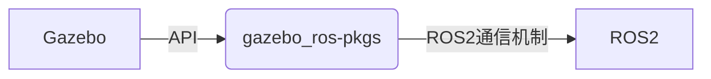
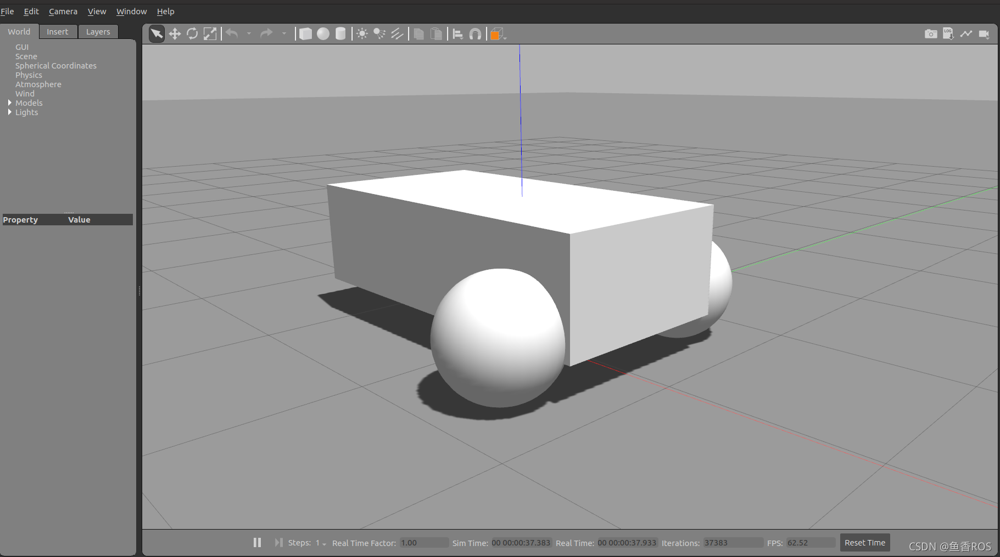

# 6.5 Gazebo介绍

今天说说Gazebo，有些同学没有学习RVIZ和Gazebo之前，分不清Gazebo和Rviz之间的区别，只道是Gazebo和RVIZ都能显示机器人模型。

## 1.Gazebo VS Rviz2
昨天小鱼有说RVIZ2是什么：

文章中讲道**RVIZ2是用来可视化数据的软件，核心要义是将数据展示出来（我们不生产数据只做数据的搬运工）。
而Gazebo是用于模拟真实环境生产数据的（我们不搬运数据只做数据的生产者）**

所以Gazebo可以根据我们所提供的机器人模型文件，传感器配置参数，给机器人创造一个虚拟的环境，虚拟的电机和虚拟的传感器，并通过ROS/ROS2的相关功能包把传感器数据电机数据等发送出来（生产数据）。

这样我们就不用花一分钱，就拥有了各式各样的机器人和传感器（一万八的雷达，也只不过是用鼠标拖拽一下）。

## 2.Gazebo集成ROS2

**Gazebo 是一个独立的应用程序，可以独立于 ROS 或 ROS 2 使用。** 

Gazebo与ROS 版本的集成是通过一组叫做`gazebo_ros_pkgs`的包 完成的，`gazebo_ros_pkgs`将Gazebo和ROS2连接起来。



### 2.1 gazebo_ros_pkgs
gazebo_ros_pkgs不是一个包，是一堆包如下：

- gazebo_dev：开发Gazebo插件可以用的API
- gazebo_msgs：定义的ROS2和Gazebo之间的接口（Topic/Service/Action）
- gazebo_ros：提供方便的 C++ 类和函数，可供其他插件使用，例如转换和测试实用程序。它还提供了一些通常有用的插件。gazebo_ros::Node
- gazebo_plugins：一系列 Gazebo 插件，将传感器和其他功能暴露给 ROS2
	例如:
	1. `gazebo_ros_camera` 发布ROS2图像
	2. `gazebo_ros_diff_drive` 通过ROS2控制和获取两轮驱动机器人的接口

> ROS1的插件迁移到ROS2进度：https://github.com/ros-simulation/gazebo_ros_pkgs/wiki
> 

## 3. 两轮差速小demo

### 3.1安装gazebo
因为安装ROS2不会默认安装gazebo，所以我们要手动安装,一行命令很简单，如果提示找不到先去更新下ROS2的源。


```shell
sudo apt install gazebo11
```

### 3.2 安装ROS2的两轮差速功能包

一行代码全给装了，不差这点空间

```shell
sudo apt install ros-foxy-gazebo-*
```

### 3.3 运行两轮差速demo

一行代码搞定
```shell
gazebo /opt/ros/foxy/share/gazebo_plugins/worlds/gazebo_ros_diff_drive_demo.world 
```
然后你就可以看到一个死丑死丑的小车


### 3.4 查看话题

通过下面的指令可看到话题和话题的类型，把目光放到这个话题`/demo/cmd_demo`,下面我们就通过这个话题来控制小车动起来。

```shell
ros2@ros2-TM1613R:~$ ros2 topic list -t
/clock [rosgraph_msgs/msg/Clock]
/demo/cmd_demo [geometry_msgs/msg/Twist]
/demo/odom_demo [nav_msgs/msg/Odometry]
/parameter_events [rcl_interfaces/msg/ParameterEvent]
/rosout [rcl_interfaces/msg/Log]
/tf [tf2_msgs/msg/TFMessage]
```

### 3.5 让小车前进

```shell
ros2 topic pub /demo/cmd_demo geometry_msgs/msg/Twist "{linear: {x: 0.2,y: 0,z: 0},angular: {x: 0,y: 0,z: 0}}"
```
然后就可以看到小车动了起来。


## 4.总结

- RVIZ2是用来可视化数据的软件，核心要义是将数据展示出来（我们不生产数据只做数据的搬运工）
- Gazebo是用于模拟真实环境生产数据的（我们不搬运数据只做数据的生产者)
- Gazebo是独立于ROS/ROS2的软件（还有很多仿真软件可以用ROS/ROS2）
- ROS2和Gazebo之间的桥梁是：gazebo_ros_pkgs
