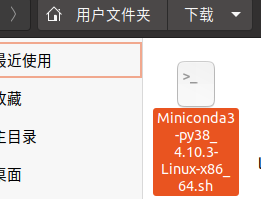
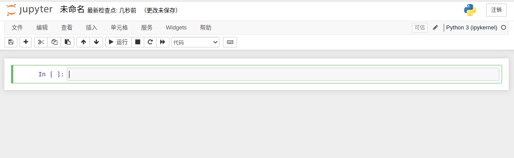
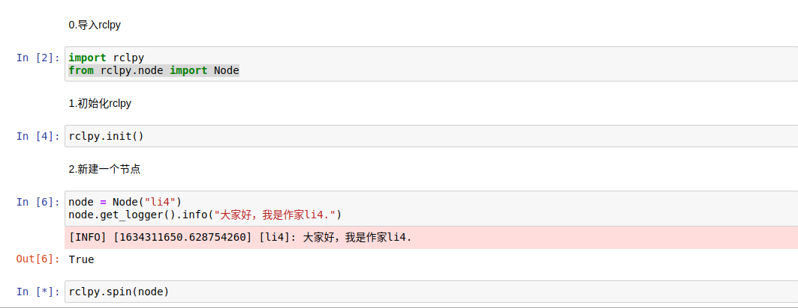
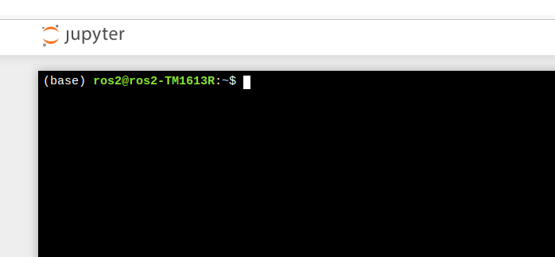

# 7.1.2 MiniConda、JupyterNotebook与ROS2

大家好，我是小鱼，上一节我们介绍了机器人学的基础——矩阵相关知识，秉持着学以至用的原则，小鱼准备带大家先用代码来实现下矩阵的创建以及矩阵的运算。

工欲善其事，必先利其器，如果是编写机器人相关算法，小鱼最为推荐的就是使用jupyter来和ros进行通信了。

所以本节课小鱼就带你一起安装好MiniConda，并在MiniConda中安装好jupyter并配置好ros2环境。


## 1.MiniConda与Jupyter介绍

### 1.1 MiniConda 介绍

Miniconda 是 Conda 的免费最小安装程序。


**Conda是什么呢？**
Conda是在Windows、macOS和Linux上运行的开源软件包管理系统和环境管理系统。Conda可以快速安装、运行和更新软件包及其依赖项。

**所以相比于conda的大体积miniconda更加的小和易用。**


### 1.2 Jupyter介绍

可以把jupyter理解为一个**可以在网页运行python**语言的工具。


jupyter提出了文学化编程的概念，让我们可以在单元格(cell)中，**像在笔记本上写文章一样，随时写，随时运行，随时根据运行的结果来修改我们的代码**，这样的交互式编程模式可以极大的提升我们编写代码的效率。


## 2.安装miniconda与jupyer

### 2.1 miniconda下载

- minconda下载地址：https://docs.conda.io/en/latest/miniconda.html

这里小鱼推荐选择`Python3.8 Miniconda3 Linux 64-bit`


下载完成后你可以得到一个.sh的安装文件




### 2.2 miniconda安装

在安装目录文件夹空白处右击，在终端中打开,输入下面指令即可安装

```bash
bash Miniconda3-py38_4.10.3-Linux-x86_64.sh 
```


一路点enter，然后输入yes，回车即可完成安装，最后一步会提醒你是否要自动初始化环境，这里我们先选择yes。

没有选没事，跟着小鱼来一起初始化一次conda，打开终端输入下面的命令即可

```bash
cd ~/miniconda3/bin
./conda init
```

重启终端，你会发现你的终端前多了一个`base`,这代表你已经装好了conda。


如果想退出conda环境可以输入

```bash
conda deactivate
```

### 2.3 jupyter安装

方便起见，我们就在base环境下安装jupyter，使用的是清华大学源。

```bash
pip3 install jupyter -i https://pypi.tuna.tsinghua.edu.cn/simple
```

安装完成后，我们就可以使用下面的指令启动jupyter了，不出意外你的浏览器将要跳出来，然后自动打开conda页面。

```bash
jupyter-notebook
```


## 3.使用jupyter编写节点李四

接着小鱼带你一起使用jupyter来写ros2的代码。

## 3.1 新建Python3并编写第一行代码

点击新建Python3


然后你可以看到一行行的单元格。



接着我们就可以在单元格里输入python代码，然后使用`Shift+Enter`来运行这行代码，比如我们可以试一试打印一句话

```bash
print("hello jupyter")
```

接着我们使用`Shift+Enter`来运行这行代码，可以看到这行代码的结果，随之展示在了该句打印的下方，我们可以修改打印的内容，然后重新使用`Shift+Enter`来运行，下面的数值也会随之改变。


## 3.2 编写ROS2代码

使用ros2无非是使用其rclpy客户端库，jupyter完美的支持了该库，一起和小鱼用import来导入吧。

第一行输入下面的指令，点击Shift+Enter可以看到没有任何报错，即导入成功了。

```python
import rclpy
from rclpy.node import Node 
```

接着在和小鱼一起初始化客户端库，新建节点李四和spin节点吧，完整的代码如下：

```python
import rclpy
from rclpy.node import Node 
rclpy.init() # 初始化rclpy
node = Node("li4")  # 新建一个节点
node.get_logger().info("大家好，我是作家li4.")
rclpy.spin(node) # 保持节点运行，检测是否收到退出指令（Ctrl+C）
```

分步输入运行



注意这里我们没有调用shutdown,因为我们还不希望rclpy关掉。

## 3.3 测试

我们接下来用，ros2的命令行工具查看一下li4节点是否在线。

在jupyter中运行命令行和打开终端也是非常方便的，为了学习jupyter，我们使用jupyter自带的终端来运行ros2的指令。

我们新建一个终端，回到文件夹目录视图，点击新建终端


打开后的样子如下



在终端中输入

```python
ros2 node list
```

可以看到李四已经出现了


## 4.总结

小鱼不能说吹爆jupyter，但用python和ros写算法调试程序，jupyter真的是非常的好用，还有更强大的画图功能等等，小鱼后面在机器人学学习课程中都会一一讲到，并且带着大家一起来熟悉jupyter与ros2的更多知识。

--------------

技术交流&&问题求助：

- **微信公众号及交流群：鱼香ROS**
- **小鱼微信：AiIotRobot**
- **QQ交流群：139707339**

- 版权保护：已加入“维权骑士”（rightknights.com）的版权保护计划

