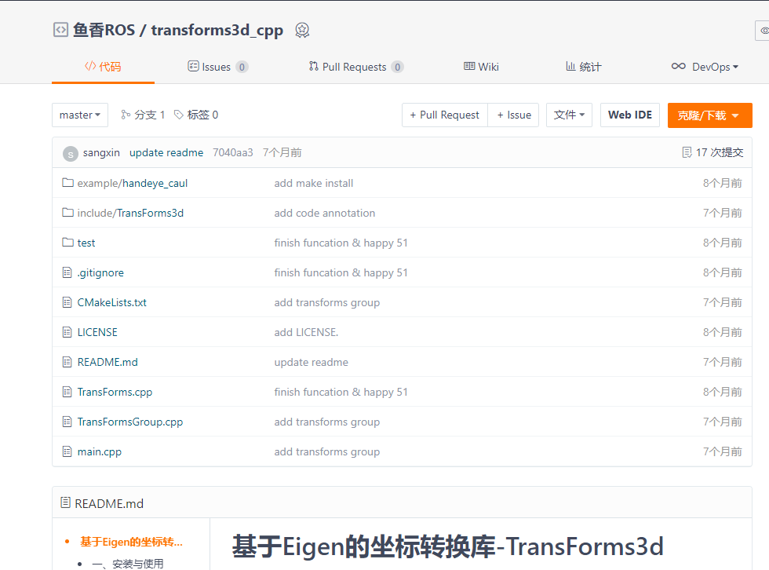

## 动手学姿态的多种表示

上一节小鱼带你一起学习了四种姿态表示方式，这节课我们就利用相关的开源库，来完成姿态的不同表示方式之间的转换。


包含12中转换形式，其中一些转换的计算方式，前面几节课中小鱼有给出相应的公式。

四元数模块:quaternions
- 四元数 转 旋转矩阵
- 旋转矩阵 转 四元数
- 四元数 转 轴角
- 轴角 转 四元数

欧拉模块:euler
- 欧拉角 转 四元数
- 四元数 转 欧拉角
- 欧拉角 转 旋转矩阵
- 旋转矩阵 转 欧拉角
- 欧拉角 转 轴角
- 轴角 转欧拉角

轴角模块:axangles
- 轴角 转 旋转矩阵
- 旋转矩阵 转 轴角


本节主要推荐的是Python的相关实现，用的是小鱼常用的transforms3d库,该库的api设计非常的巴适，小鱼是非常的爱~

## 1.安装

安装使用pip即可

```
pip install transforms3d -i https://pypi.tuna.tsinghua.edu.cn/simple
```

## 2.四元数相关转换

四元数模块在transforms3d.quaternions里，直接导入即可使用

### 2.1 四元数与旋转矩阵互转

```
import transforms3d as tfs
import numpy as np 
# 四元数转旋转矩阵
tfs.quaternions.quat2mat([1,0,0,0])
# 旋转矩阵转四元数
tfs.quaternions.mat2quat(np.asarray([[1., 0., 0.],[0., 1., 0.],[0., 0., 1.]]))
```

### 2.2 四元数与轴角互转


```
import transforms3d as tfs
import numpy as np 
# 四元数转旋轴角
tfs.quaternions.quat2axangle([1,0,0,0])
# 轴角转四元数
tfs.quaternions.axangle2quat([1,0,0],0.5)
```

## 3.欧拉角相关转换

四元数模块在transforms3d.euler里，直接导入即可使用

### 3.1 欧拉角与四元数互转

```
import transforms3d as tfs
import numpy as np 
# 固定轴欧拉角转四元数
tfs.euler.euler2quat(0,0,0,"sxyz")
# 四元数转固定轴欧拉角
tfs.euler.quat2euler([1,0,0,0],"sxyz")
```

### 3.2 欧拉角与旋转矩阵互转

```
import transforms3d as tfs
import numpy as np 
# 固定轴欧拉角转旋转矩阵
tfs.euler.euler2mat(0,0,0,"sxyz")
# 旋转矩阵转固定轴欧拉角
tfs.euler.mat2euler(np.asarray([[1., 0., 0.],[0., 1., 0.],[0., 0., 1.]]),"sxyz")
```


### 3.3 欧拉角与轴角互转

```
import transforms3d as tfs
import numpy as np 
# 固定轴欧拉角轴角
tfs.euler.euler2axangle(0,0,0,"sxyz")
# 轴角转固定轴欧拉角
tfs.euler.axangle2euler([1,0,0],0.5,"sxyz")
```

## 4.轴角相关转换

四元数模块在transforms3d.axangle里，直接导入即可使用

4.1 轴角与旋转矩阵互转
```
import transforms3d as tfs
import numpy as np 
# 轴角转旋转矩阵
tfs.axangles.axangle2mat([1,0,0],0.5)
# 旋转矩阵转轴角
tfs.axangles.mat2axangle(np.asarray([[1., 0., 0.],[0., 1., 0.],[0., 0., 1.]]))
```

## 5.C++实现Eigen

> 开源地址,欢迎一起加入完善: https://gitee.com/ohhuo/transforms3d_cpp




参考文档：
- http://matthew-brett.github.io/transforms3d/


--------------

技术交流&&问题求助：

- **微信公众号及交流群：鱼香ROS**
- **小鱼微信：AiIotRobot**
- **QQ交流群：139707339**

- 版权保护：已加入“维权骑士”（rightknights.com）的版权保护计划

