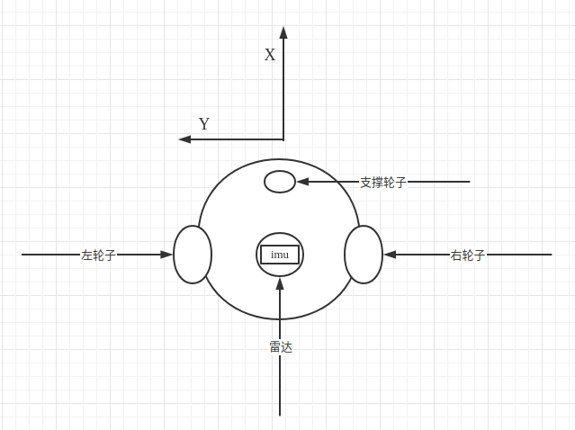
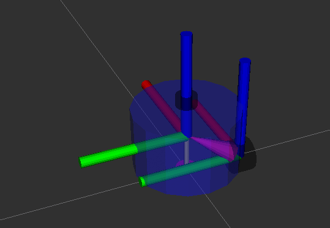
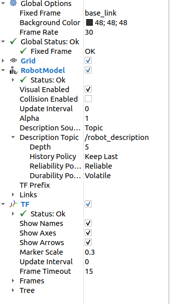
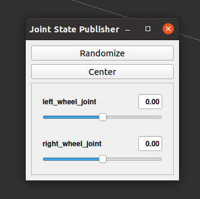

# 8.3 动手创建一个移动机器人

大家好，我是小鱼，本节课我们来一起动手创建一个两轮差速的移动机器人`fishbot`,在上一节的时候我们已经给我们的机器人安装上了雷达，本节课我们接着上节课的来继续完善我们的机器人模型。


机器人除了雷达之外，还需要`IMU`加速度传感器以及可以驱动的轮子，在第七章中我们曾介绍过机器人学部分，曾对两差速模型进行过介绍，所以我们还需要再创建两个差速驱动轮和一个支撑轮。


所以本节小鱼带你一起给机器人添加如下部件和关节：

1. IMU传感器部件与关节
2. 左轮子部件与关节
3. 右轮子部件与关节
4. 支撑轮子部件与关节




## 1.添加IMU传感器(上节作业)

IMU传感器和透明度与颜色修改是上节课，作业，小鱼先带你一起完成一下

> 练习1：尝试将修改机器人身体颜色为蓝色，透明度为50%`(0.1 0.1 1.0 0.5)`
>
> 练习2：尝试在URDF中添加imu_link并使用imu_joint将其固定在车体的中心上方2cm，imu采用的几何形状为box,长宽高各是2cm

### 1.1 修改颜色

透明度修改只需要在`base_link`中添加`material`

```xml
<link name="base_link">
    <visual>
    	<origin xyz="0 0 0.0" rpy="0 0 0"/>
    <geometry>
    	<cylinder length="0.12" radius="0.10"/>
    </geometry>
    <material name="blue">
    	<color rgba="0.1 0.1 1.0 0.5" /> 
    </material>
    </visual>
</link>
```

### 1.2 添加imu

```xml
  <link name="imu_link">
  	<visual>
      <origin xyz="0 0 0.0" rpy="0 0 0"/>
      <geometry>
		    <box size="0.02 0.02 0.02"/>
      </geometry>
    </visual>
  </link>

  <!-- imu joint -->
  <joint name="imu_joint" type="fixed">
      <parent link="base_link" />
      <child link="imu_link" />
      <origin xyz="0 0 0.02" />
  </joint>
```

## 2.添加右轮

### 2.1 添加关节

关节名称为`right_wheel_link`,小鱼在做ros2小车的时候采用的轮子如下图：


轮子的宽为4cm,直径为6.4cm,几何形状是个圆柱体，所以`geometry`配置如下：

```xml
<geometry>
	<cylinder length="0.04" radius="0.032"/>
</geometry>
```

需要注意的是,圆柱默认的朝向是向上的


我们可通过`origin`的`rpy`改变轮子的旋转角度，让其绕`x轴`旋转`pi/2`,所以`origin`的配置为

```xml
<origin xyz="0 0 0" rpy="1.57079 0 0"/>
```

颜色换黑色，可以得到下面的配置：

```xml
  <link name="right_wheel_link">
      <visual>
        <origin xyz="0 0 0" rpy="1.57079 0 0"/>
        <geometry>
          <cylinder length="0.04" radius="0.032"/>
        </geometry>
          <material name="black">
            <color rgba="0.0 0.0 0.0 0.5" /> 
          </material>
      </visual>
  </link>
```

### 2.2 添加joint

我们把左轮子的中心固定在机器人左后方

需要注意的是`origin`和`axis`值的设置

**先看origin**

因为base_link的高度是0.12,我们

- z表示child相对parent的z轴上的关系，想将轮子固定在机器人的下表面,所以`origin`的z向下偏移0.12/2=0.06m(向下符号为负)

- y表示child相对parent的y轴上的关系，base_link的半径是0.10,所以我们让轮子的y轴向负方向偏移0.10m(向左符号为负)
- x表示child相对parent的x轴上的关系，向后偏移则是x轴向后进行偏移，我们用个差不多的值0.02m(向后符号为负)



**再看axis**

轮子是会转动的，那应该按照哪个轴转动呢？从上图可以看出是绕着y轴的逆时针方向，所以axis的设置为：

```xml
<axis xyz="0 1 0" />
```

```xml
  <joint name="right_wheel_joint" type="continuous">
      <parent link="base_link" />
      <child link="right_wheel_link" />
      <origin xyz="-0.02 -0.10 -0.06" />
      <axis xyz="0 1 0" />
  </joint>
```


### 3.添加左轮

左轮就是右轮的映射，不再赘述

```xml
  <link name="left_wheel_link">
      <visual>
        <origin xyz="0 0 0" rpy="1.57079 0 0"/>
        <geometry>
          <cylinder length="0.04" radius="0.032"/>
        </geometry>
          <material name="black">
            <color rgba="0.0 0.0 0.0 0.5" /> 
          </material>
      </visual>
  </link>
    
  <joint name="left_wheel_joint" type="continuous">
      <parent link="base_link" />
      <child link="left_wheel_link" />
      <origin xyz="-0.02 0.10 -0.06" />
      <axis xyz="0 1 0" />
  </joint>
```


### 4.添加支撑轮

支撑轮子固定在机器人的前方，用个球体，半径用`0.016m`，小球的直径为0.032m与左右轮子半径相同，然后向下偏移`0.016+0.06=0.076m`,向下值为负，同时把支撑论向前移动一些，选个`0.06m`

最终结果如下：

```xml
<link name="caster_link">
    <visual>
      <origin xyz="0 0 0" rpy="0 0 0"/>
      <geometry>
          <sphere radius="0.016"/>
      </geometry>
        <material name="black">
          <color rgba="0.0 0.0 0.0 0.5" /> 
        </material>
    </visual>
  </link>
    
  <joint name="caster_joint" type="fixed">
      <parent link="base_link" />
      <child link="caster_link" />
      <origin xyz="0.06 0.0 -0.076" />
  </joint>
```

> 最终URDF文件：https://raw.githubusercontent.com/fishros/fishbot/master/src/fishbot_description/urdf/fishbot_base.urdf


## 5.测试运行

### 5.1 编译测试

```shell
colcon build
source install/setup.bash
ros2 launch fishbot_description display_rviz2.launch.py
```


### 5.2 最终结果

rviz的配置



最终结果


jointstate多出两个滑动条




节点关系


打印`joint_states`话题

```
ros2 topic echo /joint_states
```


### 5.3 通过joint_state_gui改变关节tf中关节角度

在JointStatePublisher中,拖动滑动条,观察

1. `rviz2`中`tf`的变换
2. `joint_states`中的值的变换


可以看到随着进度条拖动,话题中的值和rviz2中机器人关节在同步的旋转,joint_states话题也可以手动发送,下一节课小鱼带你一起通过手动发送`joint_states`来控制机器人轮子转动

### 5.4 论如何让车轮着地

虽然显示出了机器人模型，但有一个问题不知道你发现没有，那就是在RVIZ中的机器人轮子是在地面之下的。

原因在于我们fixed-frame选择的是base_link,base_link的位置本来就在left_wheel_link和right_wheel_link只上，那该怎么办呢？

其实很简单，我们增加一个虚拟link和关节，这个关节与base_link相连，位置位于base_link向下刚好到车轮下表面的位置。

来，让我们**给base_link添加一个父link-`base_footprint`**，新增的URDF代码如下：

```
  <!-- Robot Footprint -->
  <link name="base_footprint"/>

  <joint name="base_joint" type="fixed">
    <parent link="base_footprint"/>
    <child link="base_link"/>
    <origin xyz="0.0 0.0 0.076" rpy="0 0 0"/>
  </joint>
```

因为是虚拟关节，我们不用对这个link的形状进行描述，joint的origin设置为`xyz="0.0 0.0 0.076"`表示关节base_footprint向上0.076就是base_link（觉得不好理解可以看下图）。

保存编译再次运行测试，此时车轮就在地面只上啦~


--------------

技术交流&&问题求助：

- **微信公众号及交流群：鱼香ROS**
- **小鱼微信：AiIotRobot**
- **QQ交流群：139707339**

- 版权保护：已加入“维权骑士”（rightknights.com）的版权保护计划

