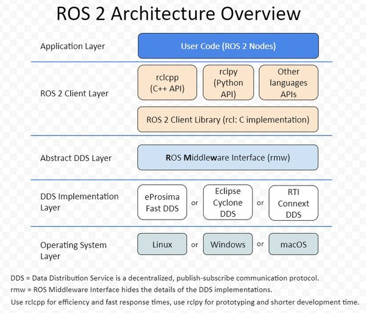

# 1.ROS2系统架构

本节小鱼主要从ROS2的整个框架上来带你进一步的了解它。

## 1.架构图

看完架构图小鱼带你一层层的来看。

## 2.操作系统层

操作系统层比较好理解，ROS2本身就是基于Linux、Windows或者macOS系统建立的，驱动计算机硬件、底层网络通信等实现都是交由操作系统来实现的。

## 3.DDS实现层

要想理解这一层就需要你了解DDS是什么? 以及为什么ROS2框架中会有多个DDS的实现。

### 3.1 DDS是什么？

- [一文读懂“数据分发服务DDS”（Data Distribution Service，RTPS，OMG）_DDS数据分发服务的博客-CSDN博客_corba dds](https://blog.csdn.net/DDS_CSIT/article/details/104607476)

DDS，全称 Data Distribution Service (数据分发服务)。是由对象管理组 (OMG) 于 2003 年发布并于 2007 年修订的开分布式系统标准。

通过类似于ROS中的话题发布和订阅形式来进行通信，同时提供了丰富的服务质量管理来保证可靠性、持久性、传输设置等。

### 3.2 DDS实现层用来做什么

DDS实现层其实就是对不同常见的DDS接口进行再次的封装，让其保持统一性，为DDS抽象层提供统一的API。

## 4. 抽象DDS层-RMW

这一层将DDS实现层进一步的封装，使得DDS更容易使用。原因在于DDS需要大量的设置和配置（分区，主题名称，发现模式，消息创建,...），这些设置都是在ROS2的抽象层中完成的。

## 5.ROS2客户端库 RCL

RCL（ROS Client Library）ROS客户端库，其实就是ROS的一种API，提供了对ROS话题、服务、参数、Action等接口。

> #### GUI和CLI
>
> - GUI（Graphical User Interface）就是平常我们说的图形用户界面，大家用的Windows是就是可视化的，我们可以通过鼠标点击按钮等图形化交互完成任务。
> - CLI（Command-Line Interface）就是命令行界面了，我们所用的终端，黑框框就是命令行界面，没有图形化。
>
> 很久之前电脑还是没有图形化界面的，所有的交互都是通过命令行实现，就学习机器人而言，命令行操作相对于图形化优势更加明显。
>
> #### API是什么
>
> 知道了CUI和CLI是根据是否有图形界面划分的，那API又是什么？
>
> API（ Application Programming Interface）应用程序编程接口。比如你写了一个库，里面有很多函数，如果别人要使用你这个库，但是并不知道每个函数内部是怎么实现的。使用的人需要看你的文档或者注释才知道这个函数的入口参数和返回值或者这个函数是用来做什么的。对于使用者来说来说 ，你的这些函数就是API。（摘自知乎）
>
> API在不同语言中的表现形式不同，在C和C++表现为头文件，在Python中表现为Python文件。

### 5.1 ROS2客户端库

ROS的客户端库就是上面所说的RCL，不同的语言对应着不同的rcl，但基本功能都是相同的。

比如Python语言提供了rclpy来操作ROS2的节点话题服务等，而C++则使用rclcpp提供API操作ROS2的节点话题和服务等。

所以后面我们使用Python和C++来编写ROS2节点实现通讯等功能时，我们就会引入rclpy和rclcpp的库。

上面这张图时ROS2，API的实现层级，最新下面的是第三方的DDS，rmw（中间件接口）层是对各家DDS的抽象层，基于rmw实现了rclc，有了rclc，我们就可以实现各个语言的库，大家都知道C语言是各个语言的鼻祖（汇编除外）所以基于rclc，ROS2官方实现了rclpy和rclcpp.

基于rclpy和rclcpp我们就可以实现上层的应用了，这张ros2的内部api架构图小鱼也算大概说清楚了。

有的同学可能还想着既然基于rclc可以实现多个语言的ROS2的库那rcljava有没有,有的:https://github.com/esteve/ros2_java,还有很多，小用户这里搜集放一下,说不定大家以后会用得到，比如在AndroidAPP上或者在Web上开发可以使用rcljava或rclnodejs。

| 语言              | 地址                                           |
| ----------------- | ---------------------------------------------- |
| python-rclpython  | https://github.com/ros2/rclpy                  |
| c++ - rclcpp      | https://github.com/ros2/rclcpp                 |
| java-rcljava      | https://github.com/esteve/ros2_java            |
| rust-rclrust      | https://github.com/ros2-rust/ros2_rust         |
| node.js-rclnodejs | https://github.com/RobotWebTools/rclnodejs     |
| go-rclgo          | https://github.com/juaruipav/rclgo             |
| lua-rcllua        | https://github.com/jbbjarnason/rcllua          |
| kotlin-rclkin     | https://github.com/ros2java-alfred/ros2_kotlin |
| swift-rclswift    | https://github.com/atyshka/ros2_swift          |
| c#-rclcs          | https://github.com/RobotecAI/ros2cs            |

## 6.应用层

应用层就是我们写代码以及ROS2开发的各种常用的机器人相关开发工具所在的层了。后面我们写的所有代码其实都是属于这一层的。

--------------

技术交流&&问题求助：

- **微信公众号及交流群：鱼香ROS**
- **小鱼微信：AiIotRobot**
- **QQ交流群：139707339**
- 版权保护：已加入“维权骑士”（rightknights.com）的版权保护计划