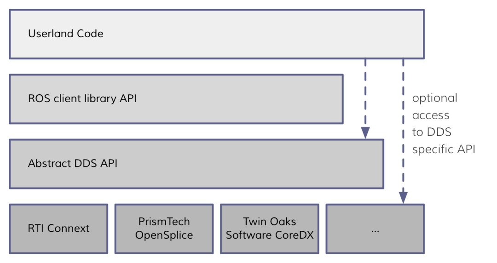
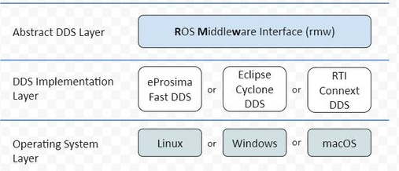
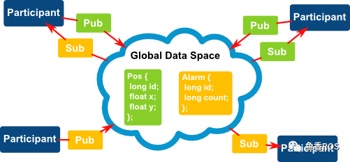
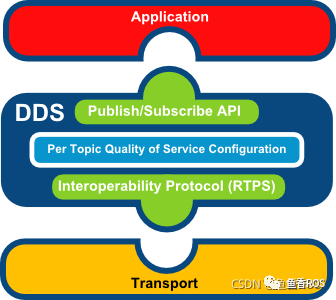

# 2.ROS2中间件DDS架构

本文主要带你了解DDS是什么、ROS2使用DDS所带来的优缺点，以及ROS2为了让DDS在机器人开发上变得简单做了哪些努力。

## 1. 中间件

### 1.1 中间件是什么

**顾名思义**

中间件就是**介于某两个或者多个节点中间的组件**。干嘛用的呢？

就是**提供多个节点中间通信**用的。

官方解释就比较玄乎了：

> 中间件是一种独立的系统软件或服务程序，分布式应用软件借助这种软件在不同的技术之间共享资源。中间件位于客户机/ 服务器的操作系统之上，管理计算机资源和网络通讯。是连接两个独立应用程序或独立系统的软件。相连接的系统，即使它们具有不同的接口，但通过中间件相互之间仍能交换信息。执行中间件的一个关键途径是信息传递。通过中间件，应用程序可以工作于多平台或OS环境。

小鱼看完表示

### 1.2 ROS中间件VS ROS2中间件

话不多说先上图

> ROS/ROS2中间件对比
>
> 此图来自论文Exploring the Performance of ROS2，小鱼已经收录到了公众号

#### 1.2.1 ROS1中间件

ROS1的中间件是ROS组织自己基于TCP/UDP机制建立的，为了维护该部分ROS1组织花费了大量的精力，但是依然存在很多问题。

#### 1.2.2 ROS2中间件

ROS2采用了第三方的DDS作为中间件，将DDS服务接口进行了一层抽象，保证了上层应用层调用接口的统一性。

基于DDS的互相发现协议，ROS2终于干掉了ROS1中的Master节点。

## 2. DDS和ROS2架构

ROS2为每家DDS供应商都开发了对应的DDS_Interface即DDS接口层，然后通过DDS Abstract抽象层来统一DDS的API。

ROS2架构中的DDS部分

## 3. DDS 通信模型

DDS的模型是非常容易理解，我们可以定义话题的数据结构（类似于ROS2中的接口类型）。下图中的例子:

- Pos：一个编号id的车子的位置x,y

DDS的参与者(Participant)通过发布和订阅主题数据进行通信。

DDS的应用层通过DDS进行数据订阅发布，DDS通过传输层进行数据的收发。

## 4. DDS的优势与劣势

### 4.1 优势

- 发布/订阅模型：简单解耦，可以轻松实现系统解耦
- 性能：在发布/订阅模式中，与请求/回复模式相比，延迟更低，吞吐量更高。
- 远程参与者的自动发现：此机制是 DDS 的主要功能之一。通信是匿名的、解耦的，开发者不必担心远程参与者的本地化。
- 丰富的 Qos 参数集，允许调整通信的各个方面：可靠性、持久性、冗余、寿命、传输设置、资源......
- 实时发布订阅协议 ( RTPS )：该协议几乎可以通过任何传输实现，允许在 UDP、TCP、共享内存和用户传输中使用 DDS，并实现不同 DDS 实现之间的真正互操作性。

### 4.2 劣势

-  API复杂，DDS 的灵活性是以复杂性为代价的。
-  系统开销相对较大，小鱼实际体会，待数据论证。
-  社区支持问题，但ROS2近两年来使用DDS后社区表现还是不错的。

### 5. ROS2使用DDS的几个理由

1. DDS已经应用在军事、潜艇各个领域，稳定性实时性经过实际检验。
2. 使用DDS需要维护的代码要少得多，可以让ROS2开发人员腾出手专注机器人开发。
3. DDS有定义好的行为和规范并且有完善的文档。
4. DDS提供了推荐的用例和软件API，有较好的语言支持。

--------------

技术交流&&问题求助：

- **微信公众号及交流群：鱼香ROS**
- **小鱼微信：AiIotRobot**
- **QQ交流群：139707339**

- 版权保护：已加入“维权骑士”（rightknights.com）的版权保护计划