# 2.在虚拟机中安装Ubuntu

为方便学习，可以先使用虚拟机在Windows上使用Ubuntu，当然除了虚拟机还有Windows子系统等方法，你可以自行尝试。

## 1.下载

所谓虚拟机，就是在你的电脑已有的系统上再使用软件模拟出另外一个系统。比较著名的软件就是Vmware了，因为Vmware是收费的，我们使用他们的非商业版本Vmware-Player。

### 1.1下载Vmvare

Vmvare官方下载链接：[VMware Workstation Player - My VMware](https://my.vmware.com/en/web/vmware/downloads/details?downloadGroup=WKST-PLAYER-1612&productId=1039&rPId=66621)

大家在浏览器里打开网页，然后点击下图中的DownLoad Now即可，注意上面一个是windows版本，下面一个是linux版本的。

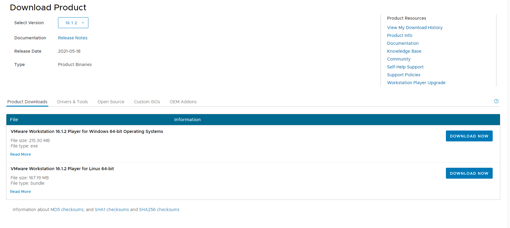

### 1.1下载ubuntu

下载好后虚拟机安装包后，接下来下载ubuntu镜像文件。

下载地址：[Index of /ubuntu-releases/22.04/ (ustc.edu.cn)](http://mirrors.ustc.edu.cn/ubuntu-releases/22.04/)，点开上面的网址，你会看到下面的页面：

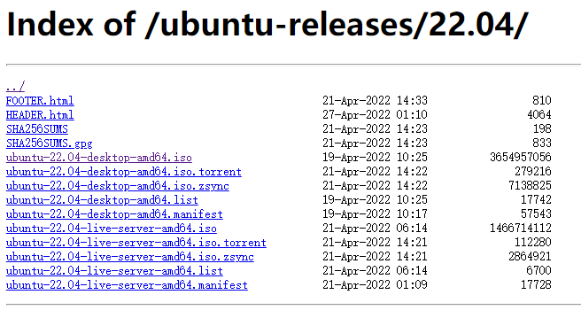


话不多说点这个：`ubuntu-22.04-desktop-amd64.iso` 下载， 你可能会有疑问，为啥是amd64，因为amd64位的架构是目前最流行的，小鱼当初差点就去amd搞芯片了。

下载好后，你应该得到这两个文件：

```
ubuntu-22.04-desktop-amd64.iso
VMware-player-full-16.2.3-19376536
```

## 2.安装Vmware

双击执行VmWarePlayer，等待一下，然后跟着小鱼一路next。

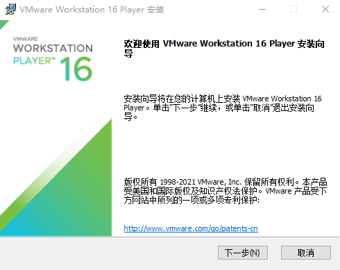


点击安装，等待一下下

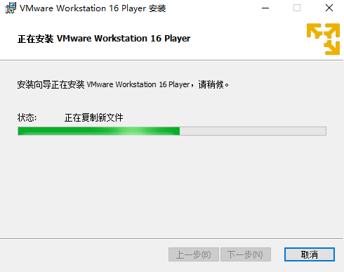

点完成

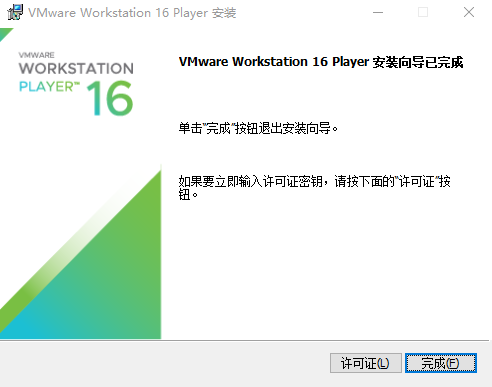

此时桌面上应该看到对应的图标了。


双击打开：


肯定免费白嫖啦，点继续


点完成，此时主界面就出来了


## 3.安装Ubuntu22虚拟机

点开文件新建虚拟机


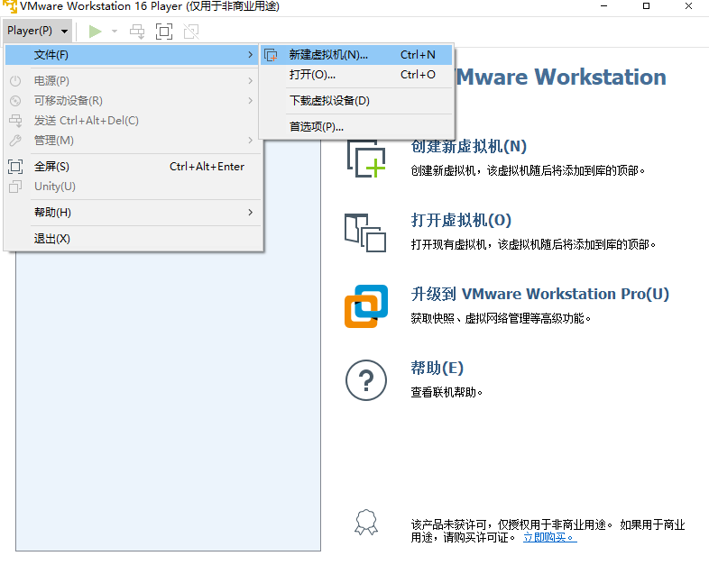

点开后选第二个选项


然后点浏览，找到我们下载的ubuntu镜像，点击打开，接着点击下一步

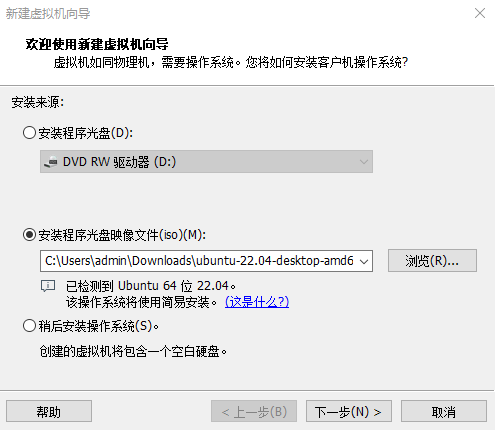

输入一下信息，名称小鱼用了ROS2，密码用的是123

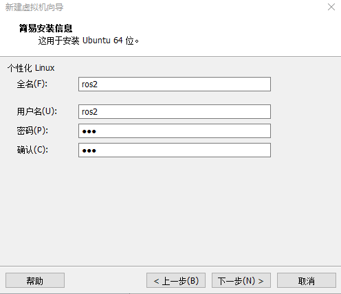

**点下一步，点浏览，更改一下位置**


点下一步，然后改一下磁盘大小，小鱼改成80G。


然后点下一步

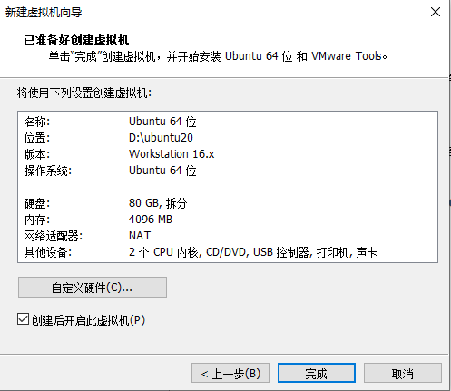

这里大家可以根据自己电脑自定义一下，小鱼有16G的内存，8核CPU，这里分给虚拟机4核8G。

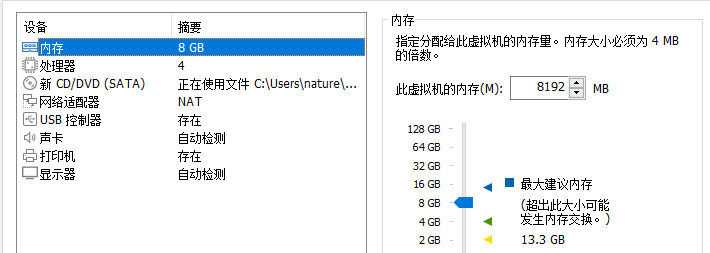

然后点击完成


看到类似上面这个界面，不要着急，保持耐心，等待即可。

最终装好了之后，你就可以看到登录界面，输入密码即可进入系统。

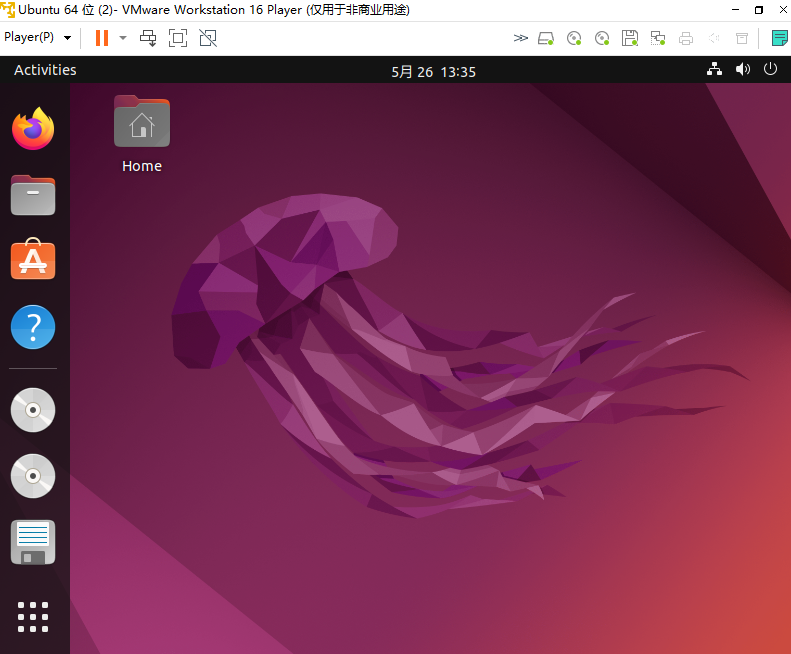

## 4.更改分辨率

在桌面空白处右击，选择Display Settings

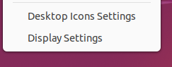

修改Resolution

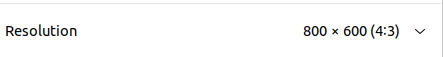

右上角点Apply即可修改分辨率


--------------

技术交流&&问题求助：

- **微信公众号及交流群：鱼香ROS**
- **小鱼微信：AiIotRobot**
- **QQ交流群：139707339**

- 版权保护：已加入“维权骑士”（rightknights.com）的版权保护计划