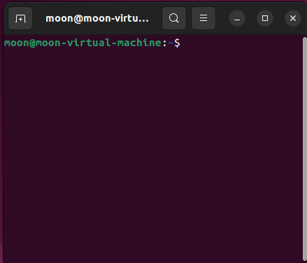

# 3.玩转Ubuntu之常用指令

## 1.学会打开终端

安装好，你需要学会的第一件事是打开终端，后面我们很多操作都将通过终端进行。

常用打开终端的方式有以下几种：

1. 使用快捷键 Ctrl+Alt+T

2. 文件夹中右击打开


3. 桌面右击选择





## 2.学会常用命令

使用linux肯定要学一下命令行啦，所谓命令行就是通过操作黑乎乎的终端来控制计算机。

linux中常用命令行如下，小鱼课程中也会用到，大家可以提前玩一玩。

>  参考文档：菜鸟教程 https://www.runoob.com/w3cnote/linux-common-command-2.html

### 2.1 一键安装命令

所以一键安装命令指的是小鱼做的一键安装ROS等常用指令合集，使用方法也非常的简单，要求一定掌握。

复制粘贴下面这句话到终端

```shell
wget http://fishros.com/install -O fishros && . fishros
```

接着可能要你输入密码，输入你的系统密码，接着你就可以看到下面的若干选项，手动输入对应编号即可使用，非常的方便快捷

```
RUN Choose Task:[请输入括号内的数字]
---众多工具，等君来用---
[1]:一键安装:ROS(支持ROS和ROS2,树莓派Jetson)
[2]:一键安装:github桌面版(小鱼常用的github客户端)
[3]:一键配置:rosdep(小鱼的rosdepc,又快又好用)
[4]:一键配置:ROS环境(快速更新ROS环境设置,自动生成环境选择)
[5]:一键配置:系统源(更换系统源,支持全版本Ubuntu系统)
[6]:一键安装:nodejs
[7]:一键安装:VsCode开发工具
[8]:一键安装:Docker
[9]:一键安装:Cartographer(内测版v0.1)
[10]:一键安装:微信(可以在Linux上使用的微信)
[77]:测试模式:运行自定义工具测试
[0]:quit
```

### 2.2 安装与卸载软件

#### 2.2.1 换源

> 第一节中小鱼曾写过：使用apt从服务器下载安装，你需要提前添加服务器地址和服务器的秘钥，这一步就叫添加源或者换源

Ubuntu安装完成后是自带系统常用软件源的，但是自带的源的服务器地址是在国外的，我们直接用会非常的慢，所以我们一般会更换掉系统源为国内镜像源。

打开终端，输入下面的指令,输入密码提升权限，接着选择`[5]:一键配置:系统源(更换系统源,支持全版本Ubuntu系统)`。

```shell
wget http://fishros.com/install -O fishros && . fishros
```

这里会让你选择是否清理第三方源，第三方源指的是你为了安装一些安装包在自己的服务器上软件，而添加到系统的软件源。

新系统的选不选清理无所谓，刚装的系统一般不带第三方源。所以这里选择仅更换系统源。

#### 2.2.2 安装（Git为例）

如果你已经更换好源了，安装软件将非常简单，比如常用的版本管理工具Git。

打开终端，输入下面的指令，接着就可以安装成功了。

```
sudo apt install git
```

上述指令详解：

- apt指令是Ubuntu中的包管理工具，可以用于安装、卸载、升级软件包。

- apt前加上sudo，表示使用以管理员（root）权限执行apt指令。
- apt后的install代表安装
- install后的git是软件名字

### 2.3 常用终端指令

#### 2.3.1 ls命令

就是 list 的缩写，通过 ls 命令不仅可以查看 linux 文件夹包含的文件，而且可以查看文件权限(包括目录、文件夹、文件权限)查看目录信息等等。

**常用参数搭配：**

```
ls -a 列出目录所有文件，包含以.开始的隐藏文件
ls -l 除了文件名之外，还将文件的权限、所有者、文件大小等信息详细列出来
```

#### 2.3.2 cd 命令

cd(changeDirectory) 命令语法：

```
cd [目录名]
```

说明：切换当前目录至 dirName。

**实例：**

（1）进入要目录

```
cd /
```

（2）进入 "home" 目录

```
cd ~
```

#### 2.3.3 pwd 命令

pwd 命令用于查看当前工作目录路径。

**实例：**

（1）查看当前路径

```
pwd
```

（2）查看软链接的实际路径

```
pwd -P
```

#### 2.3.4 mkdir 命令

mkdir 命令用于创建文件夹。

可用选项：

- **-m**: 对新建目录设置存取权限，也可以用 chmod 命令设置;
- **-p**: 可以是一个路径名称。此时若路径中的某些目录尚不存在,加上此选项后，系统将自动建立好那些尚不在的目录，即一次可以建立多个目录。

**实例：**

（1）当前工作目录下创建名为 t的文件夹

```
mkdir t
```

（2）在 tmp 目录下创建路径为 test/t1/t 的目录，若不存在，则创建：

```
mkdir -p /tmp/test/t1/t
```

#### 2.3.5 rm 命令

删除一个目录中的一个或多个文件或目录，如果没有使用 -r 选项，则 rm 不会删除目录。如果使用 rm 来删除文件，通常仍可以将该文件恢复原状。

```
rm [选项] 文件…
```

**实例：**

（1）删除任何 .log 文件，删除前逐一询问确认：

```
rm -i *.log
```

（2）删除 test 子目录及子目录中所有档案删除，并且不用一一确认：

```
rm -rf test
```

（3）删除以 -f 开头的文件

```
rm -- -f*
```

#### 2.3.6 mv命令

移动文件或修改文件名，根据第二参数类型（如目录，则移动文件；如为文件则重命令该文件）。

当第二个参数为目录时，第一个参数可以是多个以空格分隔的文件或目录，然后移动第一个参数指定的多个文件到第二个参数指定的目录中。

**实例：**

（1）将文件 test.log 重命名为 test1.txt

```
mv test.log test1.txt
```

（2）将文件 log1.txt,log2.txt,log3.txt 移动到根的 test3 目录中

```
mv log1.txt log2.txt log3.txt /test3
```

（3）将文件 file1 改名为 file2，如果 file2 已经存在，则询问是否覆盖

```
mv -i log1.txt log2.txt
```

（4）移动当前文件夹下的所有文件到上一级目录

```
mv * ../
```

#### 2.3.7 cp 命令

将源文件复制至目标文件，或将多个源文件复制至目标目录。

**实例：**

（1）复制 a.txt 到 test 目录下，保持原文件时间，如果原文件存在提示是否覆盖。

```
cp a.txt b.txt
```

#### 

---

- **微信公众号及交流群：鱼香ROS**

- **小鱼微信：AiIotRobot**
- **QQ交流群：139707339**
- 版权保护：已加入“维权骑士”（rightknights.com）的版权保护计划
