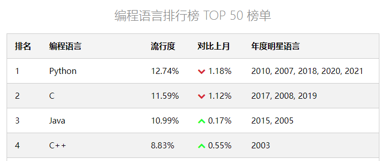
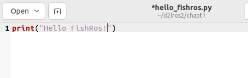
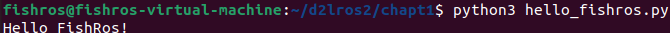
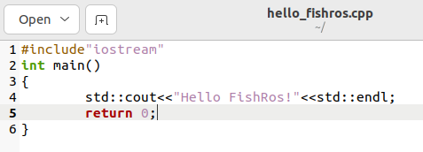
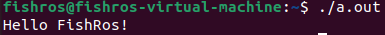

# 4.玩转Ubuntu之编程工具

做机器人最常用的两门语言就是C++和Python，同时这两门语言也是编程语言流行度排行榜数一数二的。



听说牛逼的大佬都用记事本写代码，这节小鱼带你在Linux版记事本之gedit上写一下C++和Python代码。

## 1.Hello FishRos

### 1.1 Python版

打开终端，创建一个`d2lros2`文件夹接着在文件夹下创建`chapt1`文件夹。

```shell
mkdir d2lros2
cd d2lros2
mkdir chapt1
```

接着输入下面的指令打开gedit并创建文件

```
gedit hello_fishros.py
```



接着你应该看到一个类似于记事本的东西，在里面输入下面一段代码，打印一句话

```
print("Hello FishRos!")
```

使用Ctrl+S保存代码

关掉gedit，接着在终端输入下面的指令运行这段脚本

```
python3 hello_fishros.py
```

如果一切正常，你将看到



### 1.2 C++版

接着我们来学习C++版本的打印一句话。

进入终端，用gedit再次编辑一个叫做`hello_fishros.cpp`的文件。

```shell
cd d2lros2/chapt1/
gedit hello_fishros.cpp
```

输入下面的内容

```c++
#include"iostream"

int main(){
    std::cout<<"Hello FishRos!"<<std::endl;
    return 0;
}
```

你会发现C++代码要比Python复杂很多，这也是近年来`人生苦短，我用Python`的来源。

保存代码，关闭gedit。



更麻烦的是你还不能直接运行C++的代码，C++代码必须经过编译构建之后才能运行。

C++的编译工具使用的是g++，默认是不安装的，所以我们需要手动安装一下g++。

使用上节课讲到的安装工具安装g++

```
sudo apt install g++
```

接着在终端输入下面的指令对刚刚的代码进行编译。

```
g++ hello_fishros.cpp
```

> 如报错请尝试安装：sudo apt-get install build-essential

接着使用`ls`指令，你应该可以看到一个叫做`a.out`的文件。恭喜，现在你可以运行了。

输入下面的指令即可运行

```
./a.out
```



> 请不要小看Linux中的`.`，它的用途很广，比如这里就是用于执行文件./文件名
>
> - [linux .（点）是什么意思-linux运维-PHP中文网](https://www.php.cn/linux-434268.html)


## 2.为什么C++需要编译

### 2.1 编译执行和解释执行的区别

- [3分钟搞懂什么是编译执行和解释执行](https://cloud.tencent.com/developer/article/1894284)

在知乎上看到一个比喻，非常好。

编译相当于做好了一桌子菜，可以直接开吃了。


而解释就相当于吃火锅，需要一边煮一边吃。


那么自然，吃的效率也会低一些。

### 2.2 编译执行

编译执行需要在运行之前把代码翻译成计算机认识的二进制文件，执行的时候就不需要再次翻译了，计算机可以直接看的懂。

C++的代码就是需要编译器进行翻译的，其翻译器的名字就叫做g++，该编译器非常的有名。

可以参阅下面的文章

- [g++是干什么用的 学c++一定要用这个么？ - 知乎 (zhihu.com)](https://www.zhihu.com/question/389406095)
- [GCC，G++介绍_Perz_01的博客-CSDN博客](https://blog.csdn.net/qq_24898229/article/details/124355442)


### 2.3 解释执行

Python可以说是解释执行的语言了，在运行前不需要翻译，运行时由解释器一句句解释运行即可。


### 2.4 编译VS解释

> [编译型语言VS解释型语言_Frank---7的博客-CSDN博客](https://blog.csdn.net/qq_45783660/article/details/119451738)

- 编译型语言，执行速度快、效率高；依靠编译器、跨平台性差些。
- 解释型语言，执行速度慢、效率低；依靠解释器、跨平台性好。

编译型的语言包括：C、C++、Delphi、Pascal、Fortran
解释型的语言包括：Java、Basic、javascript


--------------

技术交流&&问题求助：

- **微信公众号及交流群：鱼香ROS**
- **小鱼微信：AiIotRobot**
- **QQ交流群：139707339**

- 版权保护：已加入“维权骑士”（rightknights.com）的版权保护计划