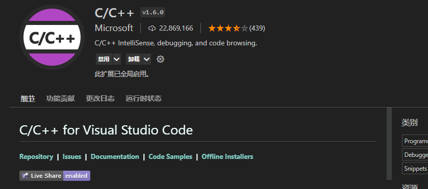
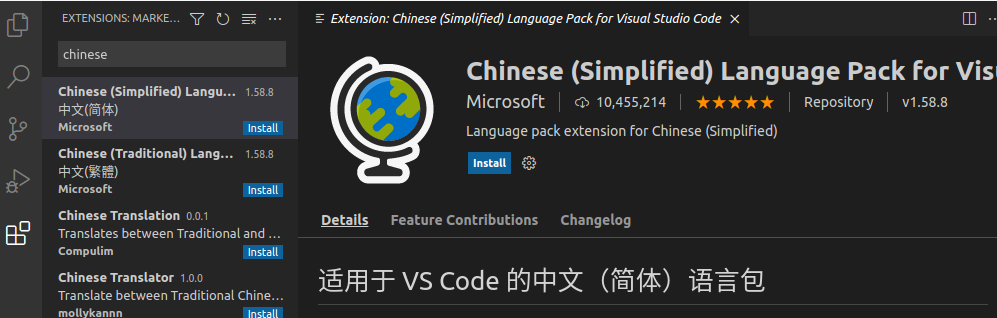
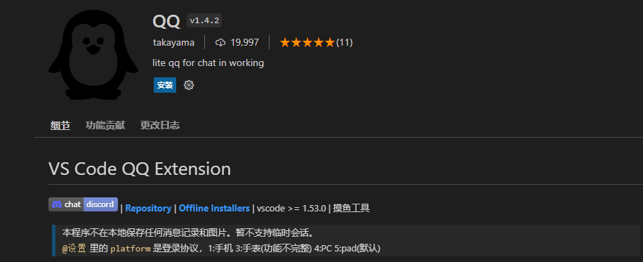

# 5.玩转Ubuntu之常用软件

gedit虽然很好用，但是效率还是不太高，毕竟写错了代码也没提示。linux虽然好用，但是中文输入和微信QQ不好装，本节小鱼带你一一解决这些问题。

## 1 鸟枪换炮之VsCode编辑器

首先出场的是代码编辑器VsCode，微软大大开源的，值得信赖。

### 1.1 VsCode安装

使用一键安装可以直接安装，打开终端，输入下面的指令

```
wget http://fishros.com/install -O fishros && . fishros
```

接着输入密码，选择7一键安装VsCode

```
RUN Choose Task:[请输入括号内的数字]
---众多工具，等君来用---
[1]:一键安装:ROS(支持ROS和ROS2,树莓派Jetson)
[2]:一键安装:github桌面版(小鱼常用的github客户端)
[3]:一键配置:rosdep(小鱼的rosdepc,又快又好用)
[4]:一键配置:ROS环境(快速更新ROS环境设置,自动生成环境选择)
[5]:一键配置:系统源(更换系统源,支持全版本Ubuntu系统)
[6]:一键安装:nodejs
[7]:一键安装:VsCode开发工具
[8]:一键安装:Docker
[9]:一键安装:Cartographer(内测版v0.1)
[10]:一键安装:微信(可以在Linux上使用的微信)
[77]:测试模式:运行自定义工具测试
[0]:quit
```

静候一会，安装完成后在任意终端输入code指令即可打开vscode，当然你还可以通过在文件夹或者文件上右击打开。

```
cd d2lros2/chapt1
code ./
```

> `code ./`在VsCode中打开当前文件夹。

### 1.2 多位一体

VsCode的强大之处有两个，第一个是强大的插件，第二个就是强大的界面。

- 左边是文件目录，`Ctrl+B`即可打开隐藏侧边栏。
- 中间是编辑器
- 下面可以显示终端，`Ctrl+Shift+~`即可打开终端。

### 1.3 强大的插件

VsCode插件无奇不有，我们常用的是Python和C++插件，帮助我们编写Python和C++代码。

**Python**


**C++**



##### 汉化插件



##### Python插件


**听歌网易抑云**


**背单词**


##### 看小说


##### 股票


## 2.中文输入法

- [搜狗输入法Linux官网-安装指导 (sogou.com)](https://pinyin.sogou.com/linux/guide)


## 3.聊天之微信QQ

### 3.1 微信

使用一键安装即可安装微信，有桌面版和Docker版本，都可以尝试使用。

```
wget http://fishros.com/install -O fishros && . fishros
```

### 3.2 QQ 

QQ推荐使用VsCode插件版本，体验很不错。



--------------

技术交流&&问题求助：

- **微信公众号及交流群：鱼香ROS**
- **小鱼微信：AiIotRobot**
- **QQ交流群：139707339**

- 版权保护：已加入“维权骑士”（rightknights.com）的版权保护计划