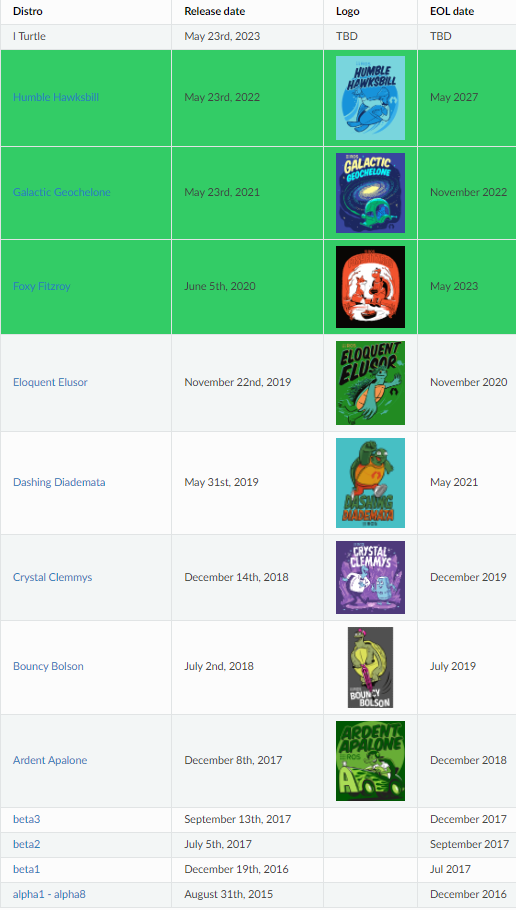

# 1.1 ROS2的前世今生

要说ROS2，那就不得不提起ROS，ROS就是传说中的机器人操作系统，英文全称（Robot Operating System），但ROS本身并不是一个操作系统，而是可以安装在现在已有的操作系统上（Linux、Windows、Mac）上的**软件库和工具集**。

ROS出生于2007年，ROS的出现解决了机器人各个组件之间的通信问题，同时基于ROS的完善的通信机制，越来越多的优秀的机器人算法集成到了ROS中来。

现在的ROS功能已经变得非常的丰富和强大。但随着对ROS功能上要求越来越多，一些原始的架构和设计不能够满足目前的使用需求，这也是ROS2出现的原因。

ROS2继承了ROS原有的优秀之处，同时又带来了很多新的功能,ROS2相对于ROS更加的强大。

## 1.ROS为什么会出现？

> ROS的设计目的是：简化在各种机器人平台上创建复杂而强大的机器人行为的任务即不重复造轮子

在ROS没有出现之前，做一个机器人是非常复杂的一件事情，因为一个机器人需要涉及到多个部分，而且这些部分之间还要进行通信。

例如设计一个像下图一样的轮式移动机器人，我们对其进行拆解。可以分为**感知、决策、控制**三个部分。

- **感知部分**有：激光雷达、深度相机、IMU、里程计、碰撞感知、建图
- **决策部分**有：路径规划（navigation）算法、定位算法
- **控制部分**有：轮子驱动

机器人复杂之处就在于此，如果想要整个机器人可以跑起来，那么必须要有一个东西将上面的几个部分合理的连接到一起，这个东西就是ROS。

ROS的作用就像我们的身体的神经系统一样，通过神经系统将我们身体的各个部分接入大脑。

## 2.有了ROS1为什么还要ROS2？

讲个故事，小鱼小时候，鱼爸鱼妈决定给小鱼盖一个新房，留着将来取媳妇，当时盖房子还不用钢筋混凝土，也没有啥设计图，一砖一瓦加上木制大梁就盖好了。盖好房子一家人开心的住了进去之后才发现没有建厕所，后来只能把杂物室给拆出来一空间建了厕所。

若干年后，小鱼出息了年薪百万，自然要过无比奢华糜烂的生活，什么样的生活才算无比奢华糜烂？

肯定要有一个全自动洗衣机，于是小鱼决定给家里买个洗衣机，某东上买好送到家，安装师傅一到小鱼家，人给整蒙了，连个下水道都没有。师傅说小鱼必须要先装个下水道，小鱼想了一下这咋办，盖房子时根本没想到会用洗衣机。

与其重新挖个下水道，不如直接盖个大楼房，请个专业设计师，用上最新最好的的材料，给邻居看看啥叫`壕无鱼性`

小鱼的故事讲完啦，接着说说ROS和ROS2，2007年ROS开发人员设计和制作ROS时，当时只想着**简化机器人的开发**，并没有想到过今天那么多的功能需求，比如商业化要求的稳定性、生命周期管理、多机协同、数据加密等。就像小鱼建房子时没想要未来会用全自动洗衣机一样~

ROS发展的后面的几年里，机器人对ROS的功能要求越来越多，ROS开发人员只能在原有的ROS上修修补补。

随着ROS不断的添加新功能，ROS变得越来越臃肿，祖传代码也越来越多。ROS开发人员发现在原有的ROS架构上修修补补十分消耗头发，于是像小鱼决定把房子推倒重建一样，ROS官方也重新设计制作了ROS2。

## 3.ROS2介绍

ROS2是在ROS的基础上设计开发的第二代机器人操作系统，可以帮助我们简化机器人开发任务，加速机器人落地的**软件库和工具集**。

### 3.1 ROS2很年轻吗

答案并不是，ROS2第一个`alpha1 - alpha8`版本从2015年8月31号就开始了，截至到目前（2021年7月）已经发布了12个版本（9个已经不再更新），所以ROS2并不年轻。

### 3.2 ROS2版本对照表

**参考资料：**

- ROS2官方更新计划：http://docs.ros.org/en/humble/Releases.html

--------------

技术交流&&问题求助：

- **微信公众号及交流群：鱼香ROS**
- **小鱼微信：AiIotRobot**
- **QQ交流群：139707339**

- 版权保护：已加入“维权骑士”（rightknights.com）的版权保护计划