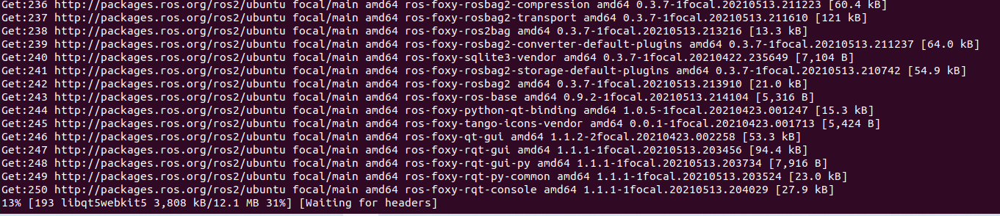

# 3.动手安装ROS2

到了这一节，终于可以开始安装ROS2了。安装ROS2本来是一件比较麻烦的事情，原因在于ROS2对于Ubuntu系统来说属于第三方软件，我们之前有讲到，第三方软件需要先添加源、再添加秘钥才才使用apt进行安装。

为帮助大家节省安装时间，小鱼制作了一键安装ROS2的脚本程序，可以非常便利的完成ROS2的安装和环境配置，接下来我们一起来体验下。

注意：1和2两种安装方式选择一个即可，第一次建议使用一键安装ROS2，防止出错。


## 1.一键安装ROS2

首先启动虚拟机或者启动双系统中的ubuntu，打开终端，输入下面的指令。

```
wget http://fishros.com/install -O fishros && . fishros
```

输入密码，在选项界面选择1-一键安装ROS，接着根据你的情况选择是否更换系统源（基础篇更换了就不用了），接着等待一会就会让你选择要安装的ROS2版本了。这里选择humble版本的ROS2即可。

接着会问你安装桌面版还是基础版，我们选择桌面版，包含可视化工具，如果是在树莓派上装可以使用基础版。

安装完成后输入ros2如果看到下面的界面则安装成功


## 2. 手动安装ROS2

### 2.1Ctrl+Alt+T打开终端

### 2.2 添加源

```
echo "deb [arch=$(dpkg --print-architecture)] https://repo.huaweicloud.com/ros2/ubuntu/ $(lsb_release -cs) main" | sudo tee /etc/apt/sources.list.d/ros2.list > /dev/null
```
### 2.3 添加源对应的秘钥

```
sudo apt install curl gnupg2 -y
curl -s https://gitee.com/ohhuo/rosdistro/raw/master/ros.asc | sudo apt-key add -
```


### 2.4 更新

```
sudo apt update	
```

### 2.5 安装ROS2

上面步骤完成后,安装就变得非常的简单了,一行指令搞定;

```
sudo apt install ros-humble-desktop
```

然后等着就行:



### 2.6 安装额外依赖

```
sudo apt install python3-argcomplete -y
```

### 2.7 配置环境变量

大家此时再打开一个终端，输入ros2,看看会有什么神奇的事情发生吧。

很不幸，你可能会看到到：


不要怕，跟着小鱼输入一句话：

```
source /opt/ros/humble/setup.bash
```

再尝试一下，就可以了。


这是为什么呢？

因为虽然安装好了ros2,但ros2并没有加入到系统默认的环境中来。每次想用还需要进行source.有什么办法可以一劳永逸呢?

有的，把ros2加入bashrc中。就是每次启动终端都让它自动的输入这句话。

```
echo "source /opt/ros/humble/setup.bash" >> ~/.bashrc
```


## 3.出现问题可以这样卸载

别的教程肯定不会写这个，不过这招有时候还挺好用，就是麻烦一些哈。

```
sudo apt remove ros-humble-*
sudo apt autoremove
```


## 4.ROS2到底装哪里了

在Windows安装过软件的小伙伴都知道安装软件都会选择一个安装目录，但是安装ROS时候并没有让你选择，ROS安装的默认目录在/opt/ros/下，根据版本的名字进行区分。

我们本节安装的是humble版本的ROS，所以安装目录在/opt/ros/humble下。

```
cd /opt/ros/humble/
ls
```


参考链接：

- ROS2 镜像使用帮助：https://mirrors.tuna.tsinghua.edu.cn/help/ros2/
- ROS2官方文档：http://docs.ros.org/en/humble/index.html


--------------

技术交流&&问题求助：

- **微信公众号及交流群：鱼香ROS**
- **小鱼微信：AiIotRobot**
- **QQ交流群：139707339**

- 版权保护：已加入“维权骑士”（rightknights.com）的版权保护计划