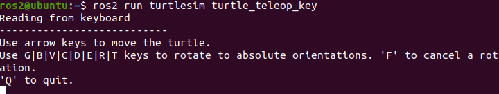
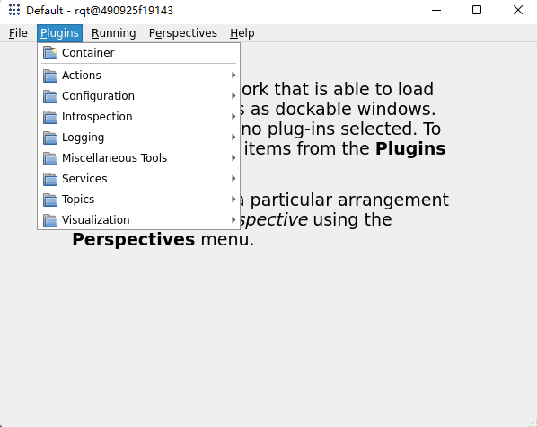
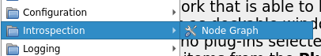
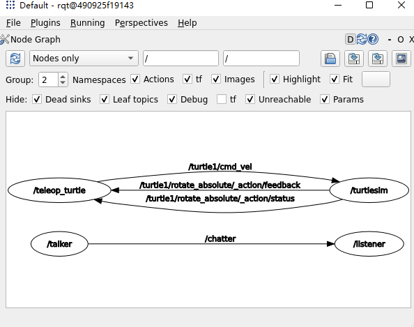

# 4.ROS2初体验

通过几个简单的小例子来体验ROS2软件库和工具集。

## 1.游戏1:你说我听

游戏内容：很简单，我们启动两个节点，一个节点负责发消息(说)，一个节点负责收消息（听）。

1. 启动一个终端Ctrl+Alt+T

2. 启动倾听者

   ```
   ros2 run demo_nodes_py listener
   ```

3. **启动一个新终端Ctrl+Alt+T**

4. 启动说话者

   ```
   ros2 run demo_nodes_cpp talker
   ```

观察一下现象，talker节点每数一个数，倾听节点每一次都能听到一个，是不是很神奇。


## 2.游戏2:涂鸦乌龟

游戏内容：启动海龟模拟器，启动海龟遥控器，控制海龟在地图上画出任意轨迹即可。

> 本来是控制海龟画个五角星的，但经过手动多次尝试，发现太难了。大家有时间可以试试，有搞定的可以发个图在群里分享一下。


### 2.1 启动海龟模拟器

打开终端Ctrl+Alt+T,输入下面的指令

```
ros2 run turtlesim turtlesim_node
```

就可以看到这样的界面


### 2.2 启动海龟遥控器

点一下原来的终端输入Ctrl+Shift+T 打开一个新的标签页输入

```
ros2 run turtlesim turtle_teleop_key
```

你可以看到这样子的界面



这个时候你就可以使用上下左右去遥控海龟了，快试一试吧。


## 3. RQT可视化

保持前面两个游戏在运行状态，打开终端，输入rqt。

```bash
rqt
```

打开之后的窗口如下图，空空如也，不要担心，因为我们没有选插件的原因。


### 选择插件

这里我们可以选择现有的几个RQT插件来试一试，可以看到和话题、参数、服务、动作四大通信组件相关的工具都有，还有一些可视化、日志和系统计算图等相关的。




#### Introspection / Node Graph



打开后就可以看到上面几个节点之间的数据关系了，是不是很方便的工具。



## 4.总结

通过本节的小游戏，你应该对ROS2稍微熟悉了一丢丢，不过心中也会多出那么几个问题？比如：

为什么一个节点说，一个节点会听到？

为什么键盘可以控制小乌龟前进后退？

没关系，让我们继续往下，你会一点点的有了拨云见月的感觉。


--------------

技术交流&&问题求助：

- **微信公众号及交流群：鱼香ROS**
- **小鱼微信：AiIotRobot**
- **QQ交流群：139707339**

- 版权保护：已加入“维权骑士”（rightknights.com）的版权保护计划
