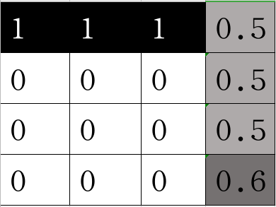

# 2.占据栅格地图

我们先了解下什么是栅格地图（Grid Map）。

如上图将地图数据分割为一块块的栅格来表达地图信息，就是栅格地图。

那什么是占据（Occupancy）呢？

机器人通过激光雷达等传感器来感知深度信息，但我们知道，传感器都是有噪声的（在前面的机器人仿真建模过程中，我们为了更加真实给激光雷达还添加了高斯噪声），所以机器人前方的某个位置到底有没有物体（障碍物）是不确定的。

我们可以采用概率来解决这一问题，认为确实有物体的栅格的占据率为100%，确定没有物体的栅格占据率为0%，不确定的栅格就用（确认占据概率/确认非占据概率）值表示占据率。

由此我们知道**占据栅格地图就是一张写满占据率的格子组成的地图**。

> 我们在做机器人的路径规划的时候，需要确定一个格子是有障碍物？没障碍物？还是未知呢？所以我们一般会设定两个阈值：
>
> - 占据阈值（occupied_thresh），比如0.65，则表示栅格占据率大于0.65的认为是有障碍物。
> - 空闲阈值（free_thresh），比如0.25，则表示栅格占据率小于0.25的认为没有障碍物。
>
> 那在free_thresh和occupied_thresh之间的则认为是未知区域（未探索）。

--------------

技术交流&&问题求助：

- **微信公众号及交流群：鱼香ROS**
- **小鱼微信：AiIotRobot**
- **QQ交流群：139707339**

- 版权保护：已加入“维权骑士”（rightknights.com）的版权保护计划

