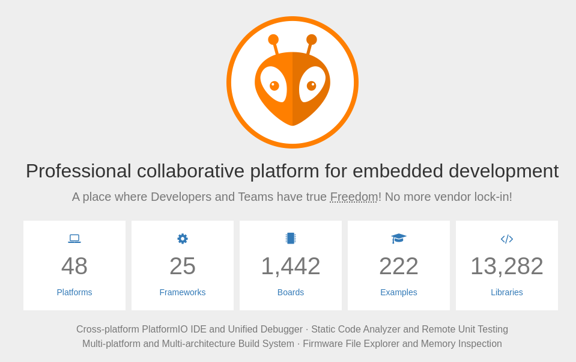

# 3.搭建PlateFormIO开发环境

你好，我是爱吃鱼香ROS的小鱼。本节我们开始介绍并搭建PlatformIO（以下简称PIO）的开发环境。因为网络原因，PIO搭建起来是一个挺困难的事情，但是小鱼在一键安装里添加了一键安装PIO，为你解决这一难题。

开始之前，小鱼想和你约定好本次学习之旅的开发环境和平台，小鱼这里采用的开发环境信息如下：

- 系统版本：Ubuntu 22.04（虚拟机实体机都可）

- ROS版本：ROS2-Humble

- 开发板：[MicroROS学习板V1.0.0](https://item.taobao.com/item.htm?id=695473143304)

## 一、PIO介绍



官网地址：https://platformio.org/

PIO是一个面向嵌入式开发的专业协作平台，它提供了一个适配VsCode的插件，它具有一个用户友好且可扩展的集成开发环境，具有一组专业开发工具，提供现代而强大的功能，以加快并简化嵌入式产品的创建和交付。

## 二、安装PIO

PIO的开发我们采用VsCode，所以在这之前你需要安装VsCode，VsCode安装可以使用一键安装，快速且稳定。

### 2.1 安装VsCode

运行一键安装指令，之后选择7即可

```
wget http://fishros.com/install -O fishros && . fishros
```


安装完成VsCode后，推荐你继续使用一键安装来安装PIO。

### 2.2 安装PIO（可跳过）

**注意这一步仅适用Ubuntu22.04系统，非该系统请直接跳过**

继续使用一键安装，选项12

```
wget http://fishros.com/install -O fishros && . fishros
```


### 2.3 安装VsCode插件

打开VsCode，我们还需安装一个PlatformIO插件就能正常Work了。

任意终端输入code，或者在菜单中找到vscode都可以打开vscode，接着在扩展中搜索`PlatformIO`，选择后点击安装即可。


安装完成后在侧方栏应该可以看到一个蚂蚁头的图标，这个就是PIO，点击图标，点击上访的Open就可以打开PIO HOME。


## 三、新建工程测试

接着我们就可以利用PIO建立第一个Arduino工程进行测试，首先点击New Project。


### 四步新建工程

1. 输入工程名 `example01_helloworld`
2. 选择开发板，这里选择`Adafruit ESP32 Feather`
3. 选择开发框架，这里我们用Arduino，PIO还支持IDF（IoT Development FrameWork）
4. 开发位置可以选择默认的位置，也可以自定义位置


最后点击`Finish`即可，这样我们就得到了一个支持ESP32的Arduino工程。


## 四、总结

本节我们学习通过VsCode安装PIO并新建一个Arduino工程，下一节小鱼带你一起了解下这个工程文件并学习如何编译工程。