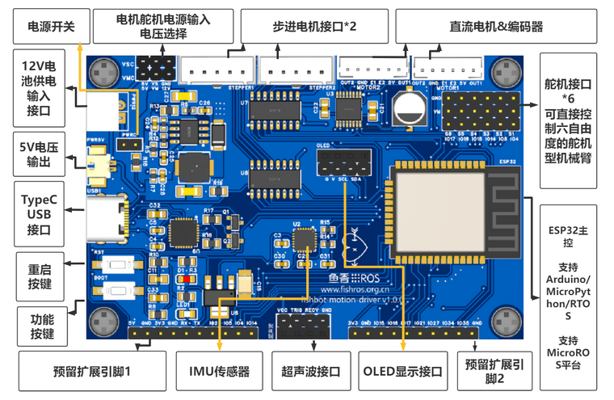

# 第 十三 章 嵌入式开发之从点灯开始

你好，我是小鱼。本章开始我们将一起走进机器人硬件的开发，学习如何通过程序控制机器人运动，通过代码驱动传感器获取环境的信息，本教程的食用方法如下。

- 基础篇，如果你是嵌入式方面的小白，即看不懂原理图，也不知道如何在微处理器上运行代码，那么请从基础篇开始，小鱼将从微处理器介绍以及点灯原理开始讲起。
- 入门篇，如果你对嵌入式有一定了解，但是对ESP32以及在PlatFormIO上开发Arduino不太了解，那么请从入门篇开始学习，小鱼将从安装PlatformIO开始带你一步步实现点灯。
- 进阶篇，最后的进阶篇，小鱼将带你学习驱动OLED显示器，学习如何在Arduino上安装依赖库以及在微处理器上用C++实现面向对象开发的方法。

**友情提示：和我们课程的名称一样，本教程中所有代码都非常建议跟着敲一遍，不要直接复制粘贴，写了才是自己的。**

## 硬件开发平台

嵌入式开发无法脱离硬件，为方便学习，本教程配套的硬件是小鱼自制的MicroROS学习板，同时该板可以作为下一章节搭建实体移动机器人的主控板以及后续制作机械臂的驱动板使用。

板载资源图如下：

该主控板可以在小鱼的店铺直接购买，性价比接地气，直达链接：[https://item.taobao.com/item.htm?id=695473143304](https://item.taobao.com/item.htm?id=695473143304)。

同时该板的原理图和PCB小鱼都已经开源了，时间充足且动手能力强工具齐全的的小伙伴可以自己购买元器件制作，开源地址见鱼香ROS社区：https://www.fishros.org.cn/forum/topic/894 

--------------

技术交流&&问题求助：

- **微信公众号及交流群：鱼香ROS**
- **小鱼微信：AiIotRobot**
- **QQ交流群：139707339**

- 版权保护：已加入“维权骑士”（rightknights.com）的版权保护计划

