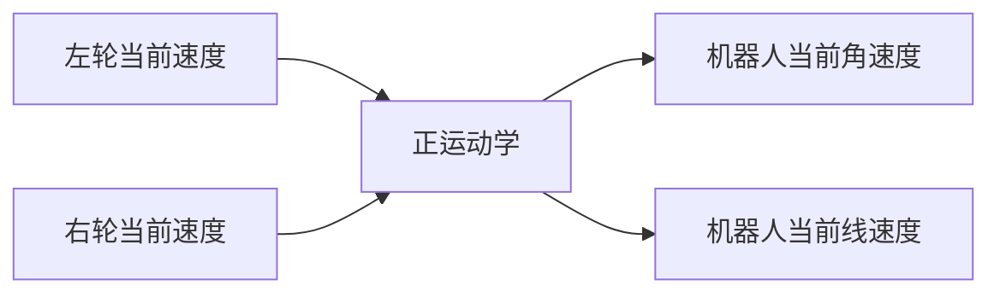
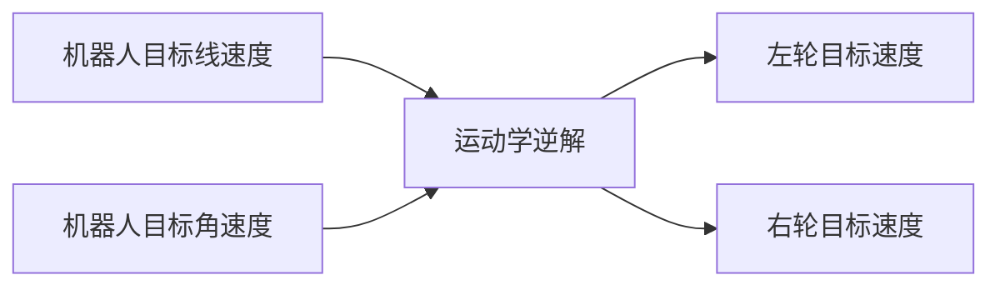

# 11.两轮差速机器人运动学介绍

你好，我是小鱼。本节我们来了解下两轮差速运动学。

## 一、两轮差速运动学模型

两轮差速模型指机器人底盘由两个驱动轮和若干支撑轮构成的底盘模型，像turtlebot和开源机器人fishbot都是两轮差速模型。

两轮差速模型通过两个驱动轮可以通过不同转速和转向，使得机器人的达到某个特定的角速度和线速度。

## 二、正逆解

了解了两轮差速模型，那正逆解又是怎么回事？

正运动学：已知两个轮子的速度，求整车的角速度（弧度/秒）和线速度（米/秒）

逆运动学：已知目标角速度和线速度，求两个轮子的转速

## 三、轮式里程计

当我们知道了两个轮子之间的相对位置，同时知道了每一时刻机器人的角速度和线速度，那我们如何获取机器人的当前角度和位置呢？

### 3.1 角度

影响机器人当前角度的因素只有一个，就是角速度。

某一时刻机器人转动的角度 = 这一时刻机器人的角速度*这一时刻时长

假如我们认定初始时刻机器人的角度为0,通过对机器人转动角度角度进行累加，即可获得机器人的当前角度。

**上述过程其实就是对角速度进行积分得到角度。**

### 3.2 位置

通过对角速度积分，我们得到了角度。

机器人某一时刻自身方向上的前进速度可以分解为里程计坐标系中x轴和y轴方向上的速度。

从图中可以看出：
$$
v_y = v*cos(\theta) \\
v_y = v*sin(\theta)
$$
得到了x和y方向上的速度，乘上该速度对应的某一时刻经过的时间，即可得到这一时刻在x轴和y轴方向上的位移，对位移进行累加即可得到里程计中的x和y。

