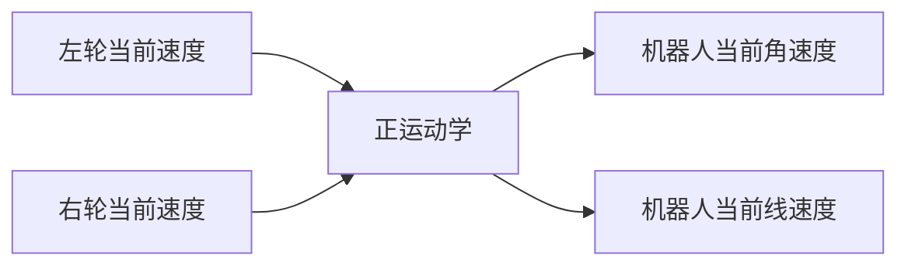

# 12. 实时速度计算-运动学正解

你好，我是小鱼。上一节了解了两轮差速运动学，本节我们线进一步的了解两轮差速正运动学的推导过程，并利用两轮差速运动学正解，来完成对小车的实时速度计算。




## 一、正运动学解推导

两轮差速机器人是一种常见的移动机器人类型，由两个轮子和一个中心点组成。我们可以通过控制每个轮子的转速来实现移动，并且可以在一个平面上进行自由移动。

前面章节我们通过PID+编码器完成了FishBot底盘两个轮子单独速度的测量，但是在实际使用当中，我们把机器人当作一个整体来看，而对于这样一个整体在空间中的速度，我们一般采用X轴线速度 $v$ 和Z轴角速度 $\omega$ 来描述。

>  需要注意的是：在ROS中，机器人的前方通常指的是机器人本体坐标系的正方向。本体坐标系是相对于机器人自身的一个坐标系，通常定义在机器人的中心位置，以**机器人的前进方向为X轴，左侧为Y轴，垂直于机器人平面的方向为Z轴**。
>
> 而**全局坐标系中的正方向X轴指向右方，Y轴指向前方，Z轴垂直于地面**。
>
> |                  | X    | Y    | Z                |
> | ---------------- | ---- | ---- | ---------------- |
> | 机器人本体坐标系 | 前方 | 左侧 | 垂直于机器人平面 |
> | 全局坐标系       | 右方 | 前方 | 垂直于地面       |

所以问题就变成了假设机器人在一小段时间$t$内，它的左右轮子线速度$v_l$和$v_r$保持不变 ，两轮之间的安装间距$ l $，求机器人的线速度$v$ ，角速度$\omega$。


我们看上图来推导

因为机器人的线速度方向和轮子转动方向始终保持一致，所以机器人的线速度为做右轮线速度的平均值，即：
$$
v=(v_l+v_r)/2
$$
我们知道$v=\omega * r$ ，根据上图所以有
$$
l = r_r-r_l \\
= v_r/{\omega}_r - v_l/{\omega}_l \\
$$
同一个机器人角速度相同，所以有
$$
{\omega}_l = {\omega}_r
$$
可以求出
$$
{\omega} = (v_r-v_l)/l
$$

## 二、正运动学代码实现

### 2.1 新建工程

从本节开始我们持续的在一个工程上进行开发，推荐大家建立代码仓库，并将代码用git进行管理起来。

在PlatformIO上新建`fishbot_motion_control_microros`工程。


添加依赖

```ini
[env:featheresp32]
platform = espressif32
board = featheresp32
framework = arduino
board_microros_transport = wifi
board_microros_distro = humble
board_build.f_cpu = 240000000L
board_build.f_flash = 80000000L
monitor_speed = 115200
lib_deps = 
	https://gitee.com/ohhuo/micro_ros_platformio.git
	https://github.com/fishros/Esp32McpwmMotor.git
	https://github.com/fishros/Esp32PcntEncoder.git
```

接着将前面章节中pid_controller样例程序的lib下的内容和main.cpp内容复制过来，最终就目录结构如下：

```
.
├── include
│   └── README
├── lib
│   ├── PidController
│   │   ├── PidController.cpp
│   │   └── PidController.h
│   └── README
├── LICENSE
├── platformio.ini
├── src
│   └── main.cpp
└── test
    ├── my_main.cpp
    ├── README
```

### 2.2 添加Kinematic库

在lib下添加`Kinematics`文件夹，并添加`Kinematics.h`和`Kinematics.cpp`文件。


编写Kinematics.h

```cpp
/**
 * @file Kinematics.h
 * @author fishros@foxmail.com
 * @brief 机器人模型设置,编码器轮速转换,ODOM推算,线速度角速度分解
 * @version V1.0.0
 * @date 2022-12-10
 *
 * @copyright Copyright www.fishros.com (c) 2022
 *
 */
#ifndef __KINEMATICS_H__
#define __KINEMATICS_H__
#include <Arduino.h>

typedef struct
{
    uint8_t id;                // 电机编号
    uint16_t reducation_ratio; // 减速器减速比，轮子转一圈，电机需要转的圈数
    uint16_t pulse_ration;     // 脉冲比，电机转一圈所产生的脉冲数
    float wheel_diameter;      // 轮子的外直径，单位mm

    float per_pulse_distance;  // 无需配置，单个脉冲轮子前进的距离，单位mm，设置时自动计算
                               // 单个脉冲距离=轮子转一圈所行进的距离/轮子转一圈所产生的脉冲数
                               // per_pulse_distance= (wheel_diameter*3.1415926)/(pulse_ration*reducation_ratio)
    uint32_t speed_factor;     // 无需配置，计算速度时使用的速度因子，设置时自动计算，speed_factor计算方式如下
                               // 设 dt（单位us,1s=1000ms=10^6us）时间内的脉冲数为dtick
                               // 速度speed = per_pulse_distance*dtick/(dt/1000/1000)=(per_pulse_distance*1000*1000)*dtic/dt
                               // 记 speed_factor = (per_pulse_distance*1000*1000)
    int16_t motor_speed;       // 无需配置，当前电机速度mm/s，计算时使用
    int64_t last_encoder_tick; // 无需配置，上次电机的编码器读数
    uint64_t last_update_time; // 无需配置，上次更新数据的时间，单位us
} motor_param_t;


class Kinematics
{
private:
    motor_param_t motor_param_[2];
    float wheel_distance_; // 轮子间距
public:
    Kinematics(/* args */) = default;
    ~Kinematics() = default;

    /**
     * @brief 设置电机相关参数
     * 
     * @param id 
     * @param reducation_ratio 
     * @param pulse_ration 
     * @param wheel_diameter 
     */
    void set_motor_param(uint8_t id, uint16_t reducation_ratio, uint16_t pulse_ration, float wheel_diameter);
    /**
     * @brief 设置运动学相关参数
     * 
     * @param wheel_distance 
     */
    void set_kinematic_param(float wheel_distance);

    /**
     * @brief 运动学逆解，输入机器人当前线速度和角速度，输出左右轮子应该达到的目标速度
     * 
     * @param line_speed 
     * @param angle_speed 
     * @param out_wheel1_speed 
     * @param out_wheel2_speed 
     */
    void kinematic_inverse(float line_speed, float angle_speed, float &out_wheel1_speed, float &out_wheel2_speed);


    /**
     * @brief 运动学正解，输入左右轮子速度，输出机器人当前线速度和角速度
     * 
     * @param wheel1_speed 
     * @param wheel2_speed 
     * @param line_speed 
     * @param angle_speed 
     */
    void kinematic_forward(float wheel1_speed, float wheel2_speed, float &line_speed, float &angle_speed);

    /**
     * @brief 更新轮子的tick数据
     * 
     * @param current_time 
     * @param motor_tick1 
     * @param motor_tick2 
     */
    void update_motor_ticks(uint64_t current_time, int32_t motor_tick1, int32_t motor_tick2);

    /**
     * @brief 获取轮子当前速度
     * 
     * @param id 
     * @return float 
     */
    float motor_speed(uint8_t id);
};

#endif // __KINEMATICS_H__
```

这里主要定义了一个电机参数结构体，并定义了一个类，该类包含以下6个函数

| 函数名称                | 描述                                                         |
| ----------------------- | ------------------------------------------------------------ |
| `set_motor_param()`     | 设置电机相关参数                                             |
| `set_kinematic_param()` | 设置运动学相关参数                                           |
| `kinematic_inverse()`   | 运动学逆解，输入机器人当前线速度和角速度，输出左右轮子应该达到的目标速度 |
| `kinematic_forward()`   | 运动学正解，输入左右轮子速度，输出机器人当前线速度和角速度   |
| `update_motor_ticks()`  | 更新轮子的tick数据                                           |
| `motor_speed()`         | 获取轮子当前速度           |

### 2.3 `Kinematics.cpp`代码实现

```cpp
#include "Kinematics.h"

void Kinematics::set_motor_param(uint8_t id, uint16_t reducation_ratio, uint16_t pulse_ration, float wheel_diameter)
{
    motor_param_[id].id = id;   // 设置电机ID
    motor_param_[id].reducation_ratio = reducation_ratio;   // 设置减速比
    motor_param_[id].pulse_ration = pulse_ration;   // 设置脉冲比
    motor_param_[id].wheel_diameter = wheel_diameter;   // 设置车轮直径
    motor_param_[id].per_pulse_distance = (wheel_diameter * PI) / (reducation_ratio * pulse_ration);   // 每个脉冲对应行驶距离
    motor_param_[id].speed_factor = (1000 * 1000) * (wheel_diameter * PI) / (reducation_ratio * pulse_ration);   // 计算速度因子
    Serial.printf("init motor param %d: %f=%f*PI/(%d*%d) speed_factor=%d\n", id, motor_param_[id].per_pulse_distance, wheel_diameter, reducation_ratio, pulse_ration, motor_param_[id].speed_factor);   // 打印调试信息
}

void Kinematics::set_kinematic_param(float wheel_distance)
{
    wheel_distance_ = wheel_distance;   // 设置轮间距离
}

void Kinematics::update_motor_ticks(uint64_t current_time, int32_t motor_tick1, int32_t motor_tick2)
{

    uint32_t dt = current_time - motor_param_[0].last_update_time;   // 计算时间差
    int32_t dtick1 = motor_tick1 - motor_param_[0].last_encoder_tick;   // 计算电机1脉冲差
    int32_t dtick2 = motor_tick2 - motor_param_[1].last_encoder_tick;   // 计算电机2脉冲差
    // 轮子速度计算
    motor_param_[0].motor_speed = dtick1 * (motor_param_[0].speed_factor / dt);   // 计算电机1轮子速度
    motor_param_[1].motor_speed = dtick2 * (motor_param_[1].speed_factor / dt);   // 计算电机2轮子速度

    motor_param_[0].last_encoder_tick = motor_tick1;   // 更新电机1上一次的脉冲计数
    motor_param_[1].last_encoder_tick = motor_tick2;   // 更新电机2上一次的脉冲计数
    motor_param_[0].last_update_time = current_time;   // 更新电机1上一次更新时间
    motor_param_[1].last_update_time = current_time;   // 更新电机2上一次更新时间
}

void Kinematics::kinematic_inverse(float linear_speed, float angular_speed, float &out_wheel1_speed, float &out_wheel2_speed)
{
}

void Kinematics::kinematic_forward(float wheel1_speed, float wheel2_speed, float &linear_speed, float &angular_speed)
{
    linear_speed = (wheel1_speed + wheel2_speed) / 2.0;   // 计算线速度
    angular_speed = (wheel2_speed - wheel1_speed) / wheel_distance_;   // 计算角速度
}

float Kinematics::motor_speed(uint8_t id)
{
    return motor_param_[id].motor_speed; // 返回指定id的轮子速度
} 
```


### 2.4 修改main.cpp

```cpp
#include <Arduino.h>
#include <micro_ros_platformio.h>    // 包含用于 ESP32 的 micro-ROS PlatformIO 库
#include <WiFi.h>                    // 包含 ESP32 的 WiFi 库
#include <rcl/rcl.h>                 // 包含 ROS 客户端库 (RCL)
#include <rclc/rclc.h>               // 包含用于 C 的 ROS 客户端库 (RCLC)
#include <rclc/executor.h>           // 包含 RCLC 执行程序库，用于执行订阅和发布
#include <geometry_msgs/msg/twist.h> // 包含 ROS2 geometry_msgs/Twist 消息类型
#include <Esp32PcntEncoder.h>        // 包含用于计数电机编码器脉冲的 ESP32 PCNT 编码器库
#include <Esp32McpwmMotor.h>         // 包含使用 ESP32 的 MCPWM 硬件模块控制 DC 电机的 ESP32 MCPWM 电机库
#include <PidController.h>           // 包含 PID 控制器库，用于实现 PID 控制
#include <Kinematics.h>              // 运动学相关实现

Esp32PcntEncoder encoders[2];      // 创建一个长度为 2 的 ESP32 PCNT 编码器数组
rclc_executor_t executor;          // 创建一个 RCLC 执行程序对象，用于处理订阅和发布
rclc_support_t support;            // 创建一个 RCLC 支持对象，用于管理 ROS2 上下文和节点
rcl_allocator_t allocator;         // 创建一个 RCL 分配器对象，用于分配内存
rcl_node_t node;                   // 创建一个 RCL 节点对象，用于此基于 ESP32 的机器人小车
rcl_subscription_t subscriber;     // 创建一个 RCL 订阅对象，用于订阅 ROS2 消息
geometry_msgs__msg__Twist sub_msg; // 创建一个 ROS2 geometry_msgs/Twist 消息对象
Esp32McpwmMotor motor;             // 创建一个 ESP32 MCPWM 电机对象，用于控制 DC 电机

float out_motor_speed[2];        // 创建一个长度为 2 的浮点数数组，用于保存输出电机速度
PidController pid_controller[2]; // 创建PidController的两个对象
Kinematics kinematics;           // 运动学相关对象

void twist_callback(const void *msg_in)
{
  const geometry_msgs__msg__Twist *twist_msg = (const geometry_msgs__msg__Twist *)msg_in;
  static float target_motor_speed1, target_motor_speed2;
  float linear_x = twist_msg->linear.x;   // 获取 Twist 消息的线性 x 分量
  float angular_z = twist_msg->angular.z; // 获取 Twist 消息的角度 z 分量
  kinematics.kinematic_inverse(linear_x * 1000, angular_z, target_motor_speed1, target_motor_speed2);
  pid_controller[0].update_target(target_motor_speed1);
  pid_controller[1].update_target(target_motor_speed2);
}

// 这个函数是一个后台任务，负责设置和处理与 micro-ROS 代理的通信。
void microros_task(void *param)
{
  // 设置 micro-ROS 代理的 IP 地址。
  IPAddress agent_ip;
  agent_ip.fromString("192.168.2.105");

  // 使用 WiFi 网络和代理 IP 设置 micro-ROS 传输层。
  set_microros_wifi_transports("fishbot", "12345678", agent_ip, 8888);

  // 等待 2 秒，以便网络连接得到建立。
  delay(2000);

  // 设置 micro-ROS 支持结构、节点和订阅。
  allocator = rcl_get_default_allocator();
  rclc_support_init(&support, 0, NULL, &allocator);
  rclc_node_init_default(&node, "esp32_car", "", &support);
  rclc_subscription_init_default(
      &subscriber,
      &node,
      ROSIDL_GET_MSG_TYPE_SUPPORT(geometry_msgs, msg, Twist),
      "/cmd_vel");

  // 设置 micro-ROS 执行器，并将订阅添加到其中。
  rclc_executor_init(&executor, &support.context, 1, &allocator);
  rclc_executor_add_subscription(&executor, &subscriber, &sub_msg, &twist_callback, ON_NEW_DATA);

  // 循环运行 micro-ROS 执行器以处理传入的消息。
  while (true)
  {
    delay(100);
    rclc_executor_spin_some(&executor, RCL_MS_TO_NS(100));
  }
}


void setup()
{
  // 初始化串口通信，波特率为115200
  Serial.begin(115200);
  // 将两个电机分别连接到引脚22、23和12、13上
  motor.attachMotor(0, 22, 23);
  motor.attachMotor(1, 12, 13);
  // 在引脚32、33和26、25上初始化两个编码器
  encoders[0].init(0, 32, 33);
  encoders[1].init(1, 26, 25);
  // 初始化PID控制器的kp、ki和kd
  pid_controller[0].update_pid(0.625, 0.125, 0.0);
  pid_controller[1].update_pid(0.625, 0.125, 0.0);
  // 初始化PID控制器的最大输入输出，MPCNT大小范围在正负100之间
  pid_controller[0].out_limit(-100, 100);
  pid_controller[1].out_limit(-100, 100);

  // 设置运动学参数
  kinematics.set_motor_param(0, 45, 44, 65);
  kinematics.set_motor_param(1, 45, 44, 65);
  kinematics.set_kinematic_param(150);

  // 在核心0上创建一个名为"microros_task"的任务，栈大小为10240
  xTaskCreatePinnedToCore(microros_task, "microros_task", 10240, NULL, 1, NULL, 0);
}

void loop()
{
  static float out_motor_speed[2];
  static uint64_t last_update_info_time = millis();
  kinematics.update_motor_ticks(micros(), encoders[0].getTicks(), encoders[1].getTicks());
  out_motor_speed[0] = pid_controller[0].update(kinematics.motor_speed(0));
  out_motor_speed[1] = pid_controller[1].update(kinematics.motor_speed(1));
  motor.updateMotorSpeed(0, out_motor_speed[0]);
  motor.updateMotorSpeed(1, out_motor_speed[1]);
  // 延迟10毫秒
  delay(10);
}
```

这里主要调用Kinematic完成相关函数的调用。

主要有下面几行

```
// 初始化运动学相关对象
Kinematics kinematics;           
// 设置运动学参数
kinematics.set_motor_param(0, 45, 44, 65);
kinematics.set_motor_param(1, 45, 44, 65);
kinematics.set_kinematic_param(150);
// 更新电机速度
kinematics.update_motor_ticks(micros(), encoders[0].getTicks(), encoders[1].getTicks());
// 运动学逆解
kinematics.kinematic_inverse(linear_x * 1000, angular_z, target_motor_speed1, target_motor_speed2);
```

## 三、上传测试

下载代码，运行agent，点击RST按键。

```shell
sudo docker run -it --rm -v /dev:/dev -v /dev/shm:/dev/shm --privileged --net=host microros/micro-ros-agent:$ROS_DISTRO udp4 --port 8888 -v6
```


看到连接建立表示通信成功，接着用`ros2 topic list`

```shell
ros2 topic list
```


看到`/cmd_vel`表示正常，接着我们使用`teleop_twist_keyboard`进行键盘控制

```shell
ros2 run teleop_twist_keyboard teleop_twist_keyboard
```

随便发送一个指令，打开串口，观察打印


速度一直在20左右徘徊，和我们设置的速度相同。

```cpp
void Kinematics::kinematic_inverse(float linear_speed, float angular_speed, float &out_wheel1_speed, float &out_wheel2_speed)
{
    // 直接返回指定速度20mm/s
    out_wheel1_speed = 20;
    out_wheel2_speed = 20;
}
```

## 四、扩展-Git初体验

### 4.1 Git使用简介

1. 安装 Git：如果你的系统中没有 Git，可以通过以下命令进行安装：

```
sudo apt update
sudo apt install git
```

2. 配置 Git：在使用 Git 之前，你需要设置用户名和邮箱地址，这样 Git 才能正确地记录你的提交信息。使用以下命令配置 Git：

```
arduino
git config --global user.name "Your Name"
git config --global user.email "youremail@example.com"
```

将 "Your Name" 替换为你的姓名，"[youremail@example.com](mailto:youremail@example.com)" 替换为你的邮箱地址。

创建一个 Git 仓库：如果你要将一个现有的项目纳入 Git 的版本控制下，可以使用以下命令将其转化为一个 Git 仓库：

```bash
cd /path/to/your/project
git init
```

3. 将文件添加到 Git 仓库：使用以下命令将文件添加到 Git 仓库：

```
git add filename
```

其中，"filename" 是要添加到 Git 仓库中的文件名。如果你要将所有文件添加到 Git 仓库中，可以使用以下命令：

```
git add .
```

4. 提交更改：使用以下命令将文件的更改提交到 Git 仓库中：

```
git commit -m "commit message"
```

其中，"commit message" 是提交信息，需要用简短的文字描述本次提交的更改内容。

### 4.2 提交本节代码

根据上面的介绍我们可以使用git来将这一节的代码保存

安装

```
sudo apt install git
```

初始化仓库，配置邮箱和用户名

```
cd fishbot_motion_control_microros
git init
```

提交本次所有代码

```
git add .
git commit -m "feat(16.12):完成运动学正解"
git log
```

