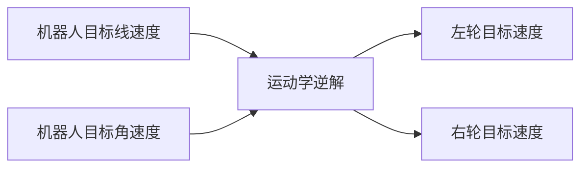

# 13.目标速度控制-运动学逆解

你好，我是小鱼。上一节我们推导并在代码中实现了运动学正解，本节我们来学习下运动学逆解，实现给定线速度和角速度，计算出轮子达到怎样的转速才能达到这个速度。



## 一、逆解推导

我们直接用正解结果进行求逆解即可。
$$
v=(v_l+v_r)/2 
\\
{\omega} = (v_r-v_l)/l
$$
所以有
$$
v_l = v-\omega l/2 \\
v_r = v+\omega l/2
$$

## 二、编写代码

继续在上一节中的代码`Kinematics.cpp`中完善即可。

```cpp
void Kinematics::kinematic_inverse(float linear_speed, float angular_speed, float &out_wheel1_speed, float &out_wheel2_speed)
{
    out_wheel1_speed =
        linear_speed - (angular_speed * wheel_distance_) / 2.0;
    out_wheel2_speed =
        linear_speed + (angular_speed * wheel_distance_) / 2.0;
}
```


## 三、下载测试

下载代码，运行agent，点击RST按键。

```shell
sudo docker run -it --rm -v /dev:/dev -v /dev/shm:/dev/shm --privileged --net=host microros/micro-ros-agent:$ROS_DISTRO udp4 --port 8888 -v6
```


看到连接建立表示通信成功，接着用`ros2 topic list`

```shell
ros2 topic list
```


看到`/cmd_vel`表示正常，接着我们使用`teleop_twist_keyboard`进行键盘控制

```shell
ros2 run teleop_twist_keyboard teleop_twist_keyboard
```

先调整下速度，降低到0.05左右（50cm/s），然后使用i\j\j\k\,测试。

## 四、总结

没啥好说的，记得提交下代码

```
git commit -m "feat(13.13):完成运动学逆解"
```

代码提交也是有规范的，我们一起来学习下：https://fishros.org.cn/forum/topic/390

我们采用用的比较多的Angular 规范

```
git commit -m "<type>(<scope>): <subject>"
```
其中 type（必选）、scope（可选）和 subject（必选）

#### Type

- feat：新功能（feature）。
- fix/to：修复bug，可以是QA发现的BUG，也可以是研发自己发现的BUG。
  - fix：产生diff并自动修复此问题。适合于一次提交直接修复问题
  - to：只产生diff不自动修复此问题。适合于多次提交。最终修复问题提交时使用fix
- docs：文档（documentation）。
- style：格式（不影响代码运行的变动）。
- refactor：重构（即不是新增功能，也不是修改bug的代码变动）。
- perf：优化相关，比如提升性能、体验。
- test：增加测试。
- chore：构建过程或辅助工具的变动。
- revert：回滚到上一个版本。
- merge：代码合并。
- sync：同步主线或分支的Bug。

#### scope(可选)

scope用于说明 commit 影响的范围，比如电机控制层、通信层等等，视项目不同而不同。

例如在FishBot嵌入式中，可以是motors，uart等。如果你的修改影响了不止一个scope，你可以使用*代替。

#### subject(必选)

subject是commit目的的简短描述，不超过50个字符。

结尾不加句号或其他标点符号。

举个例子
小鱼给FishBot增加了oled支持
```
git commit -m "feat(13.13):完成运动学逆解"
```