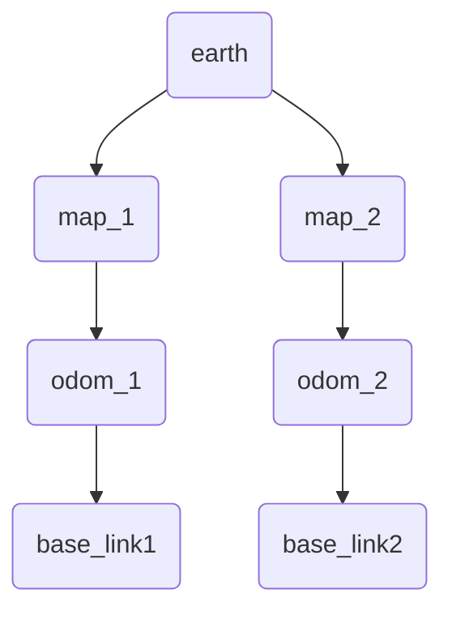

# REP-105：移动平台的坐标系框架

**REP-105** 是一个名为 *"Coordinate Frames for Mobile Platforms"*（移动平台的坐标系框架）的 **ROS Enhancement Proposal**（REP）。该提案由 **Wim Meeussen** 于 **2010年10月27日** 创建，并处于活动状态。本文将介绍 **REP-105** 的内容，包括其摘要、动机、规范、坐标系、坐标系之间的关系等。

##  一、摘要

**REP-105** 规定了用于 **ROS** 的移动平台的坐标系的命名约定和语义含义。

##  二、目的

开发者需要共享的坐标系约定，以更好地集成和重用驱动程序、模型和库等软件组件。这个共享的坐标系约定可为创建移动基座的驱动程序和模型的开发者提供规范。同样，创建库和应用程序的开发者可以更轻松地将其软件与兼容此规范的多种移动基座一起使用。例如，**REP-105** 规定了编写新的定位组件所需的坐标系。它还规定了用于引用机器人的移动基座的坐标系。

## 三、规范

### 3.1坐标系

#### **base_link**

名为 *"base_link"* 的坐标系刚性地附加在移动机器人的基座上。可以将 *"base_link"* 以任意的位置或方向附加到基座上；对于每个硬件平台，基座上提供明显参考点的位置可能不同。需要注意的是，**REP 103** 指定了坐标系的首选方向。

#### **odom**

名为 *"odom"* 的坐标系是一个世界固定坐标系。在 *"odom"* 坐标系中，移动平台的姿态随时间可能会漂移，但没有界限。这种漂移使得 *"odom"* 坐标系作为长期全局参考无用。然而，机器人在 *"odom"* 坐标系中的姿态保证是连续的，这意味着机器人在 *"odom"* 坐标系中的姿态始终以平稳的方式演变，没有离散的跳跃。

在典型的设置中，基于测距源（如轮式测距、视觉测距或惯性测量单元）计算了 *"odom"* 坐标系。机器人在 *"odom"* 坐标系中的姿态是基于这些测距源计算的。

*"odom"* 坐标系作为准确的短期局部参考很有用，但漂移使其成为长期参考的较差坐标系。

#### **map**

名为 *"map"* 的坐标系是一个世界固定坐标系，其Z轴指向上方。移动平台相对于 *"map"* 坐标系的姿态随时间不应显著漂移。但 *"map"* 坐标系不连续，这意味着移动平台在 *"map"* 坐标系中的姿态可以在任何时候以离散跳跃的方式发生变化。

在典型的设置中，定位组件基于传感器观测不断重新计算机器人在 *"map"* 坐标系中的姿态，从而消除漂移，但当新的传感器信息到达时会导致离散跳跃。

*"map"* 坐标系作为长期全局参考很有用，但在位置估计器中的离散跳跃使其成为局部感知和操作的较差参考坐标系。

### 3.2 **Map约定**

地图坐标系可以全局引用，也可以引用到特定应用程序位置。例如，一个应用程序特定的定位可能是根据EGM1996确定的海平面高度，使得地图坐标系中的Z位置等于海平面上方的米数。不管选择何种方式，最重要的部分是必须清楚地记录参考位置的选择，以避免混淆。

当与地球等全球参考一起定义坐标系时：
- 默认情况下，应将x轴对齐到东方，y轴对齐到北方，z轴在坐标系原点上方朝上。
- 如果没有其他参考，z轴的默认位置应该是在WGS84椭球的高度为零的位置。

如果存在特定应用程序要求，上述要求无法满足的情况应尽可能满足。

一个不能满足上述要求的应用示例是启动时没有外部参考设备（如GPS、罗盘或高度计）的机器人。但如果机器人仍具有加速度计，它可以在当前位置初始化地图，z轴朝上。

如果机器人在启动时具有罗盘航向，它还可以初始化东向x轴，北向y轴。

如果机器人在启动时具有高度计估计，它可以将高度初始化为MSL。

上述约定强烈建议在非结构化环境中使用。

#### **结构化环境中的Map约定**

在结构化环境中，将地图与环境对齐可能更有用。例如，办公楼内部通常是直线的，且具有有限的全局定位方法，因此建议将地图与建筑物对齐，尤其是

在建筑物布局预先已知的情况下。类似地，在室内环境中，建议将地图与楼层水平对齐。如果在多层楼环境中操作，每层楼应该有一个单独的坐标系。

如果存在歧义，可以回退到上述非结构化环境的约定。或者，如果对环境了解有限，则仍可以在结构化环境中使用非结构化约定。

#### **earth**

名为 *"earth"* 的坐标系是ECEF（Earth Centered Earth Fixed）坐标系的原点。如果应用程序只需要一个地图，则不需要 *"earth"* 坐标系。如果同时运行多个地图，则需要为每个机器人定制 *"map"*、*"odom"* 和 *"base_link"* 坐标系。如果同时运行多个机器人并在它们之间桥接数据，则每个机器人的变换帧标识（frame_ids）可以保持标准状态，只需对其他机器人的变换帧标识进行重写。

如果全局引用了 *"map"* 坐标系，则从 *"earth"* 到 *"map"* 的发布者可以是静态变换发布者。否则，通常需要通过估算当前全局位置的估计值并从地图中估算当前估计姿态来计算 *"earth"* 到 *"map"* 的变换。

如果在启动时无法确定 *"map"* 坐标系的绝对位置，它可以保持未连接状态，直到可以充分评估全局位置估计为止。这与在初始化 *"map"* 坐标系的定位之前，机器人可以在 *"odom"* 坐标系中操作的方式相同。

### 3.3 坐标系之间的关系

我们选择树形表示将所有坐标系连接在一个机器人系统中。因此，每个坐标系都有一个父坐标系和任意数量的子坐标系。在本REP中描述的坐标系如下所示：

*"map"* 坐标系是 *"odom"* 坐标系的父坐标系，而 *"odom"* 坐标系是 *"base_link"* 坐标系的父坐标系。尽管直觉可能会认为 *"map"* 和 *"odom"* 都应该附加到 *"base_link"* 坐标系，但这是不允许的，因为每个坐标系只能有一个父坐标系。

#### 额外的中间坐标系

这个图显示了该图的最小表示。基本拓扑结构应保持不变，但可以在图中插入额外的链接以提供附加功能。

#### 压力高度

潜在的附加坐标系示例是用于表示飞行器的压力高度。压力高度是基于大气气压共享估计的高度近似值。在飞行应用中，可以仅使用气压高度计精确地测量压力高度。它可能会随时间漂移，但仅在垂直方向上漂移。为了支持额外功能，可以在具有惯性一致性的 *"odom"* 坐标系和 *"map"* 坐标系之间插入一个 *"pressure_altitude"* 坐标系。需要一个额外的估计器来估计 *"pressure_altitude"* 与 *"map"* 之间的偏移，但这个额外的坐标系可以支持额外的功能，并且不会破坏上述抽象。

### 3.4 多机器人tf图的示例

这是一个包含两个机器人的tf树示例，它们使用不同的地图进行定位，并具有共同的 *"earth"* 坐标系。

### 3.5 坐标系的权限

从 *"odom"* 到 *"base_link"* 的变换由其中一个测距源计算和广播。

从 *"map"* 到 *"base_link"* 的变换由定位组件计算。然而，定位组件不广播从 *"map"* 到 *"base_link"* 的变换。相反，它首先接收从 *"odom"* 到 *"base_link"* 的变换，然后使用此信息广播从 *"map"* 到 *"odom"* 的变换。

从 *"earth"* 到 *"map"* 的变换是静态发布的，并由地图坐标系的选择进行配置。如果没有特别配置，可以使用车辆的初始位置作为地图坐标系的原点。如果地图没有进行地理参考，以支持简单的静态变换，则定位模块可以遵循与发布从 *"map"* 到 *"odom"* 的估计偏移的过程相同的程序来发布从 *"earth"* 到 *"map"* 的变换。

### 3.6 在地图之间的转换

当机器人行驶一段较长的距离时，预计它需要在地图之间进行转换。在室外环境中，地图坐标系是附近的一个欧几里得近似值，但由于地球的曲率，当距离较长时，这种欧几里得近似会失效。在室内环境中，可以在两个建筑之间进行转换，

其中每个建筑都有一个先前的地图，在该地图中进行导航，或者机器人位于建筑的新楼层。

当在地图之间移动时，定位坐标系的权威应该适当地重新设置 *"odom"* 坐标系的父坐标系。计算 *"map"* 到 *"odom"* 坐标系的常见方法是将 *"odom"* 到 *"base_link"* 的结果从定位修复的 *"map"* 到 *"base_link"* 中减去，当选择的 *"map"* 坐标系更改时，这将隐式地处理这一点。

#### *"odom"* 坐标系的一致性

在地图之间进行转换时，应不会影响里程坐标系。在积累足够的集成位置误差使数据无效之前，应该调整在 *"odom"* 坐标系中收集的数据的数据保留策略。根据机器人的里程质量不同，这些策略可能会大不相同。具有多个冗余的高分辨率编码器的轮式车辆的漂移率较低，可以在更长的时间或距离内保留数据，而仅在转弯时通过开环反馈进行反馈的履带式机器人会保留较短的时间或距离内的数据。

还有其他上下文也会影响适当的保留策略，比如机器人被外部驱动器移动，或者对静态环境的假设。例如，在电梯中的机器人的情况下，进入和退出电梯之间的环境发生了变化。

如果车辆行驶的距离足够长，以至于从 *"odom"* 坐标系的原点到车辆的距离接近最大浮点精度，可能会观察到基于浮点数据的持久化数据的性能下降。这在点云等使用32位浮点数据的浮点数据中尤为明显。如果遇到这种距离情况，可能需要定期重置 *"odom"* 坐标系的原点。如果需要厘米级的精度，则到 *"odom"* 坐标系的最大距离约为83公里。

### 3.7 异常情况

潜在的机器人软件范围太广，无法要求所有ROS软件遵循此REP的准则。然而，选择不同的约定应该有充分的理由并且要有良好的文档记录。

