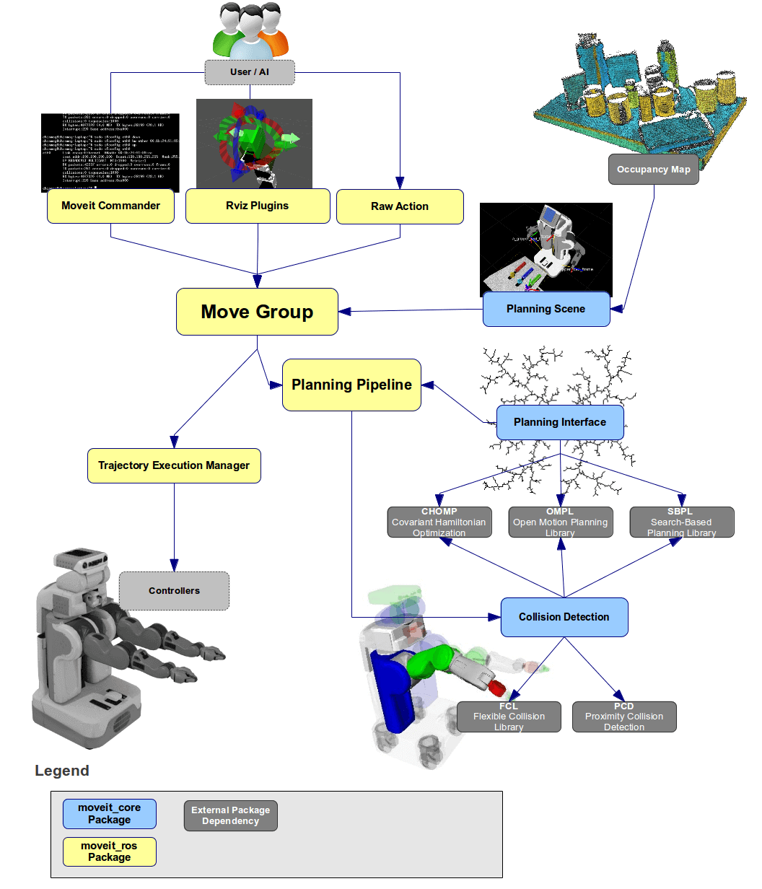
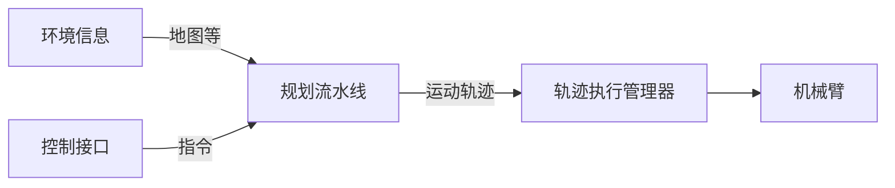

# 1.Moveit2介绍与安装

MoveIt2是基于ROS2的机器人操作平台，其集成了运动规划，操作，3D感知，运动学，控制和导航方面的最新技术与一体。

### 架构介绍

接着我们来简单看下Moveit2的框架如图1-3所示



简单的可以将图1-3拆分为以下几个部分：



其中规划流水线，通过调用规划接口产生轨迹，之后进行碰撞检测，若不通过则继续规划，直到产生一条无碰撞的轨迹。

#### 规划接口

Moveit2提供三个默认的规划流水线的实现。

- 基于开源运动规划库的规划器OMPL
- 基于搜索的规划器SBPL
- 基于梯度轨迹优化的协变哈密顿量优化规划器CHOMP

#### 碰撞检测

Moveit2提供了两种实现

- 基于FCL库实现的碰撞检测。
- 源码中没看到PCD,只看到了Bullet碰撞检测，这个图值得怀疑，就无展开了，怕大家误会。


Moveit2安装

我们可以直接使用apt安装官方编译好的二进制包，也可以把源代码下载下来自己编译出二进制包，但为了学习方便，也为了第一时间体验新发布的特性（官方二进制比源码总慢半拍），我这里优先带你用源码安装。

源码安装Moveit2

准备系统环境

小鱼是基于Ubuntu22.04，Humble版本的ROS2进行安装的，请你和小鱼保持相同的环境，这样不容易出错。

当然你如果你不是22.04的Ubuntu，也不用重新安装，用小鱼一键安装里的安装多版本ROS，可以直接帮你创建一个Ubuntu22.04且包含Humble版本ROS2的环境，非常快捷。

一键安装地址： https://fishros.org.cn/forum/topic/20


下载Moveit2源码

下载源码我们用熟悉的git工具就可以完成，将Moveit2代码下载到指定的工作空间的文件夹，可以用下面的指令

```
git clone https://github.com/ros-planning/moveit2.git moveit2_ws/src/moveit2
```

国内用户实惨，下载过程中你可能会遇到网络问题，不过不要担心，我们找一个代理来用，在原来的地址上加个头

```
git clone https://ghproxy.com/https://github.com/ros-planning/moveit2.git moveit2_ws/src/moveit2
```

下载完成后你应该可以在`moveit2_ws/src/moveit2`文件夹下看到很多个功能包，代表下载成功。

安装依赖

ROS2里有一个用于扫描代码的依赖并搜索安装的工具叫rosdep,我们接下来就要用它来扫描源码中所有`packages.xml`文件里写的依赖。

又是一个不幸的消息，rosdep检测到依赖的名字后，又到github上搜索依赖项的具体信息，你知道的，github总是有打不开的毛病。

所以后来小鱼做了个rosdec，国内用户可以用它代替rosdep使用，我们这里先用一键安装rosdepc。

运行一键安装，选择3即可。

```
---众多工具，等君来用---
[1]:一键安装:ROS(支持ROS和ROS2,树莓派Jetson)
[2]:一键安装:github桌面版(小鱼常用的github客户端)
[3]:一键配置:rosdep(小鱼的rosdepc,又快又好用)
```

安装完成后你还需要更新一下rosdepc的数据，一句指令即可`rosdepc update`。

接着我们就正式开始安装依赖

```
cd moveit2_ws/
rosdepc install --from-path src --ignore-src -r -y
```

简单介绍下rosdec这句指令，`--from-path src` src是文件夹的名字，意思说是扫描`src`文件夹下的源码，`--ignore-src`不安装已经有源码的依赖，`-r`表示遇到错误继续装，`-y`是遇到问题自动回答是。

```
# 过程中可以看到rosdepc调用了apt-get进行依赖的安装
executing command [sudo -H apt-get install -y ros-humble-joint-state-broadcaster]
# 最后可以看到这句表示成功
#All required rosdeps installed successfully
```


编译源码

编译和ROS2一样，用的是colcon工具，直接上`colcon build`即可。

```
cd moveit2_ws/
colcon build --cmake-args -DCMAKE_BUILD_TYPE=Release
```

这里我们给build传递了一个CMake参数`--cmake-args -DCMAKE_BUILD_TYPE=Release`，告诉CMake我们要编译一个Release版本（Release版本会删掉多余的调试信息，运行起来会更快）。

最后你应该看到，代表编译成功。

```
Summary: 38 packages finished [13min 22s]
```


二进制安装

```
sudo apt install ros-humble-moveit
```


## 运行一个运动规划Demo


运行一个Demo


